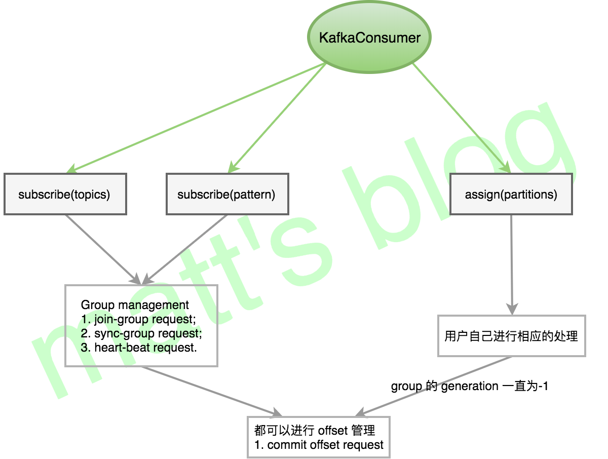

在前面两篇 Kafka Consumer 的文章中，Consumer Poll 模型这部分基本上已经完整结束，Consumer 这块的文章计划是要写五篇，这篇是 Consumer 这块的第三篇，本来计划是要从其中的三个小块细节内容着手，这三个地方有一个相同之处，那就是在 Kafka Consumer 中都提供了两个不同的解决方案，但具体怎么去使用是需要用户根据自己的业务场景去配置，这里会讲述其底层的具体实现（但为了阅读得更为方便，本来计划的这篇文章将拆分为两篇来，第一篇先讲述第一点，后面两点放在一起讲述）。   本篇文章讲述的这三点内容分别是：    
 - consumer 的两种订阅模式， <code>subscribe()</code>和<code>assign()</code> 模式，一种是 topic 粒度（使用 group 管理），一种是 topic-partition 粒度（用户自己去管理）； 
 - consumer 的两种 commit 实现，<code>commitAsync()</code>和<code>commitSync()</code>，即同步 commit 和异步 commit； 
 - consumer 提供的两种不同 <code>partition.assignment.strategy</code>，这是关于一个 group 订阅一些 topic 后，group 内各个 consumer 实例的 partition 分配策略。  0.9.X 之前 Kafka Consumer 是支持两个不同的订阅模型 —— high level 和 simple level，这两种模型的最大区别是：第一个其 offset 管理是由 Kafka 来做，包括 rebalance 操作，第二个则是由使用者自己去做，自己去管理相关的 offset，以及自己去进行 rebalance。   在新版的 consumer 中对 high level 和 simple level 的接口实现了统一，简化了相应的相应的编程模型。   
 ## 订阅模式 
 在新版的 Consumer 中，high level 模型现在叫做订阅模式，KafkaConsumer 提供了三种 API，如下：   
``` scala
// 订阅指定的 topic 列表,并且会自动进行动态 partition 订阅
// 当发生以下情况时,会进行 rebalance: 1.订阅的 topic 列表改变; 2.topic 被创建或删除; 3.consumer 线程 die; 4. 加一个新的 consumer 线程
// 当发生 rebalance 时，会唤醒 ConsumerRebalanceListener 线程
public void subscribe(Collection<String> topics, ConsumerRebalanceListener listener){}
// 同上，但是这里没有设置 listener
public void subscribe(Collection<String> topics) {}
//note: 订阅那些满足一定规则(pattern)的 topic
public void subscribe(Pattern pattern, ConsumerRebalanceListener listener){}
```
 以上三种 API 都是按照 topic 级别去订阅，可以动态地获取其分配的 topic-partition，这是使用 
<strong>Group 动态管理</strong>，它不能与手动 partition 管理一起使用。当监控到发生下面的事件时，Group 将会触发 rebalance 操作：    
 - 订阅的 topic 列表变化； 
 - topic 被创建或删除； 
 - consumer group 的某个 consumer 实例挂掉； 
 - 一个新的 consumer 实例通过 <code>join</code> 方法加入到一个 group 中。  在这种模式下，当 KafkaConsumer 调用 pollOnce 方法时，第一步会首先加入到一个 group 中，并获取其分配的 topic-partition 列表（见[Kafka 源码解析之 Consumer 如何加入一个 Group（六）](http://matt33.com/2017/10/22/consumer-join-group/)），前面两篇文章都是以这种情况来讲述的。   这里介绍一下当调用 subscribe() 方法之后，Consumer 所做的事情，分两种情况介绍，一种按 topic 列表订阅，一种是按 pattern 模式订阅：    
 - topic 列表订阅 
<ol> 
 <li>更新 SubscriptionState 中记录的 <code>subscription</code>（记录的是订阅的 topic 列表），将 SubscriptionType 类型设置为 <strong>AUTO_TOPICS</strong>；</li> 
 <li>更新 metadata 中的 topic 列表（<code>topics</code> 变量），并请求更新 metadata；</li> 
</ol> 
 - pattern 模式订阅 
<ol> 
 <li>更新 SubscriptionState 中记录的 <code>subscribedPattern</code>，设置为 pattern，将 SubscriptionType 类型设置为 <strong>AUTO_PATTERN</strong>；</li> 
 <li>设置 Metadata 的 needMetadataForAllTopics 为 true，即在请求 metadata 时，需要更新所有 topic 的 metadata 信息，设置后再请求更新 metadata；</li> 
 <li>调用 <code>coordinator.updatePatternSubscription()</code> 方法，遍历所有 topic 的 metadata，找到所有满足 pattern 的 topic 列表，更新到 SubscriptionState 的 <code>subscriptions</code> 和 Metadata 的 <code>topics</code> 中；</li> 
 <li>通过在 ConsumerCoordinator 中调用 <code>addMetadataListener()</code> 方法在 Metadata 中添加 listener 当每次 metadata update 时就调用第三步的方法更新，但是只有当本地缓存的 topic 列表与现在要订阅的 topic 列表不同时，才会触发 rebalance 操作。</li> 
</ol>  其他部分，两者基本一样，只是 pattern 模型在每次更新 topic-metadata 时，获取全局的 topic 列表，如果发现有新加入的符合条件的 topic，就立马去订阅，其他的地方，包括 Group 管理、topic-partition 的分配都是一样的。   
 ## 分配模式 
 下面来看一下 Consumer 提供的分配模式，熟悉 0.8.X 版本的人，可能会把这种方法称为 simple consumer 的接口，当调用 assign() 方法手动分配 topic-partition 列表时，是不会使用 consumer 的 Group 管理机制，也即是当 consumer group member 变化或 topic 的 metadata 信息变化时是不会触发 rebalance 操作的。比如：当 topic 的 partition 增加时，这里是无法感知，需要用户进行相应的处理，Apache Flink 就是使用的这种方式，后续我会写篇文章介绍 Flink 是如何实现这种机制的。   
``` scala
//note: 手动向 consumer 分配一些 topic-partition 列表，并且这个接口不允许增加分配的 topic-partition 列表，将会覆盖之前分配的 topic-partition 列表，如果给定的 topic-partition 列表为空，它的作用将会与 unsubscribe() 方法一样。
//note: 这种手动 topic 分配是不会使用 consumer 的 group 管理，当 group 的 member 变化或 topic 的 metadata 变化也不会触发 rebalance 操作。
public void assign(Collection<TopicPartition> partitions) {}
```
 这里来看一下 Kafka 提供的 Group 管理到底是什么？   如果有印象的话，在[Kafka 源码解析之 Consumer 如何加入一个 Group（六）](http://matt33.com/2017/10/22/consumer-join-group/)中介绍 Poll 模型的第一步中，详细介绍了 ConsumerCoordinator.poll() 方法，我们再来看一下这个方法：   
``` scala
// note: 它确保了这个 group 的 coordinator 是已知的,并且这个 consumer 是已经加入到了 group 中,也用于 offset 周期性的 commit
public void poll(long now) {
    invokeCompletedOffsetCommitCallbacks();// note: 用于测试

    // note: Step1 通过 subscribe() 方法订阅 topic,并且 coordinator 未知,初始化 Consumer Coordinator
    if (subscriptions.partitionsAutoAssigned() && coordinatorUnknown()) {
        // note: 获取 GroupCoordinator 地址,并且建立连接
        ensureCoordinatorReady();
        now = time.milliseconds();
    }

    // note: Step2 判断是否需要重新加入 group,如果订阅的 partition 变化或则分配的 partition 变化时,需要 rejoin
    // note: 如果订阅模式不是 AUTO_TOPICS 或 AUTO_PATTERN,直接跳过
    if (needRejoin()) {
        // note: rejoin group 之前先刷新一下 metadata（对于 AUTO_PATTERN 而言）
        if (subscriptions.hasPatternSubscription())
            client.ensureFreshMetadata();

        // note: 确保 group 是 active; 加入 group; 分配订阅的 partition
        ensureActiveGroup();
        now = time.milliseconds();
    }

    // note: Step3 检查心跳线程运行是否正常,如果心跳线程失败,则抛出异常,反之更新 poll 调用的时间
    // note: 发送心跳请求是在 ensureCoordinatorReady() 中调用的
    pollHeartbeat(now);
    // note: Step4 自动 commit 时,当定时达到时,进行自动 commit
    maybeAutoCommitOffsetsAsync(now);
}
```
 如果使用的是 assign 模式，也即是非 AUTO_TOPICS 或 AUTO_PATTERN 模式时，Consumer 实例在调用 poll 方法时，是不会向 GroupCoordinator 发送 join-group/sync-group/heartbeat 请求的，也就是说 GroupCoordinator 是拿不到这个 Consumer 实例的相关信息，也不会去维护这个 member 是否存活，这种情况下就需要用户自己管理自己的处理程序。但是在这种模式是可以进行 offset commit的。   
 ### commit offset 请求处理 
 当 Kafka Serve 端受到来自 client 端的 Offset Commit 请求时，其处理逻辑如下所示，是在 kafka.coordinator.GroupCoordinator 中实现的。   
``` scala
// kafka.coordinator.GroupCoordinator
//note: GroupCoordinator 处理 Offset Commit 请求
def handleCommitOffsets(groupId: String,
                        memberId: String,
                        generationId: Int,
                        offsetMetadata: immutable.Map[TopicPartition, OffsetAndMetadata],
                        responseCallback: immutable.Map[TopicPartition, Short] => Unit) {
  if (!isActive.get) {
    responseCallback(offsetMetadata.mapValues(_ => Errors.GROUP_COORDINATOR_NOT_AVAILABLE.code))
  } else if (!isCoordinatorForGroup(groupId)) {
    responseCallback(offsetMetadata.mapValues(_ => Errors.NOT_COORDINATOR_FOR_GROUP.code))
  } else if (isCoordinatorLoadingInProgress(groupId)) {
    responseCallback(offsetMetadata.mapValues(_ => Errors.GROUP_LOAD_IN_PROGRESS.code))
  } else {
    groupManager.getGroup(groupId) match {
      case None =>
        if (generationId < 0) {
          // the group is not relying on Kafka for group management, so allow the commit
          //note: 不使用 group-coordinator 管理的情况
          //note: 如果 groupID不存在,就新建一个 GroupMetadata, 其group 状态为 Empty,否则就返回已有的 groupid
          //note: 如果 simple 的 groupId 与一个 active 的 group 重复了,这里就有可能被覆盖掉了
          val group = groupManager.addGroup(new GroupMetadata(groupId))
          doCommitOffsets(group, memberId, generationId, offsetMetadata, responseCallback)
        } else {
          // or this is a request coming from an older generation. either way, reject the commit
          //note: 过期的 offset-commit
          responseCallback(offsetMetadata.mapValues(_ => Errors.ILLEGAL_GENERATION.code))
        }

      case Some(group) =>
        doCommitOffsets(group, memberId, generationId, offsetMetadata, responseCallback)
    }
  }
}

//note: 真正的处理逻辑
private def doCommitOffsets(group: GroupMetadata,
                    memberId: String,
                    generationId: Int,
                    offsetMetadata: immutable.Map[TopicPartition, OffsetAndMetadata],
                    responseCallback: immutable.Map[TopicPartition, Short] => Unit) {
  var delayedOffsetStore: Option[DelayedStore] = None

  group synchronized {
    if (group.is(Dead)) {
      responseCallback(offsetMetadata.mapValues(_ => Errors.UNKNOWN_MEMBER_ID.code))
    } else if (generationId < 0 && group.is(Empty)) {//note: 来自 assign 的情况
      // the group is only using Kafka to store offsets
      delayedOffsetStore = groupManager.prepareStoreOffsets(group, memberId, generationId,
        offsetMetadata, responseCallback)
    } else if (group.is(AwaitingSync)) {
      responseCallback(offsetMetadata.mapValues(_ => Errors.REBALANCE_IN_PROGRESS.code))
    } else if (!group.has(memberId)) {//note: 有可能 simple 与 high level 的冲突了,这里就直接拒绝相应的请求
      responseCallback(offsetMetadata.mapValues(_ => Errors.UNKNOWN_MEMBER_ID.code))
    } else if (generationId != group.generationId) {
      responseCallback(offsetMetadata.mapValues(_ => Errors.ILLEGAL_GENERATION.code))
    } else {
      val member = group.get(memberId)
      completeAndScheduleNextHeartbeatExpiration(group, member)//note: 更新下次需要的心跳时间
      delayedOffsetStore = groupManager.prepareStoreOffsets(group, memberId, generationId,
        offsetMetadata, responseCallback)
    }
  }

  // store the offsets without holding the group lock
  delayedOffsetStore.foreach(groupManager.store)
}
```
 处理过程如下：    
 - 如果这个 group 还不存在（groupManager没有这个 group 信息），并且 generation 为 -1（一般情况下应该都是这样），就新建一个 GroupMetadata, 其 Group 状态为 Empty； 
 - 现在 group 已经存在，就调用 <code>doCommitOffsets()</code> 提交 offset； 
 - 如果是来自 assign 模式的请求，并且其对应的 group 的状态为 Empty（generationId &lt; 0 &amp;&amp; group.is(Empty)），那么就记录这个 offset； 
 - 如果是来自 assign 模式的请求，但这个 group 的状态不为 Empty（!group.has(memberId)），也就是说，这个 group 已经处在活跃状态，assign 模式下的 group 是不会处于的活跃状态的，可以认为是 assign 模式使用的 group.id 与 subscribe 模式下使用的 group 相同，这种情况下就会拒绝 assign 模式下的这个 offset commit 请求。  
 ### 小结 
 根据上面的讲述，这里做一下小节，如下图所示：   

   简单做一下总结：   
| 模式| 不同之处| 相同之处 | 
| -----| -----| ----- | 
 | subscribe() | 使用 Kafka Group 管理，自动进行 rebalance 操作 | 可以在 Kafka 保存 offset | 
 | assign() | 用户自己进行相关的处理 | 也可以进行 offset commit，但是尽量保证 group.id 唯一性，如果使用一个与上面模式一样的 group，offset commit 请求将会被拒绝 |