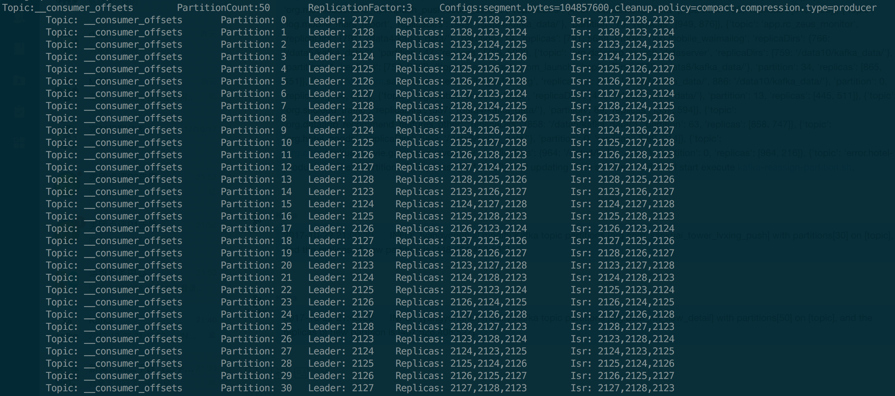
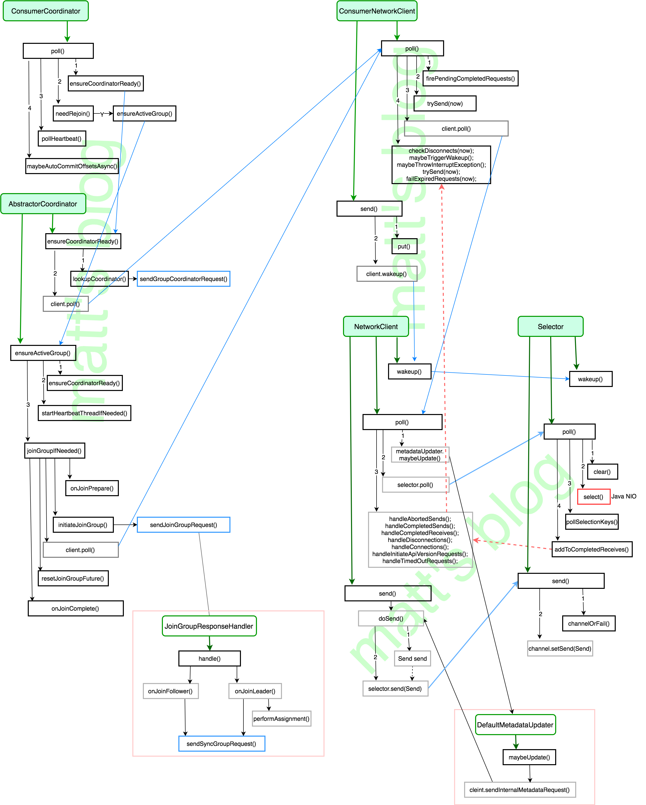
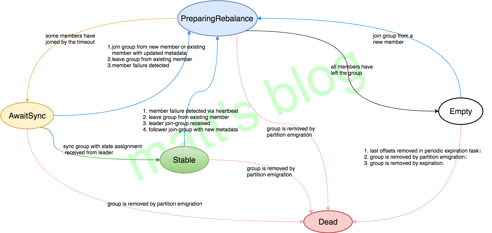

距离上一篇博客（2017-09-10），到现在已经过去一个多月了，理论上这篇文章在上个月就应该写完，无奈拖延症又犯了，一直以这部分过于复杂为借口拖了好久，这两天逼了自己一把，先整理出其中的一篇，后续要加把劲，要不然今年的年度计划（年底前把这个系列写完）就完不成了，废话到此为止，下面步入正文。在 Kafka 中，Consumer 的复杂度要比 producer 高出很多，对于 Producer 而言，没有 producer 组的概念的、也不需要 care offset 等问题，而 Consumer 就不一样了，它需要关注的内容很多，需要考虑分布式消费（Consumer Group），为了防止重复消费或者部分数据未消费需要考虑 offset，这些都对 Consumer 的设计以及 Server 对其处理提出了很高的要求。本来计划是先进行综述，然后再分别介绍各个模块，现在打算反过来，先介绍各个模块，最后再进行综述，本篇为 Consumer 源码分析开篇，先从一个 Consumer 实例如何加入一个 Consumer Group 讲起。   这里的分析是以 0.10.2 为准，在 0.10.2 版的 KafkaConsumer 中，相比于老版的 KafkaConsumer（0.9以前的），新版从0.9开始做了很大改进，总结起来，其优势有以下两点：    
 - 实现了 High Level 与 Simple Level Consumer API 的统一，极大地简化了实现的复杂度； 
 - 增加了 GroupCoordinator 角色，它作用是：<code>GroupCoordinator handles general group membership and offset management</code>；  接下来会按照下面这个流程来讲述：    
 - GroupCoordinator 简单介绍； 
 - Consumer poll 模型：join-group 是 poll 模型的第一步，其他部分后续再讲； 
 - Consumer join-group 的详细过程以及在这个过程中 group 状态的变化。  
 ## GroupCoordinator 简介 
 这里先简单介绍一下 GroupCoordinator 这个角色，后续有一篇文章进行专门讲述，GroupCoordinator 是运行在 Kafka Broker 上的一个服务，每台 Broker 在运行时都会启动一个这样的服务，但一个 consumer 具体与哪个 Broker 上这个服务交互，就需要先介绍一下 __consumer_offsets 这个 topic。   
 ### <code>__consumer_offsets</code> topic 
 __consumer_offsets 是 Kafka 内部使用的一个 topic，专门用来存储 group 消费的情况，默认情况下有50个 partition，每个 partition 三副本，如下图所示（只列出了30 个 partition）：   

   
 ### GroupCoordinator 
 GroupCoordinator 是负责 consumer group member 管理以及 offset 管理。   每个 Consumer Group 都有其对应的 GroupCoordinator，但具体是由哪个 GroupCoordinator 负责与 group.id 的 hash 值有关，通过这个 
<strong>abs(GroupId.hashCode()) % NumPartitions</strong> 来计算出一个值（其中，NumPartitions 是 __consumer_offsets 的 partition 数，默认是50个），这个值代表了 __consumer_offsets 的一个 partition，而这个 partition 的 leader 即为这个 Group 要交互的 GroupCoordinator 所在的节点。   
 ## Consumer poll 模型 
 Consumer poll 方法的真正实现是在 pollOnce() 方法中，这里直接看下其源码：   
``` scala
/**
 * Do one round of polling. In addition to checking for new data, this does any needed offset commits
 * (if auto-commit is enabled), and offset resets (if an offset reset policy is defined).
 * @param timeout The maximum time to block in the underlying call to {@link ConsumerNetworkClient#poll(long)}.
 * @return The fetched records (may be empty)
 */
// note: 一次 poll 过程,包括检查新的数据、做一些必要的 commit 以及 offset  重置操作
private Map<TopicPartition, List<ConsumerRecord<K, V>>> pollOnce(long timeout) {
    // note： 1. 获取 GroupCoordinator 并连接、加入 Group、sync Group, 期间 group 会进行 rebalance 并获取
    coordinator.poll(time.milliseconds());
    // assignment

    // fetch positions if we have partitions we're subscribed to that we
    // don't know the offset for
    // note: 2. 更新要拉取 partition 的 offset（如果需要更新的话）
    if (!subscriptions.hasAllFetchPositions())
        updateFetchPositions(this.subscriptions.missingFetchPositions());

    // if data is available already, return it immediately
    // note: 3. 获取 fetcher 已经拉取到的数据
    Map<TopicPartition, List<ConsumerRecord<K, V>>> records = fetcher.fetchedRecords();
    if (!records.isEmpty())
        return records;
    // note: 说明上次 fetch 到是的数据已经全部拉取了,需要再次发送 fetch 请求,从 broker 拉取数据

    // send any new fetches (won't resend pending fetches)
    // note: 4. 向订阅的所有 partition 发送 fetch 请求,会从多个 partition 拉取数据
    fetcher.sendFetches();

    long now = time.milliseconds();
    long pollTimeout = Math.min(coordinator.timeToNextPoll(now), timeout);

    //note: 5. 调用 poll 方法发送数据
    client.poll(pollTimeout, now, new PollCondition() {
        @Override
        public boolean shouldBlock() {
            // since a fetch might be completed by the background thread, we need this poll condition
            // to ensure that we do not block unnecessarily in poll()
            return !fetcher.hasCompletedFetches();
        }
    });

    // after the long poll, we should check whether the group needs to rebalance
    // prior to returning data so that the group can stabilize faster
    //note: 6. 如果 group 需要 rebalance, 直接返回空数据,这样更快地让 group 进行稳定状态
    if (coordinator.needRejoin())
        return Collections.emptyMap();

    return fetcher.fetchedRecords();
}
```
 在这里，我们把一个 pollOnce 模型分为6个部分，这里简单介绍一下：    
 - 连接 GroupCoordinator，并发送 join-group、sync-group 请求，加入 group 成功，并获取其分配的 tp 列表； 
 - 更新这些分配的 tp 列表的 the last committed offset（没有的话，根据其设置进行获取 offset）； 
 - 调用 Fetcher 获取拉取的数据，如果有数据，立马返回，没有的话就进行下面的操作； 
 - 调用 Fetcher 发送 fetch 请求（只是加入队列，并未真正发送）； 
 - 调用 poll() 方法发送请求； 
 - 如果 group 之前是需要 rebalacne 的，直接返回空集合，这样可以便于 group 尽快达到一个稳定的状态。  一个 Consumer 实例消费数据的前提是能够加入一个 group 成功，并获取其要订阅的 tp（topic-partition）列表，这都是在第一步中完成的，如果这个 group 是一个新的 group，那么 group 的状态将会由 
<strong>Empty –&gt; PreparingRebalance –&gt; AwaitSync –&gt; Stable</strong> 的变化过程，下面将会详细介绍。   
 ## Consumer join-group 详解 
 通过上面，我们知道，poll 模型的第一步是在 ConsumerCoordinator.poll() 中实现的，其整体过程如下所示。   

   
<blockquote> 其实，主要观察图中左边的部分即可，也就是 ConsumerCoordinator 和 AbstractCoordinator 中的方法。   
</blockquote> 对于一个 Consumer Group，其状态变化图下图所示（后面会讲到）。   

   
 ### <code>ConsumerCoordinator.poll()</code> 
 先看一下 ConsumerCoordinator.poll() 的具体实现   
``` scala
// note: 它确保了这个 group 的 coordinator 是已知的,并且这个 consumer 是已经加入到了 group 中,也用于 offset 周期性的 commit
public void poll(long now) {
    invokeCompletedOffsetCommitCallbacks();// note: 用于测试

    // note: Step1 通过 subscribe() 方法订阅 topic,并且 coordinator 未知,初始化 Consumer Coordinator
    if (subscriptions.partitionsAutoAssigned() && coordinatorUnknown()) {
        // note: 获取 GroupCoordinator 地址,并且建立连接
        ensureCoordinatorReady();
        now = time.milliseconds();
    }

    // note: Step2 判断是否需要重新加入 group,如果订阅的 partition 变化或则分配的 partition 变化时,需要 rejoin
    if (needRejoin()) {
        // due to a race condition between the initial metadata fetch and the initial rebalance,
        // we need to ensure that the metadata is fresh before joining initially. This ensures
        // that we have matched the pattern against the cluster's topics at least once before joining.
        // note: rejoin group 之前先刷新一下 metadata（对于 AUTO_PATTERN 而言）
        if (subscriptions.hasPatternSubscription())
            client.ensureFreshMetadata();

        // note: 确保 group 是 active; 加入 group; 分配订阅的 partition
        ensureActiveGroup();
        now = time.milliseconds();
    }

    // note: Step3 检查心跳线程运行是否正常,如果心跳线程失败,则抛出异常,反之更新 poll 调用的时间
    pollHeartbeat(now);
    // note: Step4 自动 commit 时,当定时达到时,进行自动 commit
    maybeAutoCommitOffsetsAsync(now);
}
```
 在 poll 方法中，具体实现，可以分为以下三步：    
 - 通过 <code>subscribe()</code> 方法订阅 topic, 并且 coordinator 未知，就初始化 Consumer Coordinator（在 <code>ensureCoordinatorReady()</code> 中实现，主要的作用是发送 GroupCoordinator 请求，并建立连接）； 
 - 判断是否需要重新加入 group，如果订阅的 partition 变化或则分配的 partition 变化时，需要 rejoin，通过 <code>ensureActiveGroup()</code> 发送 join-group、sync-group 请求，加入 group 并获取其 assign 的 tp list； 
 - 检测心跳线程运行是否正常（需要定时向 GroupCoordinator 发送心跳线程，长时间未发送的话 group就会认为该实例已经挂了）； 
 - 如果设置的是自动 commit，如果定时达到自动 commit。  这其中，有两个地方需要详细介绍，那就是第一步中的 ensureCoordinatorReady() 方法和第二步中的 ensureActiveGroup() 方法。   
 ### <code>ensureCoordinatorReady()</code> 
 这个方法的作用是：选择一个连接数最小的 broker，向其发送 GroupCoordinator 请求，并建立相应的 TCP 连接。    
 - 其方法的调用如前面的流程图所示：ensureCoordinatorReady() –&gt; lookupCoordinator() –&gt; sendGroupCoordinatorRequest()。 
 - 如果 client 获取到 Server response，那么就会与 GroupCoordinator 建立连接；  
``` scala
// note: 确保 coordinator 已经 ready（已经连接,并可以发送请求）
// note: 如果 coordinator 已经 ready 返回 true,否则返回 flase。
protected synchronized boolean ensureCoordinatorReady(long startTimeMs, long timeoutMs) {
    long remainingMs = timeoutMs;

    while (coordinatorUnknown()) {
        // note:  获取 GroupCoordinator,并建立连接
        RequestFuture<Void> future = lookupCoordinator();
        client.poll(future, remainingMs);

        if (future.failed()) {// note: 如果获取的过程中失败了
            if (future.isRetriable()) {
                remainingMs = timeoutMs - (time.milliseconds() - startTimeMs);
                if (remainingMs <= 0)
                    break;

                log.debug("Coordinator discovery failed for group {}, refreshing metadata", groupId);
                client.awaitMetadataUpdate(remainingMs);
            } else
                throw future.exception();
        } else if (coordinator != null && client.connectionFailed(coordinator)) {
            // we found the coordinator, but the connection has failed, so mark
            // it dead and backoff before retrying discovery
            coordinatorDead();
            time.sleep(retryBackoffMs);
        }

        remainingMs = timeoutMs - (time.milliseconds() - startTimeMs);
        if (remainingMs <= 0)
            break;
    }

    return !coordinatorUnknown();
}

// note: 选择一个连接最小的节点,发送 groupCoordinator 请求
protected synchronized RequestFuture<Void> lookupCoordinator() {
    if (findCoordinatorFuture == null) {
        // find a node to ask about the coordinator
        Node node = this.client.leastLoadedNode();//NOTE: 找一个节点,发送 groupCoordinator 的请求
        if (node == null) {
            // TODO: If there are no brokers left, perhaps we should use the bootstrap set
            // from configuration?
            log.debug("No broker available to send GroupCoordinator request for group {}", groupId);
            return RequestFuture.noBrokersAvailable();
        } else
            findCoordinatorFuture = sendGroupCoordinatorRequest(node);//NOTE: 发送请求，并对 response 进行处理
    }
    return findCoordinatorFuture;
}

//NOTE: 发送 GroupCoordinator 的请求
private RequestFuture<Void> sendGroupCoordinatorRequest(Node node) {
    // initiate the group metadata request
    log.debug("Sending GroupCoordinator request for group {} to broker {}", groupId, node);
    GroupCoordinatorRequest.Builder requestBuilder =
            new GroupCoordinatorRequest.Builder(this.groupId);
    return client.send(node, requestBuilder)
                 .compose(new GroupCoordinatorResponseHandler());
    //NOTE: compose 的作用是将 GroupCoordinatorResponseHandler 类转换为 RequestFuture
    //NOTE: 实际上就是为返回的 Future 类重置 onSuccess() 和 onFailure() 方法
}

//NOTE: 对 GroupCoordinator 的 response 进行处理,回调
private class GroupCoordinatorResponseHandler extends RequestFutureAdapter<ClientResponse, Void> {

    @Override
    public void onSuccess(ClientResponse resp, RequestFuture<Void> future) {
        log.debug("Received GroupCoordinator response {} for group {}", resp, groupId);

        GroupCoordinatorResponse groupCoordinatorResponse = (GroupCoordinatorResponse) resp.responseBody();
        // use MAX_VALUE - node.id as the coordinator id to mimic separate connections
        // for the coordinator in the underlying network client layer
        // TODO: this needs to be better handled in KAFKA-1935
        Errors error = Errors.forCode(groupCoordinatorResponse.errorCode());
        clearFindCoordinatorFuture();
        if (error == Errors.NONE) {
            // note: 如果正确获取 GroupCoordinator 时, 建立连接,并更新心跳时间
            synchronized (AbstractCoordinator.this) {
                AbstractCoordinator.this.coordinator = new Node(
                        Integer.MAX_VALUE - groupCoordinatorResponse.node().id(),
                        groupCoordinatorResponse.node().host(),
                        groupCoordinatorResponse.node().port());
                log.info("Discovered coordinator {} for group {}.", coordinator, groupId);
                client.tryConnect(coordinator);//note: 初始化 tcp 连接
                heartbeat.resetTimeouts(time.milliseconds());//note: 更新心跳时间
            }
            future.complete(null);
        } else if (error == Errors.GROUP_AUTHORIZATION_FAILED) {
            future.raise(new GroupAuthorizationException(groupId));
        } else {
            log.debug("Group coordinator lookup for group {} failed: {}", groupId, error.message());
            future.raise(error);
        }
    }

    @Override
    public void onFailure(RuntimeException e, RequestFuture<Void> future) {
        clearFindCoordinatorFuture();
        super.onFailure(e, future);
    }
}
```
 
 ### <code>ensureActiveGroup()</code> 
 这个方法的作用是：向 GroupCoordinator 发送 join-group、sync-group 请求，获取 assign 的 tp list。    
 - 如前面图中所示，ensureActiveGroup 方法的调用过程：ensureActiveGroup() –&gt; ensureCoordinatorReady() –&gt; startHeartbeatThreadIfNeeded() –&gt; joinGroupIfNeeded()； 
 - <code>joinGroupIfNeeded()</code> 方法中最重要的方法是 <code>initiateJoinGroup()</code>，其方法的调用过程为：initiateJoinGroup() –&gt; sendJoinGroupRequest() –&gt; JoinGroupResponseHandler.handle().succeed –&gt; onJoinLeader()/onJoinFollower() –&gt; sendSyncGroupRequest() –&gt; SyncGroupResponseHandler。  
``` scala
//NOTE: 确保 Group 是 active,并且加入该 group
public void ensureActiveGroup() {
    // always ensure that the coordinator is ready because we may have been disconnected
    // when sending heartbeats and does not necessarily require us to rejoin the group.
    ensureCoordinatorReady();//NOTE: 确保 GroupCoordinator 已经连接
    startHeartbeatThreadIfNeeded();//NOTE: 启动心跳发送线程（并不一定发送心跳,满足条件后才会发送心跳）
    joinGroupIfNeeded();//NOTE: 发送 JoinGroup 请求,并对返回的信息进行处理
}
```
 join-group 的请求是在 joinGroupIfNeeded() 中实现的。   
``` scala
// note: join group
public void joinGroupIfNeeded() {
    while (needRejoin() || rejoinIncomplete()) {
        ensureCoordinatorReady();
        // call onJoinPrepare if needed. We set a flag to make sure that we do not call it a second
        // time if the client is woken up before a pending rebalance completes. This must be called
        // on each iteration of the loop because an event requiring a rebalance (such as a metadata
        // refresh which changes the matched subscription set) can occur while another rebalance is
        // still in progress.
        //note: 触发 onJoinPrepare, 包括 offset commit 和 rebalance listener
        if (needsJoinPrepare) {
            onJoinPrepare(generation.generationId, generation.memberId);
            needsJoinPrepare = false;
        }

        // note: 初始化 JoinGroup 请求,并发送该请求
        RequestFuture<ByteBuffer> future = initiateJoinGroup();
        client.poll(future);
        resetJoinGroupFuture();//NOTE: 重置 joinFuture 为空

        if (future.succeeded()) {//note: join succeed,这一步时,时间上 sync-group 已经成功了
            needsJoinPrepare = true;
            onJoinComplete(generation.generationId, generation.memberId, generation.protocol, future.value());
        } else {
            RuntimeException exception = future.exception();
            if (exception instanceof UnknownMemberIdException ||
                    exception instanceof RebalanceInProgressException ||
                    exception instanceof IllegalGenerationException)
                continue;
            else if (!future.isRetriable())
                throw exception;
            time.sleep(retryBackoffMs);
        }
    }
}
```
 sendJoinGroupRequest() 方法是由 initiateJoinGroup() 方法来调用的。   
``` scala
//NOTE: 发送 JoinGroup 的请求, 并添加 listener
private synchronized RequestFuture<ByteBuffer> initiateJoinGroup() {
    // we store the join future in case we are woken up by the user after beginning the
    // rebalance in the call to poll below. This ensures that we do not mistakenly attempt
    // to rejoin before the pending rebalance has completed.
    if (joinFuture == null) {
        // fence off the heartbeat thread explicitly so that it cannot interfere with the join group.
        // Note that this must come after the call to onJoinPrepare since we must be able to continue
        // sending heartbeats if that callback takes some time.
        // note: rebalance 期间,心跳线程停止
        disableHeartbeatThread();

        state = MemberState.REBALANCING;//NOTE: 标记为 rebalance
        joinFuture = sendJoinGroupRequest();//NOTE: 发送 JoinGroup 请求
        joinFuture.addListener(new RequestFutureListener<ByteBuffer>() {
            @Override
            public void onSuccess(ByteBuffer value) {
                // handle join completion in the callback so that the callback will be invoked
                // even if the consumer is woken up before finishing the rebalance
                synchronized (AbstractCoordinator.this) {
                    log.info("Successfully joined group {} with generation {}", groupId, generation.generationId);
                    state = MemberState.STABLE;//NOTE: 标记 Consumer 为 stable

                    if (heartbeatThread != null)
                        heartbeatThread.enable();
                }
            }

            @Override
            public void onFailure(RuntimeException e) {
                // we handle failures below after the request finishes. if the join completes
                // after having been woken up, the exception is ignored and we will rejoin
                synchronized (AbstractCoordinator.this) {
                    state = MemberState.UNJOINED;//NOTE: 标记 Consumer 为 Unjoined
                }
            }
        });
    }
    return joinFuture;
}
```
 sendJoinGroupRequest() 及其处理如下所示。   
``` scala
/**
 * Join the group and return the assignment for the next generation. This function handles both
 * JoinGroup and SyncGroup, delegating to {@link #performAssignment(String, String, Map)} if
 * elected leader by the coordinator.
 * @return A request future which wraps the assignment returned from the group leader
 */
//NOTE: 发送 JoinGroup 请求并返回 the assignment for the next generation（这个是在 JoinGroupResponseHandler 中做的）
private RequestFuture<ByteBuffer> sendJoinGroupRequest() {
    if (coordinatorUnknown())
        return RequestFuture.coordinatorNotAvailable();

    // send a join group request to the coordinator
    log.info("(Re-)joining group {}", groupId);
    JoinGroupRequest.Builder requestBuilder = new JoinGroupRequest.Builder(
            groupId,
            this.sessionTimeoutMs,
            this.generation.memberId,
            protocolType(),
            metadata()).setRebalanceTimeout(this.rebalanceTimeoutMs);

    log.debug("Sending JoinGroup ({}) to coordinator {}", requestBuilder, this.coordinator);
    return client.send(coordinator, requestBuilder)
            .compose(new JoinGroupResponseHandler());
}

//NOTE: 处理 JoinGroup response 的 handler（同步 group 信息）
private class JoinGroupResponseHandler extends CoordinatorResponseHandler<JoinGroupResponse, ByteBuffer> {
    @Override
    public void handle(JoinGroupResponse joinResponse, RequestFuture<ByteBuffer> future) {
        Errors error = Errors.forCode(joinResponse.errorCode());
        if (error == Errors.NONE) {
            log.debug("Received successful JoinGroup response for group {}: {}", groupId, joinResponse);
            sensors.joinLatency.record(response.requestLatencyMs());

            synchronized (AbstractCoordinator.this) {
                if (state != MemberState.REBALANCING) {//NOTE: 如果此时 Consumer 的状态不是 rebalacing,就引起异常
                    // if the consumer was woken up before a rebalance completes, we may have already left
                    // the group. In this case, we do not want to continue with the sync group.
                    future.raise(new UnjoinedGroupException());
                } else {
                    AbstractCoordinator.this.generation = new Generation(joinResponse.generationId(),
                            joinResponse.memberId(), joinResponse.groupProtocol());
                    AbstractCoordinator.this.rejoinNeeded = false;
                    //NOTE: join group 成功,下面需要进行 sync-group,获取分配的 tp 列表。
                    if (joinResponse.isLeader()) {
                        onJoinLeader(joinResponse).chain(future);
                    } else {
                        onJoinFollower().chain(future);
                    }
                }
            }
        } else if (error == Errors.GROUP_LOAD_IN_PROGRESS) {
            log.debug("Attempt to join group {} rejected since coordinator {} is loading the group.", groupId,
                    coordinator());
            // backoff and retry
            future.raise(error);
        } else if (error == Errors.UNKNOWN_MEMBER_ID) {
            // reset the member id and retry immediately
            resetGeneration();
            log.debug("Attempt to join group {} failed due to unknown member id.", groupId);
            future.raise(Errors.UNKNOWN_MEMBER_ID);
        } else if (error == Errors.GROUP_COORDINATOR_NOT_AVAILABLE
                || error == Errors.NOT_COORDINATOR_FOR_GROUP) {
            // re-discover the coordinator and retry with backoff
            coordinatorDead();
            log.debug("Attempt to join group {} failed due to obsolete coordinator information: {}", groupId, error.message());
            future.raise(error);
        } else if (error == Errors.INCONSISTENT_GROUP_PROTOCOL
                || error == Errors.INVALID_SESSION_TIMEOUT
                || error == Errors.INVALID_GROUP_ID) {
            // log the error and re-throw the exception
            log.error("Attempt to join group {} failed due to fatal error: {}", groupId, error.message());
            future.raise(error);
        } else if (error == Errors.GROUP_AUTHORIZATION_FAILED) {
            future.raise(new GroupAuthorizationException(groupId));
        } else {
            // unexpected error, throw the exception
            future.raise(new KafkaException("Unexpected error in join group response: " + error.message()));
        }
    }
}
```
 sendJoinGroupRequest()：向 GroupCoordinator 发送 join-group 请求    
 - 如果 group 是新的 group.id，那么此时 group 初始化的状态为 <strong>Empty</strong>； 
 - 当 GroupCoordinator 接收到 consumer 的 join-group 请求后，由于此时这个 group 的 member 列表还是空（group 是新建的，每个 consumer 实例被称为这个 group 的一个 member），第一个加入的 member 将被选为 leader，也就是说，对于一个新的 consumer group 而言，当第一个 consumer 实例加入后将会被选为 leader； 
 - 如果 GroupCoordinator 接收到 leader 发送 join-group 请求，将会触发 rebalance，group 的状态变为 <strong>PreparingRebalance</strong>； 
 - 此时，GroupCoordinator 将会等待一定的时间，如果在一定时间内，接收到 join-group 请求的 consumer 将被认为是依然存活的，此时 group 会变为 <strong>AwaitSync</strong> 状态，并且 GroupCoordinator 会向这个 group 的所有 member 返回其 response； 
 - consumer 在接收到 GroupCoordinator 的 response 后，如果这个 consumer 是 group 的 leader，那么这个 consumer 将会负责为整个 group assign partition 订阅安排（默认是按 range 的策略，目前也可选 roundrobin），然后 leader 将分配后的信息以 <code>sendSyncGroupRequest()</code> 请求的方式发给 GroupCoordinator，而作为 follower 的 consumer 实例会发送一个空列表； 
 - GroupCoordinator 在接收到 leader 发来的请求后，会将 assign 的结果返回给所有已经发送 sync-group 请求的 consumer 实例，并且 group 的状态将会转变为 <strong>Stable</strong>，如果后续再收到 sync-group 请求，由于 group 的状态已经是 Stable，将会直接返回其分配结果。  sync-group 请求的发送及其实现如下所示。   
``` scala
//note: 当 consumer 为 follower 时,从 GroupCoordinator 拉取分配结果
private RequestFuture<ByteBuffer> onJoinFollower() {
    // send follower's sync group with an empty assignment
    SyncGroupRequest.Builder requestBuilder =
            new SyncGroupRequest.Builder(groupId, generation.generationId, generation.memberId,
                    Collections.<String, ByteBuffer>emptyMap());
    log.debug("Sending follower SyncGroup for group {} to coordinator {}: {}", groupId, this.coordinator,
            requestBuilder);
    return sendSyncGroupRequest(requestBuilder);
}

//note: 当 consumer 客户端为 leader 时,对 group 下的所有实例进行分配,将 assign 的结果发送到 GroupCoordinator
private RequestFuture<ByteBuffer> onJoinLeader(JoinGroupResponse joinResponse) {
    try {
        // perform the leader synchronization and send back the assignment for the group
        Map<String, ByteBuffer> groupAssignment = performAssignment(joinResponse.leaderId(), joinResponse.groupProtocol(),
                joinResponse.members());//NOTE: 进行 assign 操作

        SyncGroupRequest.Builder requestBuilder =
                new SyncGroupRequest.Builder(groupId, generation.generationId, generation.memberId, groupAssignment);
        log.debug("Sending leader SyncGroup for group {} to coordinator {}: {}",
                groupId, this.coordinator, requestBuilder);
        return sendSyncGroupRequest(requestBuilder);//NOTE: 发送 sync-group 请求
    } catch (RuntimeException e) {
        return RequestFuture.failure(e);
    }
}

//NOTE: 发送 SyncGroup 请求,获取对 partition 分配的安排
private RequestFuture<ByteBuffer> sendSyncGroupRequest(SyncGroupRequest.Builder requestBuilder) {
    if (coordinatorUnknown())
        return RequestFuture.coordinatorNotAvailable();
    return client.send(coordinator, requestBuilder)
            .compose(new SyncGroupResponseHandler());
}

private class SyncGroupResponseHandler extends CoordinatorResponseHandler<SyncGroupResponse, ByteBuffer> {
    @Override
    public void handle(SyncGroupResponse syncResponse,
                       RequestFuture<ByteBuffer> future) {
        Errors error = Errors.forCode(syncResponse.errorCode());
        if (error == Errors.NONE) {//note: 同步成功
            sensors.syncLatency.record(response.requestLatencyMs());
            future.complete(syncResponse.memberAssignment());
        } else {
            requestRejoin();//note: join 的标志位设置为 true

            if (error == Errors.GROUP_AUTHORIZATION_FAILED) {
                future.raise(new GroupAuthorizationException(groupId));
            } else if (error == Errors.REBALANCE_IN_PROGRESS) {//NOTE: group 正在进行 rebalance,任务失败
                log.debug("SyncGroup for group {} failed due to coordinator rebalance", groupId);
                future.raise(error);
            } else if (error == Errors.UNKNOWN_MEMBER_ID
                    || error == Errors.ILLEGAL_GENERATION) {
                log.debug("SyncGroup for group {} failed due to {}", groupId, error);
                resetGeneration();
                future.raise(error);
            } else if (error == Errors.GROUP_COORDINATOR_NOT_AVAILABLE
                    || error == Errors.NOT_COORDINATOR_FOR_GROUP) {
                log.debug("SyncGroup for group {} failed due to {}", groupId, error);
                coordinatorDead();
                future.raise(error);
            } else {
                future.raise(new KafkaException("Unexpected error from SyncGroup: " + error.message()));
            }
        }
    }
}
```
 
 ### <code>onJoinComplete()</code> 
 经过上面的步骤，一个 consumer 实例就已经加入 group 成功了，加入 group 成功后，将会触发ConsumerCoordinator 的 onJoinComplete() 方法，其作用就是：更新订阅的 tp 列表、更新其对应的 metadata 及触发注册的 listener。   
``` scala
// note: 加入 group 成功
@Override
protected void onJoinComplete(int generation,
                              String memberId,
                              String assignmentStrategy,
                              ByteBuffer assignmentBuffer) {
    // only the leader is responsible for monitoring for metadata changes (i.e. partition changes)
    if (!isLeader)
        assignmentSnapshot = null;

    PartitionAssignor assignor = lookupAssignor(assignmentStrategy);
    if (assignor == null)
        throw new IllegalStateException("Coordinator selected invalid assignment protocol: " + assignmentStrategy);

    Assignment assignment = ConsumerProtocol.deserializeAssignment(assignmentBuffer);

    // set the flag to refresh last committed offsets
    //note: 设置是否需要拉取 last committed offsets 为 true
    subscriptions.needRefreshCommits();

    // update partition assignment
    //note: 更新订阅的 tp list
    subscriptions.assignFromSubscribed(assignment.partitions());

    // check if the assignment contains some topics that were not in the original
    // subscription, if yes we will obey what leader has decided and add these topics
    // into the subscriptions as long as they still match the subscribed pattern
    //
    // TODO this part of the logic should be removed once we allow regex on leader assign
    Set<String> addedTopics = new HashSet<>();
    for (TopicPartition tp : subscriptions.assignedPartitions()) {
        if (!joinedSubscription.contains(tp.topic()))
            addedTopics.add(tp.topic());
    }

    if (!addedTopics.isEmpty()) {
        Set<String> newSubscription = new HashSet<>(subscriptions.subscription());
        Set<String> newJoinedSubscription = new HashSet<>(joinedSubscription);
        newSubscription.addAll(addedTopics);
        newJoinedSubscription.addAll(addedTopics);

        this.subscriptions.subscribeFromPattern(newSubscription);
        this.joinedSubscription = newJoinedSubscription;
    }

    // update the metadata and enforce a refresh to make sure the fetcher can start
    // fetching data in the next iteration
    //note: 更新 metadata,确保在下一次循环中可以拉取
    this.metadata.setTopics(subscriptions.groupSubscription());
    client.ensureFreshMetadata();

    // give the assignor a chance to update internal state based on the received assignment
    assignor.onAssignment(assignment);

    // reschedule the auto commit starting from now
    this.nextAutoCommitDeadline = time.milliseconds() + autoCommitIntervalMs;

    // execute the user's callback after rebalance
    //note: 执行 listener
    ConsumerRebalanceListener listener = subscriptions.listener();
    log.info("Setting newly assigned partitions {} for group {}", subscriptions.assignedPartitions(), groupId);
    try {
        Set<TopicPartition> assigned = new HashSet<>(subscriptions.assignedPartitions());
        listener.onPartitionsAssigned(assigned);
    } catch (WakeupException | InterruptException e) {
        throw e;
    } catch (Exception e) {
        log.error("User provided listener {} for group {} failed on partition assignment",
                listener.getClass().getName(), groupId, e);
    }
}
```
 至此，一个 consumer 实例算是真正上意义上加入 group 成功。