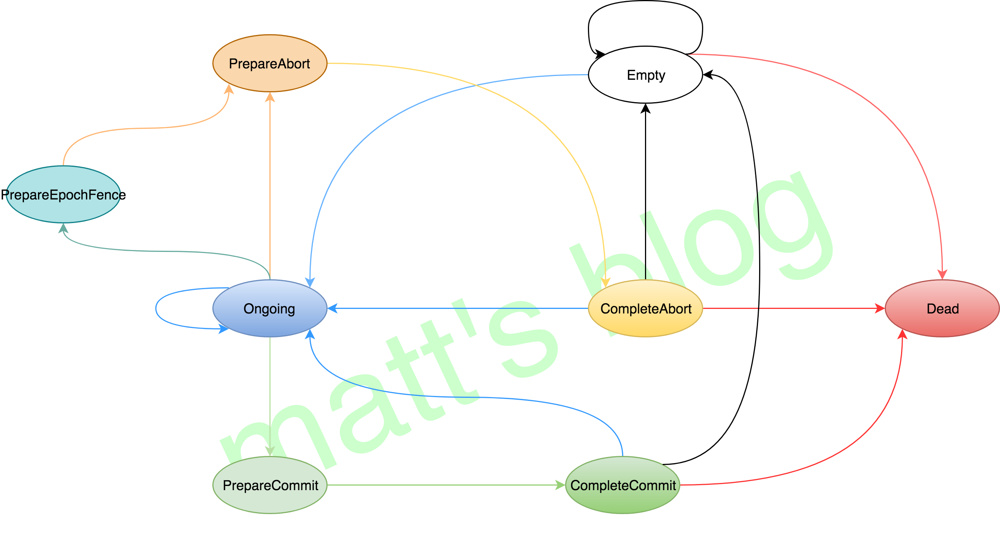
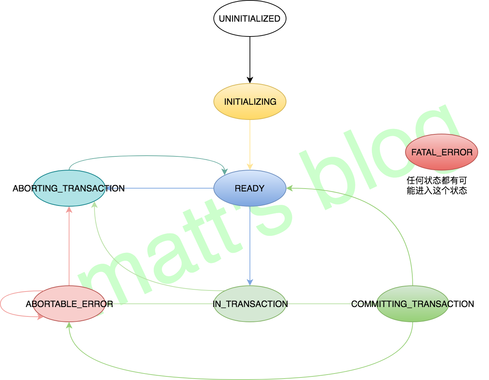
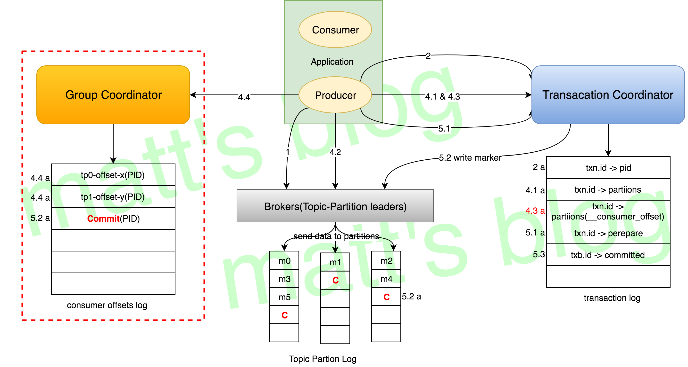

这篇文章是 Kafka Exactly-Once 实现系列的第二篇，主要讲述 Kafka 事务性的实现，这部分的实现要比幂等性的实现复杂一些，幂等性实现是事务性实现的基础，幂等性提供了单会话单 Partition Exactly-Once 语义的实现，正是因为 Idempotent Producer 不提供跨多个 Partition 和跨会话场景下的保证，因此，我们是需要一种更强的事务保证，能够原子处理多个 Partition 的写入操作，数据要么全部写入成功，要么全部失败，不期望出现中间状态。这就是 Kafka Transactions 希望解决的问题，简单来说就是能够实现 atomic writes across partitions，本文以 Apache Kafka 2.0.0 代码实现为例，深入分析一下 Kafka 是如何实现这一机制的。   Apache Kafka 在 Exactly-Once Semantics（EOS）上三种粒度的保证如下（来自 [Exactly-once Semantics in Apache Kafka](https://www.slideshare.net/ConfluentInc/exactlyonce-semantics-in-apache-kafka)）：    
 - Idempotent Producer：Exactly-once，in-order，delivery per partition； 
 - Transactions：Atomic writes across partitions； 
 - Exactly-Once stream processing across read-process-write tasks；  第二种情况就是本文讲述的主要内容，在讲述整个事务处理流程时，也顺便分析第三种情况。   
 ## Kafka Transactions 
 Kafka 事务性最开始的出发点是为了在 Kafka Streams 中实现 Exactly-Once 语义的数据处理，这个问题提出之后，在真正的方案讨论阶段，社区又挖掘了更多的应用场景，也为了尽可能覆盖更多的应用场景，在真正的实现中，在很多地方做了相应的 tradeoffs，后面会写篇文章对比一下 RocketMQ 事务性的实现，就能明白 Kafka 事务性实现及应用场景的复杂性了。   Kafka 的事务处理，主要是允许应用可以把消费和生产的 batch 处理（涉及多个 Partition）在一个原子单元内完成，操作要么全部完成、要么全部失败。为了实现这种机制，我们需要应用能提供一个唯一 id，即使故障恢复后也不会改变，这个 id 就是 TransactionnalId（也叫 txn.id，后面会详细讲述），txn.id 可以跟内部的 PID 1:1 分配，它们不同的是 txn.id 是用户提供的，而 PID 是 Producer 内部自动生成的（并且故障恢复后这个 PID 会变化），有了 txn.id 这个机制，就可以实现多 partition、跨会话的 EOS 语义。   当用户使用 Kafka 的事务性时，Kafka 可以做到的保证：    
 - 跨会话的幂等性写入：即使中间故障，恢复后依然可以保持幂等性； 
 - 跨会话的事务恢复：如果一个应用实例挂了，启动的下一个实例依然可以保证上一个事务完成（commit 或者 abort）； 
 - 跨多个 Topic-Partition 的幂等性写入，Kafka 可以保证跨多个 Topic-Partition 的数据要么全部写入成功，要么全部失败，不会出现中间状态。  上面是从 Producer 的角度来看，那么如果从 Consumer 角度呢？Consumer 端很难保证一个已经 commit 的事务的所有 msg 都会被消费，有以下几个原因：    
 - 对于 compacted topic，在一个事务中写入的数据可能会被新的值覆盖； 
 - 一个事务内的数据，可能会跨多个 log segment，如果旧的 segmeng 数据由于过期而被清除，那么这个事务的一部分数据就无法被消费到了； 
 - Consumer 在消费时可以通过 seek 机制，随机从一个位置开始消费，这也会导致一个事务内的部分数据无法消费； 
 - Consumer 可能没有订阅这个事务涉及的全部 Partition。  简单总结一下，关于 Kafka 事务性语义提供的保证主要以下三个：    
 - Atomic writes across multiple partitions. 
 - All messages in a transaction are made visible together, or none are. 
 - Consumers must be configured to skip uncommitted messages.  
 ## 事务性示例 
 Kafka 事务性的使用方法也非常简单，用户只需要在 Producer 的配置中配置 transactional.id，通过 initTransactions() 初始化事务状态信息，再通过 beginTransaction() 标识一个事务的开始，然后通过 commitTransaction() 或 abortTransaction() 对事务进行 commit 或 abort，示例如下所示：   
``` scala
Properties props = new Properties();
props.put("key.serializer", "org.apache.kafka.common.serialization.StringSerializer");
props.put("value.serializer", "org.apache.kafka.common.serialization.StringSerializer");
props.put("client.id", "ProducerTranscationnalExample");
props.put("bootstrap.servers", "localhost:9092");
props.put("transactional.id", "test-transactional");
props.put("acks", "all");
KafkaProducer producer = new KafkaProducer(props);
producer.initTransactions();

try {
    String msg = "matt test";
    producer.beginTransaction();
    producer.send(new ProducerRecord(topic, "0", msg.toString()));
    producer.send(new ProducerRecord(topic, "1", msg.toString()));
    producer.send(new ProducerRecord(topic, "2", msg.toString()));
    producer.commitTransaction();
} catch (ProducerFencedException e1) {
    e1.printStackTrace();
    producer.close();
} catch (KafkaException e2) {
    e2.printStackTrace();
    producer.abortTransaction();
}
producer.close();
```
 事务性的 API 也同样保持了 Kafka 一直以来的简洁性，使用起来是非常方便的。   
 ## 事务性要解决的问题 
 回想一下，前面一篇文章中关于幂等性要解决的问题（[幂等性要解决的问题](http://matt33.com/2018/10/24/kafka-idempotent/#%E5%B9%82%E7%AD%89%E6%80%A7%E8%A6%81%E8%A7%A3%E5%86%B3%E7%9A%84%E9%97%AE%E9%A2%98)），事务性其实更多的是解决幂等性中没有解决的问题，比如：    
 - 在写多个 Topic-Partition 时，执行的一批写入操作，有可能出现部分 Topic-Partition 写入成功，部分写入失败（比如达到重试次数），这相当于出现了中间的状态，这并不是我们期望的结果； 
 - Producer 应用中间挂之后再恢复，无法做到 Exactly-Once 语义保证；  再来分析一下，Kafka 提供的事务性是如何解决上面两个问题的：    
 - 如果启用事务性的话，涉及到多个 Topic-Partition 的写入时，这个事务操作要么会全部成功，要么会全部失败，不会出现上面的情况（部分成功、部分失败），如果有 Topic-Partition 无法写入，那么当前这个事务操作会直接 abort； 
 - 其实应用做到端到端的 Exactly-Once，仅仅靠 Kafka 是无法做到的，还需要应用本身做相应的容错设计，以 Flink 为例，其容错设计就是 checkpoint 机制，作业保证在每次 checkpoint 成功时，它之前的处理都是 Exactly-Once 的，如果中间作业出现了故障，恢复之后，只需要接着上次 checkpoint 的记录做恢复即可，对于失败前那个未完成的事务执行回滚操作（abort）就可以了，这样的话就是实现了 Flink + Kafka 端到端的 Exactly-Once（这只是设计的思想，具体的实现后续会有文章详细解揭秘）。  
 ## 事务性实现的关键 
 对于 Kafka 的事务性实现，最关键的就是其事务操作原子性的实现。对于一个事务操作而言，其会涉及到多个 Topic-Partition 数据的写入，如果是一个 long transaction 操作，可能会涉及到非常多的数据，如何才能保证这个事务操作的原子性（要么全部完成，要么全部失败）呢？    
 - 关于这点，最容易想到的应该是引用 2PC 协议（它主要是解决分布式系统数据一致性的问题）中协调者的角色，它的作用是统计所有参与者的投票结果，如果大家一致认为可以 commit，那么就执行 commit，否则执行 abort： 
<ul> 
 <li>我们来想一下，Kafka 是不是也可以引入一个类似的角色来管理事务的状态，只有当 Producer 真正 commit 时，事务才会提交，否则事务会还在进行中（实际的实现中还需要考虑 timeout 的情况），不会处于完成状态；</li> 
 <li>Producer 在开始一个事务时，告诉【协调者】事务开始，然后开始向多个 Topic-Partition 写数据，只有这批数据全部写完（中间没有出现异常），Producer 会调用 commit 接口进行 commit，然后事务真正提交，否则如果中间出现异常，那么事务将会被 abort（Producer 通过 abort 接口告诉【协调者】执行 abort 操作）；</li> 
 <li>这里的协调者与 2PC 中的协调者略有不同，主要为了管理事务相关的状态信息，这就是 Kafka Server 端的 <strong>TransactionCoordinator</strong> 角色；</li> 
</ul> 
 - 有了上面的机制，是不是就可以了？很容易想到的问题就是 TransactionCoordinator 挂的话怎么办？TransactionCoordinator 如何实现高可用？ 
<ul> 
 <li>TransactionCoordinator 需要管理事务的状态信息，如果一个事务的 TransactionCoordinator 挂的话，需要转移到其他的机器上，这里关键是在 <strong>事务状态信息如何恢复？</strong> 也就是事务的状态信息需要<strong>很强的容错性、一致性</strong>；</li> 
 <li>关于数据的强容错性、一致性，存储的容错性方案基本就是多副本机制，而对于一致性，就有很多的机制实现，其实这个在 Kafka 内部已经实现（不考虑数据重复问题），那就是 <code>min.isr + ack</code> 机制；</li> 
 <li>分析到这里，对于 Kafka 熟悉的同学应该就知道，这个是不是跟 <code>__consumer_offset</code> 这个内部的 topic 很像，TransactionCoordinator 也跟 GroupCoordinator 类似，而对应事务数据（transaction log）就是 <code>__transaction_state</code> 这个内部 topic，所有事务状态信息都会持久化到这个 topic，TransactionCoordinator 在做故障恢复也是从这个 topic 中恢复数据；</li> 
</ul> 
 - 有了上面的机制，就够了么？我们再来考虑一种情况，我们期望一个 Producer 在 Fail 恢复后能主动 abort 上次未完成的事务（接上之前未完成的事务），然后重新开始一个事务，这种情况应该怎么办？之前幂等性引入的 PID 是无法解决这个问题的，因为每次 Producer 在重启时，PID 都会更新为一个新值： 
<ul> 
 <li>Kafka 在 Producer 端引入了一个 <strong>TransactionalId</strong> 来解决这个问题，这个 txn.id 是由应用来配置的；</li> 
 <li>TransactionalId 的引入还有一个好处，就是跟 consumer group 类似，它可以用来标识一个事务操作，便于这个事务的所有操作都能在一个地方（同一个 TransactionCoordinator）进行处理；</li> 
</ul> 
 - 再来考虑一个问题，在具体的实现时，我们应该如何标识一个事务操作的开始、进行、完成的状态？正常来说，一个事务操作是由很多操作组成的一个操作单元，对于 TransactionCoordinator 而言，是需要准确知道当前的事务操作处于哪个阶段，这样在容错恢复时，新选举的 TransactionCoordinator 才能恢复之前的状态： 
<ul> 
 <li>这个就是<strong>事务状态转移</strong>，一个事务从开始，都会有一个相应的状态标识，直到事务完成，有了事务的状态转移关系之后，TransactionCoordinator 对于事务的管理就会简单很多，TransactionCoordinator 会将当前事务的状态信息都会缓存起来，每当事务需要进行转移，就更新缓存中事务的状态（前提是这个状态转移是有效的）。</li> 
</ul>  
<blockquote> 上面的分析都是个人见解，有问题欢迎指正~   
</blockquote> 下面这节就讲述一下事务性实现的一些关键的实现机制（对这些细节不太感兴趣或者之前没有深入接触过 Kafka，可以直接跳过，直接去看下一节的事务流程处理，先去了解一下一个事务操作的主要流程步骤）。   
 ### TransactionCoordinator 
 TransactionCoordinator 与 GroupCoordinator 有一些相似之处，它主要是处理来自 Transactional Producer 的一些与事务相关的请求，涉及的请求如下表所示（关于这些请求处理的详细过程会在下篇文章详细讲述，这里先有个大概的认识即可）：   
| 请求类型| 用途说明 | 
| -----| ----- | 
 | ApiKeys.FIND_COORDINATOR | Transaction Producer 会发送这个 FindCoordinatorRequest 请求，来查询当前事务（txn.id）对应的 TransactionCoordinator，这个与 GroupCoordinator 查询类似，是根据 txn.id 的 hash 值取模找到对应 Partition 的 leader，这个 leader 就是该事务对应的 TransactionCoordinator | 
 | ApiKeys.INIT_PRODUCER_ID | Producer 初始化时，会发送一个 InitProducerIdRequest 请求，来获取其分配的 PID 信息，对于幂等性的 Producer，会随机选择一台 broker 发送请求，而对于 Transaction Producer 会选择向其对应的 TransactionCoordinator 发送该请求（目的是为了根据 txn.id 对应的事务状态做一些判断） | 
 | ApiKeys.ADD_PARTITIONS_TO_TXN | 将这个事务涉及到的 topic-partition 列表添加到事务的 meta 信息中（通过 AddPartitionsToTxnRequest 请求），事务 meta 信息需要知道当前的事务操作涉及到了哪些 Topic-Partition 的写入 | 
 | ApiKeys.ADD_OFFSETS_TO_TXN | Transaction Producer 的这个 AddOffsetsToTxnRequest 请求是由 sendOffsetsToTransaction() 接口触发的，它主要是用在 consume-process-produce 的场景中，这时候 consumer 也是整个事务的一部分，只有这个事务 commit 时，offset 才会被真正 commit（主要还是用于 Failover） | 
 | ApiKeys.END_TXN | 当提交事务时， Transaction Producer 会向 TransactionCoordinator 发送一个 EndTxnRequest 请求，来 commit 或者 abort 事务 | 
 TransactionCoordinator 对象中还有两个关键的对象，分别是:    
 - TransactionStateManager：这个对象，从名字应该就能大概明白其作用是关于事务的状态管理，它会维护分配到这个 TransactionCoordinator 的所有事务的 meta 信息； 
 - TransactionMarkerChannelManager：这个主要是用于向其他的 Broker 发送 Transaction Marker 数据，关于 Transaction Marker，第一次接触的人，可能会有一些困惑，什么是 Transaction Marker，Transaction Marker 是用来解决什么问题的呢？这里先留一个疑问，后面会来解密。  总结一下，TransactionCoordinator 主要的功能有三个，分别是：    
 - 处理事务相关的请求； 
 - 维护事务的状态信息； 
 - 向其他 Broker 发送 Transaction Marker 数据。  
 ### Transaction Log（__transaction_state） 
 在前面分析中，讨论过一个问题，那就是如果 TransactionCoordinator 故障的话应该怎么恢复？怎么恢复之前的状态？我们知道 Kafka 内部有一个事务 topic __transaction_state，一个事务应该由哪个 TransactionCoordinator 来处理，是根据其 txn.id 的 hash 值与 __transaction_state 的 partition 数取模得到，__transaction_state Partition 默认是50个，假设取模之后的结果是2，那么这个 txn.id 应该由 __transaction_state Partition 2 的 leader 来处理。   对于 __transaction_state 这个 topic 默认是由 Server 端的 transaction.state.log.replication.factor 参数来配置，默认是3，如果当前 leader 故障，需要进行 leader 切换，也就是对应的 TransactionCoordinator 需要迁移到新的 leader 上，迁移之后，如何恢复之前的事务状态信息呢？   正如 GroupCoordinator 的实现一样，TransactionCoordinator 的恢复也是通过 __transaction_state 中读取之前事务的日志信息，来恢复其状态信息，前提是要求事务日志写入做相应的不丢配置。这也是 __transaction_state 一个重要作用之一，用于 TransactionCoordinator 的恢复，__transaction_state 与 __consumer_offsets 一样是 compact 类型的 topic，其 scheme 如下：   
``` scala
Key => Version TransactionalId
    Version => 0 (int16)
    TransactionalId => String

Value => Version ProducerId ProducerEpoch TxnTimeoutDuration TxnStatus [TxnPartitions] TxnEntryLastUpdateTime TxnStartTime
    Version => 0 (int16)
    ProducerId => int64
    ProducerEpoch => int16
    TxnTimeoutDuration => int32
    TxnStatus => int8
    TxnPartitions => [Topic [Partition]]
        Topic => String
        Partition => int32
    TxnLastUpdateTime => int64
    TxnStartTime => int64
```
 
 ### Transaction Marker 
 终于讲到了 Transaction Marker，这也是前面留的一个疑问，什么是 Transaction Marker？Transaction Marker 是用来解决什么问题的呢？   Transaction Marker 也叫做 control messages，它的作用主要是告诉这个事务操作涉及的 Topic-Partition Set 的 leaders 当前的事务操作已经完成，可以执行 commit 或者 abort（Marker 主要的内容就是 commit 或 abort），这个 marker 数据由该事务的 TransactionCoordinator 来发送的。我们来假设一下：如果没有 Transaction Marker，一个事务在完成后，如何执行 commit 操作？（以这个事务涉及多个 Topic-Partition 写入为例）    
 - Transactional Producer 在进行 commit 时，需要先告诉 TransactionCoordinator 这个事务可以 commit 了（因为 TransactionCoordinator 记录这个事务对应的状态信息），然后再去告诉这些 Topic-Partition 的 leader 当前已经可以 commit，也就是 Transactional Producer 在执行 commit 时，至少需要做两步操作； 
 - <p>在 Transactional Producer 通知这些 Topic-Partition 的 leader 事务可以 commit 时，这些 Topic-Partition 应该怎么处理呢？难道是 commit 时再把数据持久化到磁盘，abort 时就直接丢弃不做持久化？这明显是问题的，如果这是一个 long transaction 操作，写数据非常多，内存中无法存下，数据肯定是需要持久化到硬盘的，如果数据已经持久化到硬盘了，假设这个时候收到了一个 abort 操作，是需要把数据再从硬盘清掉？</p>  
<ul> 
 <li>这种方案有一个问题是：已经持久化的数据是持久化到本身的日志文件，还是其他文件？如果持久化本来的日志文件中，那么 consumer 消费到一个未 commit 的数据怎么办？这些数据是有可能 abort 的，如果是持久化到其他文件中，这会涉及到数据多次写磁盘、从磁盘清除的操作，会影响其 server 端的性能；</li> 
</ul> <p>再看下如果有了 Transaction Marker 这个机制后，情况会变成什么样？</p>  
<ol> 
 <li>首先 Transactional Producer 只需要告诉 TransactionCoordinator 当前事务可以 commit，然后再由 TransactionCoordinator 来向其涉及到的 Topic-Partition 的 leader 发送 Transaction Marker 数据，这里减轻了 Client 的压力，而且 TransactionCoordinator 会做一些优化，如果这个目标 Broker 涉及到多个事务操作，是可以共享这个 TCP 连接的；</li> 
 <li>有了 Transaction Marker 之后，Producer 在持久化数据时就简单很多，写入的数据跟之前一样，按照条件持久化到硬盘（数据会有一个标识，标识这条或这批数据是不是事务写入的数据），当收到 Transaction Marker 时，把这个 Transaction Marker 数据也直接写入这个 Partition 中，这样在处理 Consumer 消费时，就可以根据 marker 信息做相应的处理。</li> 
</ol>  Transaction Marker 的数据格式如下，其中 ControlMessageType 为 0 代表是 COMMIT，为 1 代表是 ABORT：   
``` scala
ControlMessageKey => Version ControlMessageType
    Version => int16
    ControlMessageType => int16

TransactionControlMessageValue => Version CoordinatorEpoch
    Version => int16
    CoordinatorEpoch => int32
```
 这里再讲一个额外的内容，对于事务写入的数据，为了给消息添加一个标识（标识这条消息是不是来自事务写入的），
<strong>数据格式（消息协议）发生了变化</strong>，这个改动主要是在 Attribute 字段，对于 MessageSet，Attribute 是16位，新的格式如下：   
``` scala
| Unused (6-15) | Control (5) | Transactional (4) | Timestamp Type (3) | Compression Type (0-2) |
```
 对于 Message，也就是单条数据存储时（其中 Marker 数据都是单条存储的），在 Kafka 中，只有 MessageSet 才可以做压缩，所以 Message 就没必要设置压缩字段，其格式如下：   
``` scala
| Unused (1-7) | Control Flag(0) |
```
 
 ### Server 端事务状态管理 
 TransactionCoordinator 会维护相应的事务的状态信息（也就是 TxnStatus），对于一个事务，总共有以下几种状态：   
| 状态| 状态码| 说明 | 
| -----| -----| ----- | 
 | Empty | 0 | Transaction has not existed yet | 
 | Ongoing | 1 | Transaction has started and ongoing | 
 | PrepareCommit | 2 | Group is preparing to commit | 
 | PrepareAbort | 3 | Group is preparing to abort | 
 | CompleteCommit | 4 | Group has completed commit | 
 | CompleteAbort | 5 | Group has completed abort | 
 | Dead | 6 | TransactionalId has expired and is about to be removed from the transaction cache | 
 | PrepareEpochFence | 7 | We are in the middle of bumping the epoch and fencing out older producers | 
 其相应有效的状态转移图如下：   

   正常情况下，对于一个事务而言，其状态状态流程应该是 Empty –&gt; Ongoing –&gt; PrepareCommit –&gt; CompleteCommit –&gt; Empty 或者是 Empty –&gt; Ongoing –&gt; PrepareAbort –&gt; CompleteAbort –&gt; Empty。   
 ### Client 端事务状态管理 
 Client 的事务状态信息主要记录本地事务的状态，当然跟其他的系统类似，本地的状态信息与 Server 端的状态信息并不完全一致（状态的设置，就像 GroupCoodinator 会维护一个 Group 的状态，每个 Consumer 也会维护本地的 Consumer 对象的状态一样）。Client 端的事务状态信息主要用于 Client 端的事务状态处理，其主要有以下几种：    
 - UNINITIALIZED：Transactional Producer 初始化时的状态，此时还没有事务处理； 
 - INITIALIZING：Transactional Producer 调用 <code>initTransactions()</code> 方法初始化事务相关的内容，比如发送 InitProducerIdRequest 请求； 
 - READY：对于新建的事务，Transactional Producer 收到来自 TransactionCoordinator 的 InitProducerIdResponse 后，其状态会置为 READY（对于已有的事务而言，是当前事务完成后 Client 的状态会转移为 READY）； 
 - IN_TRANSACTION：Transactional Producer 调用 <code>beginTransaction()</code> 方法，开始一个事务，标志着一个事务开始初始化； 
 - COMMITTING_TRANSACTION：Transactional Producer 调用 <code>commitTransaction()</code> 方法时，会先更新本地的状态信息； 
 - ABORTING_TRANSACTION：Transactional Producer 调用 <code>abortTransaction()</code> 方法时，会先更新本地的状态信息； 
 - ABORTABLE_ERROR：在一个事务操作中，如果有数据发送失败，本地状态会转移到这个状态，之后再自动 abort 事务； 
 - FATAL_ERROR：转移到这个状态之后，再进行状态转移时，会抛出异常；  Client 端状态如下图：   

   
 ## 事务性的整体流程 
 有了前面对 Kafka 事务性关键实现的讲述之后，这里详细讲述一个事务操作的处理流程，当然这里只是重点讲述事务性相关的内容，官方版的流程图可参考[Kafka Exactly-Once Data Flow](https://cwiki.apache.org/confluence/display/KAFKA/KIP-98+-+Exactly+Once+Delivery+and+Transactional+Messaging#KIP-98-ExactlyOnceDeliveryandTransactionalMessaging-DataFlow)，这里我做了一些改动，其流程图如下：   

   这个流程是以 consume-process-produce 场景为例（主要是 kafka streams 的场景），图中红虚框及 4.3a 部分是关于 consumer 的操作，去掉这部分的话，就是只考虑写入情况的场景。这种只考虑写入场景的事务操作目前在业内应用也是非常广泛的，比如 Flink + Kafka 端到端的 Exactly-Once 实现就是这种场景，下面来详细讲述一下整个流程。   
 ### 1. Finding a TransactionCoordinator 
 对于事务性的处理，第一步首先需要做的就是找到这个事务 txn.id 对应的 TransactionCoordinator，Transaction Producer 会向 Broker （随机选择一台 broker，一般选择本地连接最少的这台 broker）发送 FindCoordinatorRequest 请求，获取其 TransactionCoordinator。   怎么找到对应的 TransactionCoordinator 呢？这个前面已经讲过了，主要是通过下面的方法获取 __transaction_state 的 Partition，该 Partition 对应的 leader 就是这个 txn.id 对应的 TransactionCoordinator。   
``` scala
def partitionFor(transactionalId: String): Int = Utils.abs(transactionalId.hashCode) % transactionTopicPartitionCount
```
 
 ### 2. Getting a PID 
 PID 这里就不再介绍了，不了解的可以看前面那篇文章（[Producer ID](http://matt33.com/2018/10/24/kafka-idempotent/#PID)）。   Transaction Producer 在 initializeTransactions() 方法中会向 TransactionCoordinator 发送 InitPidRequest 请求获取其分配的 PID，有了 PID，事务写入时可以保证幂等性，PID 如何分配可以参考 [PID 分配](http://matt33.com/2018/10/24/kafka-idempotent/#Producer-PID-%E7%94%B3%E8%AF%B7)，但是 TransactionCoordinator 在给事务 Producer 分配 PID 会做一些判断，主要的内容是：    
 - 如果这个 txn.id 之前没有相应的事务状态（new txn.id），那么会初始化其事务 meta 信息 TransactionMetadata（会给其分配一个 PID，初始的 epoch 为-1），如果有事务状态，获取之前的状态； 
 - 校验其 TransactionMetadata 的状态信息（参考下面代码中 <code>prepareInitProduceIdTransit()</code> 方法）： 
<ol> 
 <li>如果前面还有状态转移正在进行，直接返回 CONCURRENT_TRANSACTIONS 异常；</li> 
 <li>如果此时的状态为 PrepareAbort 或 PrepareCommit，返回 CONCURRENT_TRANSACTIONS 异常；</li> 
 <li>如果之前的状态为 CompleteAbort、CompleteCommit 或 Empty，那么先将状态转移为 Empty，然后更新一下 epoch 值；</li> 
 <li>如果之前的状态为 Ongoing，状态会转移成 PrepareEpochFence，然后再 abort 当前的事务，并向 client 返回 CONCURRENT_TRANSACTIONS 异常；</li> 
 <li>如果状态为 Dead 或 PrepareEpochFence，直接抛出相应的 FATAL 异常；</li> 
</ol> 
 - 将 txn.id 与相应的 TransactionMetadata 持久化到事务日志中，对于 new txn.id，这个持久化的数据主要时 txn.id 与 pid 关系信息，如图中的 3a 所示。  
``` scala
//note: producer 启用事务性的情况下，检测此时事务的状态信息
private def prepareInitProduceIdTransit(transactionalId: String,
                                        transactionTimeoutMs: Int,
                                        coordinatorEpoch: Int,
                                        txnMetadata: TransactionMetadata): ApiResult[(Int, TxnTransitMetadata)] = {
  if (txnMetadata.pendingTransitionInProgress) {
    // return a retriable exception to let the client backoff and retry
    Left(Errors.CONCURRENT_TRANSACTIONS)
  } else {
    // caller should have synchronized on txnMetadata already
    txnMetadata.state match {
      case PrepareAbort | PrepareCommit =>
        // reply to client and let it backoff and retry
        Left(Errors.CONCURRENT_TRANSACTIONS)

      case CompleteAbort | CompleteCommit | Empty => //note: 此时需要将状态转移到 Empty（此时状态并没有转移，只是在 PendingState 记录了将要转移的状态）
        val transitMetadata = if (txnMetadata.isProducerEpochExhausted) {
          val newProducerId = producerIdManager.generateProducerId()
          txnMetadata.prepareProducerIdRotation(newProducerId, transactionTimeoutMs, time.milliseconds())
        } else { //note: 增加 producer 的 epoch 值
          txnMetadata.prepareIncrementProducerEpoch(transactionTimeoutMs, time.milliseconds())
        }

        Right(coordinatorEpoch, transitMetadata)

      case Ongoing => //note: abort 当前的事务，并返回一个 CONCURRENT_TRANSACTIONS 异常，强制 client 去重试
        // indicate to abort the current ongoing txn first. Note that this epoch is never returned to the
        // user. We will abort the ongoing transaction and return CONCURRENT_TRANSACTIONS to the client.
        // This forces the client to retry, which will ensure that the epoch is bumped a second time. In
        // particular, if fencing the current producer exhausts the available epochs for the current producerId,
        // then when the client retries, we will generate a new producerId.
        Right(coordinatorEpoch, txnMetadata.prepareFenceProducerEpoch())

      case Dead | PrepareEpochFence => //note: 返回错误
        val errorMsg = s"Found transactionalId $transactionalId with state ${txnMetadata.state}. " +
          s"This is illegal as we should never have transitioned to this state."
        fatal(errorMsg)
        throw new IllegalStateException(errorMsg)

    }
  }
}
```
 
 ### 3. Starting a Transaction 
 前面两步都是 Transaction Producer 调用 initTransactions() 部分，到这里，Producer 可以调用 beginTransaction() 开始一个事务操作，其实现方法如下面所示：   
``` scala
//KafkaProducer
//note: 应该在一个事务操作之前进行调用
public void beginTransaction() throws ProducerFencedException {
    throwIfNoTransactionManager();
    transactionManager.beginTransaction();
}

// TransactionManager
//note: 在一个事务开始之前进行调用，这里实际上只是转换了状态（只在 producer 本地记录了状态的开始）
public synchronized void beginTransaction() {
    ensureTransactional();
    maybeFailWithError();
    transitionTo(State.IN_TRANSACTION);
}
```
 这里只是将本地事务状态转移成 IN_TRANSACTION，并没有与 Server 端进行交互，所以在流程图中没有体现出来（TransactionManager 初始化时，其状态为 UNINITIALIZED，Producer 调用 initializeTransactions() 方法，其状态转移成 INITIALIZING）。   
 ### 4. Consume-Porcess-Produce Loop 
 在这个阶段，Transaction Producer 会做相应的处理，主要包括：从 consumer 拉取数据、对数据做相应的处理、通过 Producer 写入到下游系统中（对于只有写入场景，忽略前面那一步即可），下面有一个示例（start 和 end 中间的部分），是一个典型的 consume-process-produce 场景：   
``` scala
while (true) {
    ConsumerRecords records = consumer.poll(Long.MAX_VALUE);
    producer.beginTransaction();
    //start
    for (ConsumerRecord record : records){
        producer.send(producerRecord(“outputTopic1”, record));
        producer.send(producerRecord(“outputTopic2”, record));
    }
    producer.sendOffsetsToTransaction(currentOffsets(consumer), group);
    //end
    producer.commitTransaction();
}
```
 下面来结合前面的流程图来讲述一下这部分的实现。   
 #### 4.1. AddPartitionsToTxnRequest 
 Producer 在调用 send() 方法时，Producer 会将这个对应的 Topic—Partition 添加到 TransactionManager 的记录中，如下所示：   
``` scala
//note: 如何开启了幂等性或事务性，需要做一些处理
if (transactionManager != null && transactionManager.isTransactional())
    transactionManager.maybeAddPartitionToTransaction(tp);
```
 如果这个 Topic-Partition 之前不存在，那么就添加到 newPartitionsInTransaction 集合中，如下所示：   
``` scala
//note: 将 tp 添加到 newPartitionsInTransaction 中，记录当前进行事务操作的 tp
public synchronized void maybeAddPartitionToTransaction(TopicPartition topicPartition) {
    failIfNotReadyForSend();

    //note: 如果 partition 已经添加到 partitionsInTransaction、pendingPartitionsInTransaction、newPartitionsInTransaction中
    if (isPartitionAdded(topicPartition) || isPartitionPendingAdd(topicPartition))
        return;

    log.debug("Begin adding new partition {} to transaction", topicPartition);
    newPartitionsInTransaction.add(topicPartition);
}
```
 Producer 端的 Sender 线程会将这个信息通过 AddPartitionsToTxnRequest 请求发送给 TransactionCoordinator，也就是图中的 4.1 过程，TransactionCoordinator 会将这个 Topic-Partition 列表更新到 txn.id 对应的 TransactionMetadata 中，并且会持久化到事务日志中，也就是图中的 4.1 a 部分，这里持久化的数据主要是 txn.id 与其涉及到的 Topic-Partition 信息。   
 #### 4.2. ProduceRequest 
 这一步与正常 Producer 写入基本上一样，就是相应的 Leader 在持久化数据时会在头信息中标识这条数据是不是来自事务 Producer 的写入（主要是数据协议有变动，Server 处理并不需要做额外的处理）。   
 #### 4.3. AddOffsetsToTxnRequest 
 Producer 在调用 sendOffsetsToTransaction() 方法时，第一步会首先向 TransactionCoordinator 发送相应的 AddOffsetsToTxnRequest 请求，如下所示：   
``` scala
//class KafkaProcducer
//note: 当你需要 batch 的消费-处理-写入消息，这个方法需要被使用
//note: 发送指定的 offset 给 group coordinator，用来标记这些 offset 是作为当前事务的一部分，只有这次事务成功时
//note: 这些 offset 才会被认为 commit 了
public void sendOffsetsToTransaction(Map<TopicPartition, OffsetAndMetadata> offsets,
                                     String consumerGroupId) throws ProducerFencedException {
    throwIfNoTransactionManager();
    TransactionalRequestResult result = transactionManager.sendOffsetsToTransaction(offsets, consumerGroupId);
    sender.wakeup();
    result.await();
}


// class TransactionManager
//note: 发送 AddOffsetsToTxRequest
public synchronized TransactionalRequestResult sendOffsetsToTransaction(Map<TopicPartition, OffsetAndMetadata> offsets,
                                                                        String consumerGroupId) {
    ensureTransactional();
    maybeFailWithError();
    if (currentState != State.IN_TRANSACTION)
        throw new KafkaException("Cannot send offsets to transaction either because the producer is not in an " +
                "active transaction");

    log.debug("Begin adding offsets {} for consumer group {} to transaction", offsets, consumerGroupId);
    AddOffsetsToTxnRequest.Builder builder = new AddOffsetsToTxnRequest.Builder(transactionalId,
            producerIdAndEpoch.producerId, producerIdAndEpoch.epoch, consumerGroupId);
    AddOffsetsToTxnHandler handler = new AddOffsetsToTxnHandler(builder, offsets);
    enqueueRequest(handler);
    return handler.result;
}
```
 TransactionCoordinator 在收到这个请求时，处理方法与 4.1 中的一样，把这个 group.id 对应的 __consumer_offsets 的 Partition （与写入涉及的 Topic-Partition 一样）保存到事务对应的 meta 中，之后会持久化相应的事务日志，如图中 4.3a 所示。   
 #### 4.4. TxnOffsetsCommitRequest 
 Producer 在收到 TransactionCoordinator 关于 AddOffsetsToTxnRequest 请求的结果后，后再次发送 TxnOffsetsCommitRequest 请求给对应的 GroupCoordinator，AddOffsetsToTxnHandler 的 handleResponse() 的实现如下：   
``` scala
@Override
public void handleResponse(AbstractResponse response) {
    AddOffsetsToTxnResponse addOffsetsToTxnResponse = (AddOffsetsToTxnResponse) response;
    Errors error = addOffsetsToTxnResponse.error();

    if (error == Errors.NONE) {
        log.debug("Successfully added partition for consumer group {} to transaction", builder.consumerGroupId());

        // note the result is not completed until the TxnOffsetCommit returns
        //note: AddOffsetsToTnxRequest 之后，还会再发送 TxnOffsetCommitRequest
        pendingRequests.add(txnOffsetCommitHandler(result, offsets, builder.consumerGroupId()));
        transactionStarted = true;
    } else if (error == Errors.COORDINATOR_NOT_AVAILABLE || error == Errors.NOT_COORDINATOR) {
        lookupCoordinator(FindCoordinatorRequest.CoordinatorType.TRANSACTION, transactionalId);
        reenqueue();
    } else if (error == Errors.COORDINATOR_LOAD_IN_PROGRESS || error == Errors.CONCURRENT_TRANSACTIONS) {
        reenqueue();
    } else if (error == Errors.INVALID_PRODUCER_EPOCH) {
        fatalError(error.exception());
    } else if (error == Errors.TRANSACTIONAL_ID_AUTHORIZATION_FAILED) {
        fatalError(error.exception());
    } else if (error == Errors.GROUP_AUTHORIZATION_FAILED) {
        abortableError(new GroupAuthorizationException(builder.consumerGroupId()));
    } else {
        fatalError(new KafkaException("Unexpected error in AddOffsetsToTxnResponse: " + error.message()));
    }
}
```
 GroupCoordinator 在收到相应的请求后，会将 offset 信息持久化到 consumer offsets log 中（包含对应的 PID 信息），但是
<strong>不会更新到缓存</strong>中，除非这个事务 commit 了，这样的话就可以保证这个 offset 信息对 consumer 是不可见的（没有更新到缓存中的数据是不可见的，通过接口是获取的，这是 GroupCoordinator 本身来保证的）。   
 ### 5.Committing or Aborting a Transaction 
 在一个事务操作处理完成之后，Producer 需要调用 commitTransaction() 或者 abortTransaction() 方法来 commit 或者 abort 这个事务操作。   
 #### 5.1. EndTxnRequest 
 无论是 Commit 还是 Abort，对于 Producer 而言，都是向 TransactionCoordinator 发送 EndTxnRequest 请求，这个请求的内容里会标识是 commit 操作还是 abort 操作，Producer 的 commitTransaction() 方法实现如下所示：   
``` scala
//class KafkaProducer
//note: commit 正在进行的事务操作，这个方法在真正发送 commit 之后将会 flush 所有未发送的数据
//note: 如果在发送中遇到任何一个不能修复的错误，这个方法抛出异常，事务也不会被提交，所有 send 必须成功，这个事务才能 commit 成功
public void commitTransaction() throws ProducerFencedException {
    throwIfNoTransactionManager();
    TransactionalRequestResult result = transactionManager.beginCommit();
    sender.wakeup();
    result.await();
}

// class TransactionManager
//note: 开始 commit，转移本地本地保存的状态以及发送相应的请求
public synchronized TransactionalRequestResult beginCommit() {
    ensureTransactional();
    maybeFailWithError();
    transitionTo(State.COMMITTING_TRANSACTION);
    return beginCompletingTransaction(TransactionResult.COMMIT);
}
```
 Producer 的 abortTransaction() 方法实现如下：   
``` scala
//class KafkaProducer
//note: 取消正在进行事务，任何没有 flush 的数据都会被丢弃
public void abortTransaction() throws ProducerFencedException {
    throwIfNoTransactionManager();
    TransactionalRequestResult result = transactionManager.beginAbort();
    sender.wakeup();
    result.await();
}

// class TransactionManager
public synchronized TransactionalRequestResult beginAbort() {
    ensureTransactional();
    if (currentState != State.ABORTABLE_ERROR)
        maybeFailWithError();
    transitionTo(State.ABORTING_TRANSACTION);

    // We're aborting the transaction, so there should be no need to add new partitions
    newPartitionsInTransaction.clear();
    return beginCompletingTransaction(TransactionResult.ABORT);
}
```
 它们最终都是调用了 TransactionManager 的 beginCompletingTransaction() 方法，这个方法会向其 待发送请求列表 中添加 EndTxnRequest 请求，其实现如下：   
``` scala
//note: 发送 EndTxnRequest 请求，添加到 pending 队列中
private TransactionalRequestResult beginCompletingTransaction(TransactionResult transactionResult) {
    if (!newPartitionsInTransaction.isEmpty())
        enqueueRequest(addPartitionsToTransactionHandler());
    EndTxnRequest.Builder builder = new EndTxnRequest.Builder(transactionalId, producerIdAndEpoch.producerId,
            producerIdAndEpoch.epoch, transactionResult);
    EndTxnHandler handler = new EndTxnHandler(builder);
    enqueueRequest(handler);
    return handler.result;
}
```
 TransactionCoordinator 在收到 EndTxnRequest 请求后，会做以下处理：    
 - 更新事务的 meta 信息，状态转移成 PREPARE_COMMIT 或 PREPARE_ABORT，并将事务状态信息持久化到事务日志中； 
 - 根据事务 meta 信息，向其涉及到的所有 Topic-Partition 的 leader 发送 Transaction Marker 信息（也就是 WriteTxnMarkerRquest 请求，见下面的 5.2 分析）； 
 - 最后将事务状态更新为 COMMIT 或者 ABORT，并将事务的 meta 持久化到事务日志中，也就是 5.3 步骤。  
 #### 5.2. WriteTxnMarkerRquest 
 WriteTxnMarkerRquest 是 TransactionCoordinator 收到 Producer 的 EndTxnRequest 请求后向其他 Broker 发送的请求，主要是告诉它们事务已经完成。不论是普通的 Topic-Partition 还是 __consumer_offsets，在收到这个请求后，都会把事务结果（Transaction Marker 的格数据式见前面）持久化到对应的日志文件中，这样下游 Consumer 在消费这个数据时，就知道这个事务是 commit 还是 abort。   
 #### 5.3. Writing the Final Commit or Abort Message 
 当这个事务涉及到所有 Topic-Partition 都已经把这个 marker 信息持久化到日志文件之后，TransactionCoordinator 会将这个事务的状态置为 COMMIT 或 ABORT，并持久化到事务日志文件中，到这里，这个事务操作就算真正完成了，TransactionCoordinator 缓存的很多关于这个事务的数据可以被清除了。   
 ## 小思考 
 在上面讲述完 Kafka 事务性处理之后，我们来思考一下以下这些问题，上面的流程可能会出现下面这些问题或者很多人可能会有下面的疑问：    
 - txn.id 是否可以被多 Producer 使用，如果有多个 Producer 使用了这个 txn.id 会出现什么问题？ 
 - TransactionCoordinator Fencing 和 Producer Fencing 分别是什么，它们是用来解决什么问题的？ 
 - 对于事务的数据，Consumer 端是如何消费的，一个事务可能会 commit，也可能会 abort，这个在 Consumer 端是如何体现的？ 
 - 对于一个 Topic，如果既有事务数据写入又有其他 topic 数据写入，消费时，其顺序性时怎么保证的？ 
 - 如果 txn.id 长期不使用，server 端怎么处理？ 
 - PID Snapshot 是做什么的？是用来解决什么问题？  下面，来详细分析一下上面提到的这些问题。   
 ### 如果多个 Producer 使用同一个 txn.id 会出现什么情况？ 
 对于这个情况，我们这里直接做了一个相应的实验，两个 Producer 示例都使用了同一个 txn.id（为 test-transactional-matt），Producer 1 先启动，然后过一会再启动 Producer 2，这时候会发现一个现象，那就是 Producer 1 进程会抛出异常退出进程，其异常信息为：   
``` scala
org.apache.kafka.common.KafkaException: Cannot execute transactional method because we are in an error state
	at org.apache.kafka.clients.producer.internals.TransactionManager.maybeFailWithError(TransactionManager.java:784)
	at org.apache.kafka.clients.producer.internals.TransactionManager.beginTransaction(TransactionManager.java:215)
	at org.apache.kafka.clients.producer.KafkaProducer.beginTransaction(KafkaProducer.java:606)
	at com.matt.test.kafka.producer.ProducerTransactionExample.main(ProducerTransactionExample.java:68)
Caused by: org.apache.kafka.common.errors.ProducerFencedException: Producer attempted an operation with an old epoch. Either there is a newer producer with the same transactionalId, or the producer's transaction has been expired by the broker.
```
 这里抛出了 ProducerFencedException 异常，如果打开相应的 Debug 日志，在 Producer 1 的日志文件会看到下面的日志信息   
``` scala
[2018-11-03 12:48:52,495] DEBUG [Producer clientId=ProducerTransactionExample, transactionalId=test-transactional-matt] Transition from state COMMITTING_TRANSACTION to error state FATAL_ERROR (org.apache.kafka.clients.producer.internals.TransactionManager)
org.apache.kafka.common.errors.ProducerFencedException: Producer attempted an operation with an old epoch. Either there is a newer producer with the same transactionalId, or the producer's transaction has been expired by the broker.
[2018-11-03 12:48:52,498] ERROR [Producer clientId=ProducerTransactionExample, transactionalId=test-transactional-matt] Aborting producer batches due to fatal error (org.apache.kafka.clients.producer.internals.Sender)
org.apache.kafka.common.errors.ProducerFencedException: Producer attempted an operation with an old epoch. Either there is a newer producer with the same transactionalId, or the producer's transaction has been expired by the broker.
[2018-11-03 12:48:52,599] INFO [Producer clientId=ProducerTransactionExample, transactionalId=test-transactional-matt] Closing the Kafka producer with timeoutMillis = 9223372036854775807 ms. (org.apache.kafka.clients.producer.KafkaProducer)
[2018-11-03 12:48:52,599] DEBUG [Producer clientId=ProducerTransactionExample, transactionalId=test-transactional-matt] Beginning shutdown of Kafka producer I/O thread, sending remaining records. (org.apache.kafka.clients.producer.internals.Sender)
[2018-11-03 12:48:52,601] DEBUG Removed sensor with name connections-closed: (org.apache.kafka.common.metrics.Metrics)
[2018-11-03 12:48:52,601] DEBUG Removed sensor with name connections-created: (org.apache.kafka.common.metrics.Metrics)
[2018-11-03 12:48:52,602] DEBUG Removed sensor with name successful-authentication: (org.apache.kafka.common.metrics.Metrics)
[2018-11-03 12:48:52,602] DEBUG Removed sensor with name failed-authentication: (org.apache.kafka.common.metrics.Metrics)
[2018-11-03 12:48:52,602] DEBUG Removed sensor with name bytes-sent-received: (org.apache.kafka.common.metrics.Metrics)
[2018-11-03 12:48:52,603] DEBUG Removed sensor with name bytes-sent: (org.apache.kafka.common.metrics.Metrics)
[2018-11-03 12:48:52,603] DEBUG Removed sensor with name bytes-received: (org.apache.kafka.common.metrics.Metrics)
[2018-11-03 12:48:52,604] DEBUG Removed sensor with name select-time: (org.apache.kafka.common.metrics.Metrics)
[2018-11-03 12:48:52,604] DEBUG Removed sensor with name io-time: (org.apache.kafka.common.metrics.Metrics)
[2018-11-03 12:48:52,604] DEBUG Removed sensor with name node--1.bytes-sent (org.apache.kafka.common.metrics.Metrics)
[2018-11-03 12:48:52,605] DEBUG Removed sensor with name node--1.bytes-received (org.apache.kafka.common.metrics.Metrics)
[2018-11-03 12:48:52,605] DEBUG Removed sensor with name node--1.latency (org.apache.kafka.common.metrics.Metrics)
[2018-11-03 12:48:52,605] DEBUG Removed sensor with name node-33.bytes-sent (org.apache.kafka.common.metrics.Metrics)
[2018-11-03 12:48:52,606] DEBUG Removed sensor with name node-33.bytes-received (org.apache.kafka.common.metrics.Metrics)
[2018-11-03 12:48:52,606] DEBUG Removed sensor with name node-33.latency (org.apache.kafka.common.metrics.Metrics)
[2018-11-03 12:48:52,606] DEBUG Removed sensor with name node-35.bytes-sent (org.apache.kafka.common.metrics.Metrics)
[2018-11-03 12:48:52,606] DEBUG Removed sensor with name node-35.bytes-received (org.apache.kafka.common.metrics.Metrics)
[2018-11-03 12:48:52,606] DEBUG Removed sensor with name node-35.latency (org.apache.kafka.common.metrics.Metrics)
[2018-11-03 12:48:52,607] DEBUG [Producer clientId=ProducerTransactionExample, transactionalId=test-transactional-matt] Shutdown of Kafka producer I/O thread has completed. (org.apache.kafka.clients.producer.internals.Sender)
[2018-11-03 12:48:52,607] DEBUG [Producer clientId=ProducerTransactionExample, transactionalId=test-transactional-matt] Kafka producer has been closed (org.apache.kafka.clients.producer.KafkaProducer)
[2018-11-03 12:48:52,808] ERROR Forcing producer close! (com.matt.test.kafka.producer.ProducerTransactionExample)
[2018-11-03 12:48:52,808] INFO [Producer clientId=ProducerTransactionExample, transactionalId=test-transactional-matt] Closing the Kafka producer with timeoutMillis = 9223372036854775807 ms. (org.apache.kafka.clients.producer.KafkaProducer)
[2018-11-03 12:48:52,808] DEBUG [Producer clientId=ProducerTransactionExample, transactionalId=test-transactional-matt] Kafka producer has been closed (org.apache.kafka.clients.producer.KafkaProducer)
```
 Producer 1 本地事务状态从 COMMITTING_TRANSACTION 变成了 FATAL_ERROR 状态，导致 Producer 进程直接退出了，出现这个异常的原因，就是抛出的 ProducerFencedException 异常，简单来说 Producer 1 被 Fencing 了（这是 Producer Fencing 的情况）。因此，这个问题的答案就很清除了，如果多个 Producer 共用一个 txn.id，那么最后启动的 Producer 会成功运行，会它之前启动的 Producer 都 Fencing 掉（至于为什么会 Fencing 下一小节会做分析）。   
 ### Fencing 
 关于 Fencing 这个机制，在分布式系统还是很常见的，我第一个见到这个机制是在 HDFS 中，可以参考我之前总结的一篇文章 [HDFS NN 脑裂问题](http://matt33.com/2018/07/15/hdfs-architecture-learn/#HDFS-%E8%84%91%E8%A3%82%E9%97%AE%E9%A2%98)，Fencing 机制解决的主要也是这种类型的问题 —— 脑裂问题，简单来说就是，本来系统这个组件在某个时刻应该只有一个处于 active 状态的，但是在实际生产环境中，特别是切换期间，可能会同时出现两个组件处于 active 状态，这就是脑裂问题，在 Kafka 的事务场景下，用到 Fencing 机制有两个地方：    
 - TransactionCoordinator Fencing； 
 - Producer Fencing；  
 #### TransactionCoordinator Fencing 
 TransactionCoordinator 在遇到上 long FGC 时，可能会导致 脑裂 问题，FGC 时会 stop-the-world，这时候可能会与 zk 连接超时导致临时节点消失进而触发 leader 选举，如果 __transaction_state 发生了 leader 选举，TransactionCoordinator 就会切换，如果此时旧的 TransactionCoordinator FGC 完成，在还没来得及同步到最细 meta 之前，会有一个短暂的时刻，对于一个 txn.id 而言就是这个时刻可能出现了两个 TransactionCoordinator。   相应的解决方案就是 TransactionCoordinator Fencing，这里 Fencing 策略不像离线场景 HDFS 这种直接 Kill 旧的 NN 进程或者强制切换状态这么暴力，而是通过 CoordinatorEpoch 来判断，每个 TransactionCoordinator 都有其 CoordinatorEpoch 值，这个值就是对应 __transaction_state Partition 的 Epoch 值（每当 leader 切换一次，该值就会自增1）。   明白了 TransactionCoordinator 脑裂问题发生情况及解决方案之后，来分析下，Fencing 机制会在哪里发挥作用？仔细想想，是可以推断出来的，只可能是 TransactionCoordinator 向别人发请求时影响才会比较严重（特别是乱发 admin 命令）。有了 CoordinatorEpoch 之后，其他 Server 在收到请求时做相应的判断，如果发现 CoordinatorEpoch 值比缓存的最新的值小，那么 Fencing 就生效，拒绝这个请求，也就是 TransactionCoordinator 发送 WriteTxnMarkerRequest 时可能会触发这一机制。   
 #### Producer Fencing 
 Producer Fencing 与前面的类似，如果对于相同 PID 和 txn.id 的 Producer，Server 端会记录最新的 Epoch 值，拒绝来自 zombie Producer （Epoch 值小的 Producer）的请求。前面第一个问题的情况，Producer 2 在启动时，会向 TransactionCoordinator 发送 InitPIDRequest 请求，此时 TransactionCoordinator 已经有了这个 txn.id 对应的 meta，会返回之前分配的 PID，并把 Epoch 自增 1 返回，这样 Producer 2 就被认为是最新的 Producer，而 Producer 1 就会被认为是 zombie Producer，因此，TransactionCoordinator 在处理 Producer 1 的事务请求时，会返回相应的异常信息。   
 ### Consumer 端如何消费事务数据 
 在讲述这个问题之前，需要先介绍一下事务场景下，Consumer 的消费策略，Consumer 有一个 isolation.level 配置，这个是配置对于事务性数据的消费策略，有以下两种可选配置：    
 - <code>read_committed</code>: only consume non-­transactional messages or transactional messages that are already committed, in offset ordering. 
 - <code>read_uncommitted</code>: consume all available messages in offset ordering. This is the <strong>default value</strong>.  简单来说就是，read_committed 只会读取 commit 的数据，而 abort 的数据不会向 consumer 显现，对于 read_uncommitted 这种模式，consumer 可以读取到所有数据（control msg 会过滤掉），这种模式与普通的消费机制基本没有区别，就是做了一个 check，过滤掉 control msg（也就是 marker 数据），这部分的难点在于 read_committed 机制的实现。   
 #### Last Stable Offset（LSO） 
 在事务机制的实现中，Kafka 又设置了一个新的 offset 概念，那就是 Last Stable Offset，简称 LSO（其他的 Offset 概念可参考 [Kafka Offset 那些事](http://matt33.com/2017/01/16/kafka-group/#offset-%E9%82%A3%E4%BA%9B%E4%BA%8B)），先看下 LSO 的定义：   
<blockquote> The LSO is defined as the latest offset such that the status of all transactional messages at lower offsets have been determined (i.e. committed or aborted).   
</blockquote> 对于一个 Partition 而言，offset 小于 LSO 的数据，全都是已经确定的数据，这个主要是对于事务操作而言，在这个 offset 之前的事务操作都是已经完成的事务（已经 commit 或 abort），如果这个 Partition 没有涉及到事务数据，那么 LSO 就是其 HW（水位）。   
 #### Server 处理 read_committed 类型的 Fetch 请求 
 如果 Consumer 的消费策略设置的是 read_committed，其在向 Server 发送 Fetch 请求时，Server 端
<strong>只会返回 LSO 之前的数据</strong>，在 LSO 之后的数据不会返回。   这种机制有没有什么问题呢？我现在能想到的就是如果有一个 long transaction，比如其 first offset 是 1000，另外有几个已经完成的小事务操作，比如：txn1（offset：1100~1200）、txn2（offset：1400~1500），假设此时的 LSO 是 1000，也就是说这个 long transaction 还没有完成，那么已经完成的 txn1、txn2 也会对 consumer 不可见（假设都是 commit 操作），此时
<strong>受 long transaction 的影响可能会导致数据有延迟</strong>。   那么我们再来想一下，如果不设计 LSO，又会有什么问题呢？可能分两种情况：    
 - 允许读未完成的事务：那么 Consumer 可以直接读取到 Partition 的 HW 位置，对于未完成的事务，因为设置的是 read_committed 机制，所以不能对用户可见，需要在 Consumer 端做缓存，这个缓存应该设置多大？（不限制肯定会出现 OOM 的情况，当然也可以现在 client 端持久化到硬盘，这样的设计太过于复杂，还需要考虑 client 端 IO、磁盘故障等风险），明显这种设计方案是不可行的； 
 - 如果不允许读未完成的事务：相当于还是在 Server 端处理，与前面的区别是，这里需要先把示例中的 txn1、txn2 的数据发送给 Consumer，这样的设计会带来什么问题呢？ 
<ol> 
 <li>假设这个 long transaction commit 了，其 end offset 是 2000，这时候有两种方案：第一种是把 1000-2000 的数据全部读出来（可能是磁盘读），把这个 long transaction 的数据过滤出来返回给 Consumer；第二种是随机读，只读这个 long transaction 的数据，无论哪种都有多触发一次磁盘读的风险，可能影响影响 Server 端的性能；</li> 
 <li>Server 端需要维护每个 consumer group 有哪些事务读了、哪些事务没读的 meta 信息，因为 consumer 是随机可能挂掉，需要接上次消费的，这样实现就复杂很多了；</li> 
 <li>还有一个问题是，消费的顺序性无法保证，两次消费其读取到的数据顺序可能是不同的（两次消费启动时间不一样）；</li> 
</ol>  从这些分析来看，个人认为 LSO 机制还是一种相当来说 实现起来比较简单、而且不影响原来 server 端性能、还能保证顺序性的一种设计方案，它不一定是最好的，但也不会差太多。在实际的生产场景中，尽量避免 long transaction 这种操作，而且 long transaction可能也会容易触发事务超时。   
 #### Consumer 如何过滤 abort 的事务数据 
 Consumer 在拉取到相应的数据之后，后面该怎么处理呢？它拉取到的这批数据并不能保证都是完整的事务数据，很有可能是拉取到一个事务的部分数据（marker 数据还没有拉取到），这时候应该怎么办？难道 Consumer 先把这部分数据缓存下来，等后面的 marker 数据到来时再确认数据应该不应该丢弃？（还是又 OOM 的风险）有没有更好的实现方案？   Kafka 的设计总是不会让我们失望，这部分做的优化也是非常高明，Broker 会追踪每个 Partition 涉及到的 abort transactions，Partition 的每个 log segment 都会有一个单独只写的文件（append-only file）来存储 abort transaction 信息，因为 abort transaction 并不是很多，所以这个开销是可以可以接受的，之所以要持久化到磁盘，主要是为了故障后快速恢复，要不然 Broker 需要把这个 Partition 的所有数据都读一遍，才能直到哪些事务是 abort 的，这样的话，开销太大（如果这个 Partition 没有事务操作，就不会生成这个文件）。这个持久化的文件是以 .txnindex 做后缀，前面依然是这个 log segment 的 offset 信息，存储的数据格式如下：   
``` scala
TransactionEntry =>
    Version => int16
    PID => int64
    FirstOffset => int64
    LastOffset => int64
    LastStableOffset => int64
```
 有了这个设计，Consumer 在拉取数据时，Broker 会把这批数据涉及到的所有 abort transaction 信息都返回给 Consumer，Server 端会根据拉取的 offset 范围与 abort transaction 的 offset 做对比，返回涉及到的 abort transaction 集合，其实现如下：   
``` scala
def collectAbortedTxns(fetchOffset: Long, upperBoundOffset: Long): TxnIndexSearchResult = {
  val abortedTransactions = ListBuffer.empty[AbortedTxn]
  for ((abortedTxn, _) <- iterator()) {
    if (abortedTxn.lastOffset >= fetchOffset && abortedTxn.firstOffset < upperBoundOffset)
      abortedTransactions += abortedTxn //note: 这个 abort 的事务有在在这个范围内，就返回

    if (abortedTxn.lastStableOffset >= upperBoundOffset)
      return TxnIndexSearchResult(abortedTransactions.toList, isComplete = true)
  }
  TxnIndexSearchResult(abortedTransactions.toList, isComplete = false)
}
```
 Consumer 在拿到这些数据之后，会进行相应的过滤，大概的判断逻辑如下（Server 端返回的 abort transaction 列表就保存在 abortedTransactions 集合中，abortedProducerIds 最开始时是为空的）：    
 - 如果这个数据是 control msg（也即是 marker 数据），是 ABORT 的话，那么与这个事务相关的 PID 信息从 <code>abortedProducerIds</code> 集合删掉，是 COMMIT 的话，就忽略（每个这个 PID 对应的 marker 数据收到之后，就从 <code>abortedProducerIds</code> 中清除这个 PID 信息）； 
 - 如果这个数据是正常的数据，把它的 PID 和 offset 信息与 <code>abortedTransactions</code> 队列（有序队列，头部 transaction 的 first offset 最小）第一个 transaction 做比较，如果 PID 相同，并且 offset 大于等于这个 transaction 的 first offset，就将这个 PID 信息添加到 <code>abortedProducerIds</code> 集合中，同时从 <code>abortedTransactions</code> 队列中删除这个 transaction，最后再丢掉这个 batch（它是 abort transaction 的数据）； 
 - 检查这个 batch 的 PID 是否在 <code>abortedProducerIds</code> 集合中，在的话，就丢弃，不在的话就返回上层应用。  这部分的实现确实有些绕（有兴趣的可以慢慢咀嚼一下），它严重依赖了 Kafka 提供的下面两种保证：    
 - Consumer 拉取到的数据，在处理时，其 offset 是严格有序的； 
 - 同一个 txn.id（PID 相同）在某一个时刻最多只能有一个事务正在进行；  这部分代码实现如下：   
``` scala
private Record nextFetchedRecord() {
    while (true) {
        if (records == null || !records.hasNext()) { //note: records 为空（数据全部丢掉了），records 没有数据（是 control msg）
            maybeCloseRecordStream();

            if (!batches.hasNext()) {
                // Message format v2 preserves the last offset in a batch even if the last record is removed
                // through compaction. By using the next offset computed from the last offset in the batch,
                // we ensure that the offset of the next fetch will point to the next batch, which avoids
                // unnecessary re-fetching of the same batch (in the worst case, the consumer could get stuck
                // fetching the same batch repeatedly).
                if (currentBatch != null)
                    nextFetchOffset = currentBatch.nextOffset();
                drain();
                return null;
            }

            currentBatch = batches.next();
            maybeEnsureValid(currentBatch);

            if (isolationLevel == IsolationLevel.READ_COMMITTED && currentBatch.hasProducerId()) {
                //note: 需要做相应的判断
                // remove from the aborted transaction queue all aborted transactions which have begun
                // before the current batch's last offset and add the associated producerIds to the
                // aborted producer set
                //note: 如果这个 batch 的 offset 已经大于等于 abortedTransactions 中第一事务的 first offset
                //note: 那就证明下个 abort transaction 的数据已经开始到来，将 PID 添加到 abortedProducerIds 中
                consumeAbortedTransactionsUpTo(currentBatch.lastOffset());

                long producerId = currentBatch.producerId();
                if (containsAbortMarker(currentBatch)) {
                    abortedProducerIds.remove(producerId); //note: 这个 PID（当前事务）涉及到的数据已经处理完
                } else if (isBatchAborted(currentBatch)) { //note: 丢弃这个数据
                    log.debug("Skipping aborted record batch from partition {} with producerId {} and " +
                                  "offsets {} to {}",
                              partition, producerId, currentBatch.baseOffset(), currentBatch.lastOffset());
                    nextFetchOffset = currentBatch.nextOffset();
                    continue;
                }
            }

            records = currentBatch.streamingIterator(decompressionBufferSupplier);
        } else {
            Record record = records.next();
            // skip any records out of range
            if (record.offset() >= nextFetchOffset) {
                // we only do validation when the message should not be skipped.
                maybeEnsureValid(record);

                // control records are not returned to the user
                if (!currentBatch.isControlBatch()) { //note: 过滤掉 marker 数据
                    return record;
                } else {
                    // Increment the next fetch offset when we skip a control batch.
                    nextFetchOffset = record.offset() + 1;
                }
            }
        }
    }
}
```
 
 ### Consumer 消费数据时，其顺序如何保证 
 有了前面的分析，这个问题就很好回答了，顺序性还是严格按照 offset 的，只不过遇到 abort trsansaction 的数据时就丢弃掉，其他的与普通 Consumer 并没有区别。   
 ### 如果 txn.id 长期不使用，server 端怎么处理？ 
 Producer 在开始一个事务操作时，可以设置其事务超时时间（参数是 transaction.timeout.ms，默认60s），而且 Server 端还有一个最大可允许的事务操作超时时间（参数是 transaction.timeout.ms，默认是15min），Producer 设置超时时间不能超过 Server，否则的话会抛出异常。   上面是关于事务操作的超时设置，而对于 txn.id，我们知道 TransactionCoordinator 会缓存 txn.id 的相关信息，如果没有超时机制，这个 meta 大小是无法预估的，Server 端提供了一个 transaction.id.expiration.ms 参数来配置这个超时时间（默认是7天），如果超过这个时间没有任何事务相关的请求发送过来，那么 TransactionCoordinator 将会使这个 txn.id 过期。   
 ### PID Snapshot 是做什么的？用来解决什么问题？ 
 对于每个 Topic-Partition，Broker 都会在内存中维护其 PID 与 sequence number（最后成功写入的 msg 的 sequence number）的对应关系（这个在上面幂等性文章应讲述过，主要是为了不丢补充的实现）。   Broker 重启时，如果想恢复上面的状态信息，那么它读取所有的 log 文件。相比于之下，定期对这个 state 信息做 checkpoint（Snapshot），明显收益是非常大的，此时如果 Broker 重启，只需要读取最近一个 Snapshot 文件，之后的数据再从 log 文件中恢复即可。   这个 PID Snapshot 样式如 00000000000235947656.snapshot，以 .snapshot 作为后缀，其数据格式如下：   
``` scala
[matt@XXX-35 app.matt_test_transaction_json_3-2]$ /usr/local/java18/bin/java -Djava.ext.dirs=/XXX/kafka/libs kafka.tools.DumpLogSegments --files 00000000000235947656.snapshot
Dumping 00000000000235947656.snapshot
producerId: 2000 producerEpoch: 1 coordinatorEpoch: 4 currentTxnFirstOffset: None firstSequence: 95769510 lastSequence: 95769511 lastOffset: 235947654 offsetDelta: 1 timestamp: 1541325156503
producerId: 3000 producerEpoch: 5 coordinatorEpoch: 6 currentTxnFirstOffset: None firstSequence: 91669662 lastSequence: 91669666 lastOffset: 235947651 offsetDelta: 4 timestamp: 1541325156454
```
 在实际的使用中，这个 snapshot 文件一般只会保存最近的两个文件。   
 ### 中间流程故障如何恢复 
 对于上面所讲述的一个事务操作流程，实际生产环境中，任何一个地方都有可能出现的失败：    
 - Producer 在发送 <code>beginTransaction()</code> 时，如果出现 timeout 或者错误：Producer 只需要重试即可； 
 - Producer 在发送数据时出现错误：Producer 应该 abort 这个事务，如果 Produce 没有 abort（比如设置了重试无限次，并且 batch 超时设置得非常大），TransactionCoordinator 将会在这个事务超时之后 abort 这个事务操作； 
 - Producer 发送 <code>commitTransaction()</code> 时出现 timeout 或者错误：Producer 应该重试这个请求； 
 - Coordinator Failure：如果 Transaction Coordinator 发生切换（事务 topic leader 切换），Coordinator 可以从日志中恢复。如果发送事务有处于 PREPARE_COMMIT 或 PREPARE_ABORT 状态，那么直接执行 commit 或者 abort 操作，如果是一个正在进行的事务，Coordinator 的失败并不需要 abort 事务，producer 只需要向新的 Coordinator 发送请求即可。  陆陆续续写了几天，终于把这篇文章总结完了。   
<hr> 参考：    
 - [Exactly Once Delivery and Transactional Messaging in Kafka](https://docs.google.com/document/d/11Jqy_GjUGtdXJK94XGsEIK7CP1SnQGdp2eF0wSw9ra8/edit)； 
 - [Idempotent Producer](https://cwiki.apache.org/confluence/display/KAFKA/Idempotent+Producer)； 
 - [Exactly-once Semantics in Apache Kafka](https://www.slideshare.net/ConfluentInc/exactlyonce-semantics-in-apache-kafka)； 
 - [Transactional Messaging in Kafka](https://cwiki.apache.org/confluence/display/KAFKA/Transactional+Messaging+in+Kafka)； 
 - [Transactions in Apache Kafka](https://www.confluent.io/blog/transactions-apache-kafka/)；