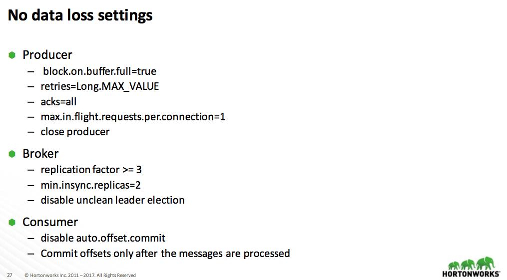

这里翻译一篇关于 Kafka 实践的文章，内容来自 DataWorks Summit/Hadoop Summit（[Hadoop Summit](https://dataworkssummit.com/munich-2017/sessions/apache-kafka-best-practices/)）上一篇分享，PPT 见[Apache Kafka Best Pratices](https://www.slideshare.net/HadoopSummit/apache-kafka-best-practices)，里面讲述了很多关于 Kafka 配置、监控、优化的内容，绝对是在实践中总结出的精华，有很大的借鉴参考意义，本文主要是根据 PPT 的内容进行翻译及适当补充。   Kafka 的架构这里就不多做介绍了，直接不如正题。   
 ## Kafka 基本配置及性能优化 
 这里主要是 Kafka 集群基本配置的相关内容。   
 ### 硬件要求 
 Kafka 集群基本硬件的保证   
| | 集群规模| 内存| CPU| 存储 |
| -----| -----| -----| -----| ----- |
| Kafka Brokers | 3+ | 24GB+（小规模）；64GB+（大规模） | 多核（12CPU+），并允许超线程 | 6+ 1TB 的专属磁盘（RAID 或 JBOD） |
| Zookeeper | 3（小规模）；5（大规模） | 8GB+（小规模）；24GB+（大规模） | 2核+ | SSD 用于中间的日志传输 |

 ### OS 调优 

 - OS page cache：应当可以缓存所有活跃的 Segment（Kafka 中最基本的数据存储单位）； 
 - fd 限制：100k+； 
 - 禁用 swapping：简单来说，swap 作用是当内存的使用达到一个临界值时就会将内存中的数据移动到 swap 交换空间，但是此时，内存可能还有很多空余资源，swap 走的是磁盘 IO，对于内存读写很在意的系统，最好禁止使用 swap 分区（参考[What is swapping in an OS?](https://www.quora.com/What-is-swapping-in-an-OS)）； 
 - TCP 调优； 
 - JVM 配置 
<ol> 
 <li>JDK 8 并且使用 G1 垃圾收集器；</li> 
 <li>至少要分配 6-8 GB 的堆内存。</li> 
</ol>  
 ### Kafka 磁盘存储 

 - 使用多块磁盘，并配置为 Kafka 专用的磁盘； 
 - JBOD vs RAID10； 
 - JBOD（Just a Bunch of Disks，简单来说它表示一个没有控制软件提供协调控制的磁盘集合，它将多个物理磁盘串联起来，提供一个巨大的逻辑磁盘，数据是按序存储，它的性能与单块磁盘类似） 
 - JBOD 的一些缺陷： 
<ul> 
 <li>任何磁盘的损坏都会导致异常关闭，并且需要较长的时间恢复；</li> 
 <li>数据不保证一致性；</li> 
 <li>多级目录；</li> 
</ul> 
 - 社区也正在解决这么问题，可以关注 KIP 112、113： 
<ul> 
 <li>必要的工具用于管理 JBOD；</li> 
 <li>自动化的分区管理；</li> 
 <li>磁盘损坏时，Broker 可以将 replicas 迁移到好的磁盘上；</li> 
 <li>在同一个 Broker 的磁盘间 reassign replicas；</li> 
</ul> 
 - RAID 10 的特点： 
<ul> 
 <li>可以允许单磁盘的损坏；</li> 
 <li>性能和保护；</li> 
 <li>不同磁盘间的负载均衡；</li> 
 <li>高命中来减少 space；</li> 
 <li>单一的 mount point；</li> 
</ul> 
 - 文件系统： 
<ul> 
 <li>使用 EXT 或 XFS；</li> 
 <li>SSD；</li> 
</ul>  
 ### 基本的监控 
 Kafka 集群需要监控的一些指标，这些指标反应了集群的健康度。    
 - CPU 负载； 
 - Network Metrics； 
 - File Handle 使用； 
 - 磁盘空间； 
 - 磁盘 IO 性能； 
 - GC 信息； 
 - ZooKeeper 监控。  
 ## Kafka replica 相关配置及监控 

 ### Kafka Replication 

 - Partition 有两种副本：Leader，Follower； 
 - Leader 负责维护 in-sync-replicas(ISR) 
 - <code>replica.lag.time.max.ms</code>：默认为10000，如果 follower 落后于 leader 的消息数超过这个数值时，leader 就将 follower 从 isr 列表中移除；
 - <code>num.replica.fetchers</code>，默认为1，用于从 leader 同步数据的 fetcher 线程数；
 - <code>min.insync.replica</code>：Producer 端使用来用于保证 Durability（持久性）；</li> 
 ### Under Replicated Partitions 
 当发现 replica 的配置与集群的不同时，一般情况都是集群上的 replica 少于配置数时，可以从以下几个角度来排查问题：    
 - JMX 监控项：kafka.server:type=ReplicaManager,name=UnderReplicatedPartitions； 
 - 可能的原因： 
<ul> 
 <li>Broker 挂了？</li> 
 <li>Controller 的问题？</li> 
 <li>ZooKeeper 的问题？</li> 
 <li>Network 的问题？</li> 
</ul> 
 - 解决办法： 
<ul> 
 <li>调整 ISR 的设置；</li> 
 <li>Broker 扩容。</li> 
</ul>  

 ### Controller 
 - 负责管理 partition 生命周期； 
 - 避免 Controller’s ZK 会话超时： 
<ul> 
 <li>ISR 抖动；</li> 
 <li>ZK Server 性能问题；</li> 
 <li>Broker 长时间的 GC；</li> 
 <li>网络 IO 问题；</li> 
</ul> 
 - 监控： 
<ul> 
 <li>kafka.controller:type=KafkaController,name=ActiveControllerCount，应该为1；</li> 
 <li>LeaderElectionRate。</li> 
</ul>  
 ### Unclean leader 选举 
 允许不在 isr 中 replica 被选举为 leader。    
 - 这是 Availability 和 Correctness 之间选择，Kafka 默认选择了可用性； 
 - <code>unclean.leader.election.enable</code>：默认为 true，即允许不在 isr 中 replica 选为 leader，这个配置可以全局配置，也可以在 topic 级别配置； 
 - 监控：kafka.controller:type=ControllerStats,name=UncleanLeaderElectionsPerSec。  
 ## Broker 配置 
 Broker 级别有几个比较重要的配置，一般需要根据实际情况进行相应配置的：    
 - <code>log.retention.{ms, minutes, hours}</code> , <code>log.retention.bytes</code>：数据保存时间； 
 - <code>message.max.bytes</code>, <code>replica.fetch.max.bytes</code>； 
 - <code>delete.topic.enable</code>：默认为 false，是否允许通过 admin tool 来删除 topic； 
 - <code>unclean.leader.election.enable</code> = false，参见上面； 
 - <code>min.insync.replicas</code> = 2：当 Producer 的 acks 设置为 all 或 -1 时，<code>min.insync.replicas</code> 代表了必须进行确认的最小 replica 数，如果不够的话 Producer 将会报 <code>NotEnoughReplicas</code> 或 <code>NotEnoughReplicasAfterAppend</code> 异常； 
 - <code>replica.lag.time.max.ms</code>（超过这个时间没有发送请求的话，follower 将从 isr 中移除）, num.replica.fetchers； 
 - <code>replica.fetch.response.max.bytes</code>； 
 - <code>zookeeper.session.timeout.ms</code> = 30s； 
 - <code>num.io.threads</code>：默认为8，KafkaRequestHandlerPool 的大小。  
 ## Kafka 相关资源的评估 

 ### 集群评估 

 - Broker 评估 
<ul> 
 <li>每个 Broker 的 Partition 数不应该超过2k；</li> 
 <li>控制 partition 大小（不要超过25GB）；</li> 
</ul> 
 - 集群评估（Broker 的数量根据以下条件配置） 
<ul> 
 <li>数据保留时间；</li> 
 <li>集群的流量大小；</li> 
</ul> 
 - 集群扩容： 
<ul> 
 <li>磁盘使用率应该在 60% 以下；</li> 
 <li>网络使用率应该在 75% 以下；</li> 
</ul> 
 - 集群监控 
<ul> 
 <li>保持负载均衡；</li> 
 <li>确保 topic 的 partition 均匀分布在所有 Broker 上；</li> 
 <li>确保集群的阶段没有耗尽磁盘或带宽。</li> 
</ul>  
 ### Broker 监控 

 - Partition 数：kafka.server:type=ReplicaManager,name=PartitionCount； 
 - Leader 副本数：kafka.server:type=ReplicaManager,name=LeaderCount； 
 - ISR 扩容/缩容率：kafka.server:type=ReplicaManager,name=IsrExpandsPerSec； 
 - 读写速率：Message in rate/Byte in rate/Byte out rate； 
 - 网络请求的平均空闲率：NetworkProcessorAvgIdlePercent； 
 - 请求处理平均空闲率：RequestHandlerAvgIdlePercent。  
 ### Topic 评估 

 - partition 数 
<ul> 
 <li>Partition 数应该至少与最大 consumer group 中 consumer 线程数一致；</li> 
 <li>对于使用频繁的 topic，应该设置更多的 partition；</li> 
 <li>控制 partition 的大小（25GB 左右）；</li> 
 <li>考虑应用未来的增长（可以使用一种机制进行自动扩容）；</li> 
</ul> 
 - 使用带 key 的 topic； 
 - partition 扩容：当 partition 的数据量超过一个阈值时应该自动扩容（实际上还应该考虑网络流量）。  
 ### 合理地设置 partition 

 - 根据吞吐量的要求设置 partition 数： 
<ul> 
 <li>假设 Producer 单 partition 的吞吐量为 P；</li> 
 <li>consumer 消费一个 partition 的吞吐量为 C；</li> 
 <li>而要求的吞吐量为 T；</li> 
 <li>那么 partition 数至少应该大于 T/P、T/c 的最大值；</li> 
</ul> 
 - 更多的 partition，意味着： 
<ul> 
 <li>更多的 fd；</li> 
 <li>可能增加 Unavailability（可能会增加不可用的时间）；</li> 
 <li>可能增加端到端的延迟；</li> 
 <li>client 端将会使用更多的内存。</li> 
</ul>  关于 Partition 的设置可以参考这篇文章[How to choose the number of topics/partitions in a Kafka cluster?](https://www.confluent.io/blog/how-to-choose-the-number-of-topicspartitions-in-a-kafka-cluster/)，这里简单讲述一下，Partition 的增加将会带来以下几个优点和缺点：    
 - 增加吞吐量：对于 consumer 来说，一个 partition 只能被一个 consumer 线程所消费，适当增加 partition 数，可以增加 consumer 的并发，进而增加系统的吞吐量； 
 - 需要更多的 fd：对于每一个 segment，在 broker 都会有一个对应的 index 和实际数据文件，而对于 Kafka Broker，它将会对于每个 segment 每个 index 和数据文件都会打开相应的 file handle（可以理解为 fd），因此，partition 越多，将会带来更多的 fd； 
 - 可能会增加数据不可用性（主要是指增加不可用时间）：主要是指 broker 宕机的情况，越多的 partition 将会意味着越多的 partition 需要 leader 选举（leader 在宕机这台 broker 的 partition 需要重新选举），特别是如果刚好 controller 宕机，重新选举的 controller 将会首先读取所有 partition 的 metadata，然后才进行相应的 leader 选举，这将会带来更大不可用时间； 
 - 可能增加 End-to-end 延迟：一条消息只有其被同步到 isr 的所有 broker 上后，才能被消费，partition 越多，不同节点之间同步就越多，这可能会带来毫秒级甚至数十毫秒级的延迟； 
 - Client 将会需要更多的内存：Producer 和 Consumer 都会按照 partition 去缓存数据，每个 partition 都会带来数十 KB 的消耗，partition 越多, Client 将会占用更多的内存。  
 ## Producer 的相关配置、性能调优及监控 

 ### Quotas 

 - 避免被恶意 Client 攻击，保证 SLA； 
 - 设置 produce 和 fetch 请求的字节速率阈值； 
 - 可以应用在 user、client-id、或者 user 和 client-id groups； 
 - Broker 端的 metrics 监控：throttle-rate、byte-rate； 
 - <code>replica.fetch.response.max.bytes</code>：用于限制 replica 拉取请求的内存使用； 
 - 进行数据迁移时限制贷款的使用，<code>kafka-reassign-partitions.sh -- -throttle option</code>。  
 ### Kafka Producer 

 - 使用 Java 版的 Client； 
 - 使用 <code>kafka-producer-perf-test.sh</code> 测试你的环境； 
 - 设置内存、CPU、batch 压缩； 
<ul> 
 <li>batch.size：该值设置越大，吞吐越大，但延迟也会越大；</li> 
 <li>linger.ms：表示 batch 的超时时间，该值越大，吞吐越大、但延迟也会越大；</li> 
 <li><code>max.in.flight.requests.per.connection</code>：默认为5，表示 client 在 blocking 之前向单个连接（broker）发送的未确认请求的最大数，超过1时，将会影响数据的顺序性；</li> 
 <li><code>compression.type</code>：压缩设置，会提高吞吐量；</li> 
 <li><code>acks</code>：数据 durability 的设置；</li> 
</ul> 
 - 避免大消息 
<ul> 
 <li>会使用更多的内存；</li> 
 <li>降低 Broker 的处理速度；</li> 
</ul>  
 ### 性能调优 

 - 如果吞吐量小于网络带宽 
<ul> 
 <li>增加线程；</li> 
 <li>提高 batch.size；</li> 
 <li>增加更多 producer 实例；</li> 
 <li>增加 partition 数；</li> 
</ul> 
 - 设置 acks=-1 时，如果延迟增大：可以增大 <code>num.replica.fetchers</code>（follower 同步数据的线程数）来调解； 
 - 跨数据中心的传输：增加 socket 缓冲区设置以及 OS tcp 缓冲区设置。  
 ### Prodcuer 监控 

 - batch-size-avg 
 - compression-rate-avg 
 - waiting-threads 
 - buffer-available-bytes 
 - record-queue-time-max 
 - record-send-rate 
 - records-per-request-avg  
 ## Kafka Consumer 配置、性能调优及监控 

 ### Kafka Consumer 

 - 使用 <code>kafka-consumer-perf-test.sh</code> 测试环境； 
 - 吞吐量问题： 
<ul> 
 <li>partition 数太少；</li> 
 <li>OS page cache：分配足够的内存来缓存数据；</li> 
 <li>应用的处理逻辑；</li> 
</ul> 
 - offset topic（<code>__consumer_offsets</code>） 
<ul> 
 <li><code>offsets.topic.replication.factor</code>：默认为3；</li> 
 <li><code>offsets.retention.minutes</code>：默认为1440，即 1day； – MonitorISR，topicsize；</li> 
</ul> 
 - offset commit较慢：异步 commit 或 手动 commit。  
 ### Consumer 配置 

 - <code>fetch.min.bytes</code> 、<code>fetch.max.wait.ms</code>； 
 - <code>max.poll.interval.ms</code>：调用 <code>poll()</code> 之后延迟的最大时间，超过这个时间没有调用 <code>poll()</code> 的话，就会认为这个 consumer 挂掉了，将会进行 rebalance； 
 - <code>max.poll.records</code>：当调用 <code>poll()</code> 之后返回最大的 record 数，默认为500； 
 - <code>session.timeout.ms</code>； 
 - Consumer Rebalance – check timeouts – check processing times/logic – GC Issues 
 - 网络配置；  
 ### Consumer 监控 
 consumer 是否跟得上数据的发送速度。    
 - Consumer Lag：consumer offset 与 the end of log（partition 可以消费的最大 offset） 的差值； 
 - 监控 
<ul> 
 <li>metric 监控：records-lag-max；</li> 
 <li>通过 <code>bin/kafka-consumer-groups.sh</code> 查看；</li> 
 <li>用于 consumer 监控的 LinkedIn’s Burrow；</li> 
</ul> 
 - 减少 Lag 
<ul> 
 <li>分析 consumer：是 GC 问题还是 Consumer hang 住了；</li> 
 <li>增加 Consumer 的线程；</li> 
 <li>增加分区数和 consumer 线程；</li> 
</ul>  
 ## 如何保证数据不丢 
 这个是常用的配置，这里截了 PPT 中的内容   

    
 - <code>block.on.buffer.full</code>：默认设置为 false，当达到内存设置时，可能通过 block 停止接受新的 record 或者抛出一些错误，默认情况下，Producer 将不会抛出 BufferExhaustException，而是当达到 <code>max.block.ms</code> 这个时间后直接抛出 TimeoutException。设置为 true 的意义就是将 <code>max.block.ms</code> 设置为 Long.MAX_VALUE，未来版本中这个设置将被遗弃，推荐设置 <code>max.block.ms</code>。  

 参考：    
 - [Apache Kafka Best Pratices](https://www.slideshare.net/HadoopSummit/apache-kafka-best-practices)； 
 - 胡夕-[【译】Kafka最佳实践 / Kafka Best Practices](http://www.cnblogs.com/huxi2b/p/6720292.html)； 
 - [How to choose the number of topics/partitions in a Kafka cluster?](https://www.confluent.io/blog/how-to-choose-the-number-of-topicspartitions-in-a-kafka-cluster/)； 
 - [raid有哪几种有什么区别？希望讲通俗点](https://www.zhihu.com/question/20131784)； 
 - [File Descriptors and File Handles (and C)](https://stackoverflow.com/questions/33536061/file-descriptors-and-file-handles-and-c#).