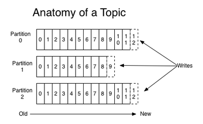
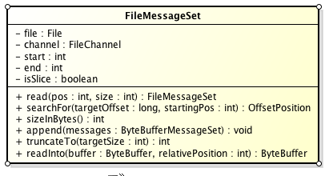
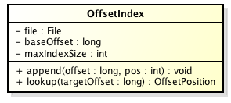

本文主要讲述以下两部分内容：    
 - kafka数据的存储方式； 
 - kafka如何通过offset查找message。  
 ### 1.前言 
 写介绍kafka的几个重要概念（可以参考之前的博文[Kafka的简单介绍](http://matt33.com/2015/11/14/The-Introduce-of-Kafka)）：    
 - <strong>Broker</strong>：消息中间件处理结点，一个Kafka节点就是一个broker，多个broker可以组成一个Kafka集群； 
 - <strong>Topic</strong>：一类消息，例如page view日志、click日志等都可以以topic的形式存在，Kafka集群能够同时负责多个topic的分发； 
 - <strong>Partition</strong>：topic物理上的分组，一个topic可以分为多个partition，每个partition是一个有序的队； 
 - <strong>Segment</strong>：每个partition又由多个segment file组成； 
 - <strong>offset</strong>：每个partition都由一系列有序的、不可变的消息组成，这些消息被连续的追加到partition中。partition中的每个消息都有一个连续的序列号叫做offset，用于partition唯一标识一条消息； 
 - <strong>message</strong>：这个算是kafka文件中最小的存储单位，即是 a commit log。  kafka的message是以topic为基本单位，不同topic之间是相互独立的。每个topic又可分为几个不同的partition，每个partition存储一部的分message。topic与partition的关系如下：   

   其中，partition是以文件夹的形式存储在具体Broker本机上。   
 ### 2.partition中的数据文件 
 有了上面的介绍，下面我们开始介绍Topic中partition的数据文件类型。   
 #### 2.1.segment中的文件 
 对于一个partition（在Broker中以文件夹的形式存在），里面又有很多大小相等的segment数据文件（这个文件的具体大小可以在config/server.properties中进行设置），这种特性可以方便old segment file的快速删除。   下面先介绍一下partition中的segment file的组成：    
 - segment file <strong>组成</strong>：由2部分组成，分别为index file和data file，这两个文件是一一对应的，后缀”.index”和”.log”分别表示索引文件和数据文件； 
 - segment file <strong>命名规则</strong>：partition的第一个segment从0开始，后续每个segment文件名为上一个segment文件最后一条消息的offset,ofsset的数值最大为64位（long类型），20位数字字符长度，没有数字用0填充。如下图所示：  

   关于segment file中index与data file对应关系图，这里我们选用网上的一个图片，如下所示：   

   segment的索引文件中存储着大量的元数据，数据文件中存储着大量消息，索引文件中的元数据指向对应数据文件中的message的物理偏移地址。以索引文件中的3，497为例，在数据文件中表示第3个message（在全局partition表示第368772个message），以及该消息的物理偏移地址为497。   注：Partition中的每条message由offset来表示它在这个partition中的偏移量，这个offset并不是该Message在partition中实际存储位置，而是逻辑上的一个值（如上面的3），但它却唯一确定了partition中的一条Message（可以认为offset是partition中Message的id）。   
 #### 2.2.message文件 
 message中的物理结构为：   

   参数说明：   
| 关键字| 解释说明 |
| -----| ----- |
| 8 byte offset | 在parition(分区)内的每条消息都有一个有序的id号，这个id号被称为偏移(offset),它可以唯一确定每条消息在parition(分区)内的位置。即offset表示partiion的第多少message |
| 4 byte message size | message大小 |
| 4 byte CRC32 | 用crc32校验message |
| 1 byte “magic” | 表示本次发布Kafka服务程序协议版本号 |
| 1 byte “attributes” | 表示为独立版本、或标识压缩类型、或编码类型 |
| 4 byte key length | 表示key的长度,当key为-1时，K byte key字段不填 |
| K byte key | 可选 |
| value bytes payload | 表示实际消息数据 |

 #### 2.3.数据文件的内部实现方法 
 Partition数据文件包含了若干上述格式的message，按照offset由小到大排列在一起，它实现的类是FileMessageSet，类图如下：   

   它的主要方法如下：    
 - <strong>append</strong>: 把给定的ByteBufferMessageSet中的Message写入到这个数据文件中。 
 - <strong>searchFor</strong>: 从指定的startingPosition开始搜索，找到第一个Message判断其offset是大于或者等于指定的offset，并返回其在文件中的位置Position。它的实现方式是从startingPosition开始读取12个字节，分别是当前MessageSet的offset和size。如果当前offset小于指定的offset，那么将position向后移动LogOverHead+MessageSize（其中LogOverHead为offset+messagesize，为12个字节）。 
 - <strong>read</strong>：准确名字应该是slice，它截取其中一部分返回一个新的FileMessageSet。它不保证截取的位置数据的完整性。 
 - <strong>sizeInBytes</strong>: 表示这个FileMessageSet占有了多少字节的空间。 
 - <strong>truncateTo</strong>: 把这个文件截断，这个方法不保证截断位置的Message的完整性。 
 - <strong>readInto</strong>: 从指定的相对位置开始把文件的内容读取到对应的ByteBuffer中。  
 #### 3.查找 

 #### 3.1.遇到的问题 
 我们首先试想一下，如果对于Kafka的一个topic而言，如果topic的partition中只有一个数据文件的话会怎么样？    
 - 新数据是添加在文件末尾（调用FileMessageSet的append方法），不论文件数据文件有多大，这个操作永远都是O(1)的。 
 - 查找某个offset的Message（调用FileMessageSet的searchFor方法）是顺序查找的。因此，如果数据文件很大的话，查找的效率就低。  
 #### 3.2.如何去解决这个问题 
 由上述我们知道，如果在topic的partition中只有一个数据文件的话，Kafka插入的效率虽然很高，但是查找的效率非常低，那么Kafka在内部是如何解决查找效率的的问题呢？对于这个问题，Kafka有两大法宝：分段和索引。   
<strong>数据文件的分段</strong>   这个是比较好理解的，加入有100条message，它们的offset是从0到99，假设将数据文件分为5端，第一段为0-19，第二段为20-39，依次类推，每段放在一个单独的数据文件里面，数据文件以该段中最小的offset命名。这样在查找指定offset的Message的时候，用二分查找就可以定位到该Message在哪个段中。   
<strong>为数据文件建索引</strong>   数据文件分段使得可以在一个较小的数据文件中查找对应offset的message了，但是这依然需要顺序扫描才能找到对应offset的message。为了进一步提高查找的效率，Kafka为每个分段后的数据文件建立了索引文件，文件名与数据文件的名字是一样的，只是文件扩展名为.index。   索引文件中包含若干个索引条目，每个条目表示数据文件中一条message的索引。索引包含两个部分（均为4个字节的数字），分别为相对offset和position。    
 - <strong>相对offset</strong>：因为数据文件分段以后，每个数据文件的起始offset不为0，相对offset表示这条message相对于其所属数据文件中最小的offset的大小。举例，分段后的一个数据文件的offset是从20开始，那么offset为25的message在index文件中的相对offset就是25-20 = 5。存储相对offset可以减小索引文件占用的空间。 
 - <strong>position</strong>：表示该条message在数据文件中的绝对位置。只要打开文件并移动文件指针到这个position就可以读取对应的message了。  在kafka中，索引文件的实现类为OffsetIndex，它的类图如下：   

   主要的方法有：    
 - append方法：添加一对offset和position到index文件中，这里的offset将会被转成相对的offset。 
 - lookup：用二分查找的方式去查找小于或等于给定offset的最大的那个offset  
 #### 3.3.通过offset查找message 
 假如我们想要读取offset=368776的message（见前面的第三个图），需要通过下面2个步骤查找。    
 - <strong>查找segment file</strong> 00000000000000000000.index表示最开始的文件，起始偏移量(offset)为0.第二个文件00000000000000368769.index的消息量起始偏移量为368770 = 368769 + 1.同样，第三个文件00000000000000737337.index的起始偏移量为737338=737337 + 1，其他后续文件依次类推，以起始偏移量命名并排序这些文件，只要根据offset <strong>二分查找</strong>文件列表，就可以快速定位到具体文件。 当offset=368776时定位到00000000000000368769.index|log 
 - 通过segment file<strong>查找message</strong> 通过第一步定位到segment file，当offset=368776时，依次定位到00000000000000368769.index的元数据物理位置和00000000000000368769.log的物理偏移地址，然后再通过00000000000000368769.log顺序查找直到offset=368776为止。  segment index file并没有为数据文件中的每条message建立索引，而是采取稀疏索引存储方式，每隔一定字节的数据建立一条索引，它减少了索引文件大小，通过map可以直接内存操作，稀疏索引为数据文件的每个对应message设置一个元数据指针,它比稠密索引节省了更多的存储空间，但查找起来需要消耗更多的时间。   总结：   Kafka高效文件存储设计特点：    
 - Kafka把topic中一个parition大文件分成多个小文件段，通过多个小文件段，就容易定期清除或删除已经消费完文件，减少磁盘占用。 
 - 通过索引信息可以快速定位message和确定response的最大大小。 
 - 通过index元数据全部映射到memory，可以避免segment file的IO磁盘操作。 
 - 通过索引文件稀疏存储，可以大幅降低index文件元数据占用空间大小。  