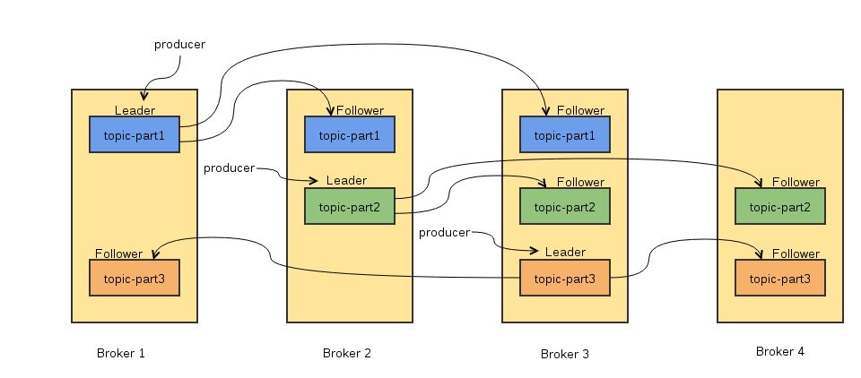

问题研究：    
 - 研究Kafka consumer和broker之间的数据传输方式？ 
 - Kafka是如何保证可靠性？ 
 - 消费机制是consumer pull还是broker push？, 如果是push的话，kafka是否知道数据传输成功  
 ## 0.写在前面 
 昨天整理完[Kafka之数据存储](http://matt33.com/2016/03/08/kafka-store)之后，今天决定再把笔记中kafka消息传输部分整理一下，逐步去完善kafka系列的博文。本文中讲述的kafka是0.8.1版，目前最新版的0.9.0版把consumer的The high-level Consumer API和The SimpleConsumer API结合到了一起，这个是最新版的变化的最大之处，这个以后再讲（本来打算分两篇讲解consumer的，看来这样写了）。   
 ## 1.消息传递机制 
 kafka在保证消息在producer和consumer之间的传输，主要有以下几种可能的delivery guaratee:    
 - <strong>At most once</strong>：消息可能会丢，但绝不会重复传输; 
 - <strong>At least one</strong>：消息绝不会丢，但可能会重复传输; 
 - <strong>Exactly once</strong>：每条消息肯定会被传输一次且仅传输一次.  
<strong>producer到broker端</strong>，当kafka的producer向broker发送消息时，一旦这条消息被commit，因为有replication的存在，它就不会丢失。但如果producer发送数据给broker后，遇到的网络问题而造成通信中断，那producer就无法判断该条消息是否已经commit，（这一点有点像向一个自动生成primary key的数据库表中插入数据，虽然Kafka无法确定网络故障期间发生了什么，但是producer可以生成一种类似于primary key的东西，发生故障时幂等性的retry多次，这样就做到了Exactly one。这一feature可能会在kafka未来的版本中实现），目前默认的情况下，一条消息从producer到broker是确保了At least once，但可通过设置producer异步发送实现At most once（可以在request.required.acks中设置）。   
<strong>broker到consumer端</strong>（对于heigh level API），consumer在从broker读取消息后，可以选择commit，该操作会在zookeeper中存储下该consumer在该partition下读取消息的offset。该consumer下一次再读该partition时会从下一条开始读取。如未commit，下一次读取的开始位置会跟上一次commit之后的开始位置相同。当然可以将consumer设置为autocommit，即consumer一旦读到数据立即自动commit。如果只讨论这一读取消息的过程，那Kafka是确保了Exactly once。但实际上实际使用中consumer并非读取完数据就结束了，而是要进行进一步处理，而数据处理与commit的顺序在很大程度上决定了消息从broker和consumer的delivery guarantee semantic。下面介绍以下这两种情况的区别：    
 - 读完消息先commit再处理消息。这种模式下，如果consumer在commit后还没来得及处理消息就crash了，下次重新开始工作后就无法读到刚刚已提交而未处理的消息，这就对应于At most once； 
 - 读完消息先处理再commit。这种模式下，如果处理完了消息在commit之前consumer crash了，下次重新开始工作时还会处理刚刚未commit的消息，实际上该消息已经被处理过了。这就对应于At least once。  如果一定要做到Exactly once，就需要协调offset和实际操作的输出。精典的做法是引入
<strong>两阶段提交</strong>。如果能让offset和操作输入存在同一个地方，会更简洁和通用。这种方式可能更好，因为许多输出系统可能不支持两阶段提交。比如，consumer拿到数据后可能把数据放到HDFS，如果把最新的offset和数据本身一起写到HDFS，那就可以保证数据的输出和offset的更新要么都完成，要么都不完成，间接实现Exactly once。（目前就high level API而言，offset是存于Zookeeper中的，无法存于HDFS，而low level API的offset是由自己去维护的，可以将之存于HDFS中）。   总之，kafka默认保证At least once，并且允许通过设置producer异步提交来实现At most once。而Exactly once要求与目标存储系统协作，幸运的是kafka提供的offset可以使用这种方式非常直接非常容易。   
 ## 2. 消费机制 

 - <strong>Topic</strong>：Topic在逻辑上可以认为是一个queue，每条消息必须指定它的topic，可以简单理解为把这条消息放进哪个queue里； 
 - <strong>partition</strong>：为了使kafka的吞吐率可以水平扩展，物理上把topic分成为一个或多个partition，每个partition物理上对应一个文件夹，该文件夹下存储这个partition的所有消息和索引文件。  kafka消费高效率的原因：    
 - 顺序写入磁盘； 
 - broker是无状态的，不需要锁机制；  
 ### 2.1.磁盘顺序写入 
 一个和磁盘性能有关的关键事实是：磁盘驱动器的吞吐量跟寻到延迟是相背离的，也就是说，线性写的速度远远大于随机写。比如：在一个6 7200rpm SATA RAID-5 的磁盘阵列上线性写的速度大概是600M/秒，但是随机写的速度只有100K/秒，两者相差将近6000倍。线性读写在大多数应用场景下是可以预测的，因此，操作系统利用read-ahead和write-behind技术来从大的数据块中预取数据，或者将多个逻辑上的写操作组合成一个大写物理写操作中（[Kafka设计原理详解](http://blog.csdn.net/suifeng3051/article/details/48053965)）。   
 ### 2.2.broker的无状态 
 kafka在为每个consuemr group保留一些metadata信息（当前消费的position，即offset），这个offset由consumer控制，正常情况下consumer会在消费完一条消息后线性增加这个offset。因此，在一些情况下，kafka可以重新设置offset来重新消费一些信息。因为offset由consumer控制，所以broker是无状态的，它不需要标记哪些消息被哪些consumer消费过了，不需要通过broker去保证同一个consumer group只有一个consumer能消费同一条信息，因此不需要锁机制。   
 #### 2.2.1.replica 
 先说一下kafka为何需要Replication，在Kafka在0.8以前的版本中，是没有Replication的，一旦某一个Broker宕机，则其上所有的Partition数据都不可被消费，这与kafka数据持久性及Delivery Guarantee的设计目标相悖。同时Producer都不能再将数据存于这些Partition中。    
 - 如果Producer使用同步模式则Producer会在尝试重新发送<code>message.send.max.retries</code>（默认值为3）次后抛出Exception，用户可以选择停止发送后续数据也可选择继续选择发送。而前者会造成本应发往该Broker的数据的丢失，后者会造成数据的阻塞。 
 - 如果Producer使用异步模式，则Producer会尝试重新发<code>送message.send.max.retries</code>（默认值为3）次后记录该异常并继续发送后续数据，这会造成数据丢失并且用户只能通过日志发现该问题。  由此可见，在没有Replication的情况下，一旦某机器宕机或者某个Broker停止工作则会造成整个系统的可用性降低。随着集群规模的增加，整个集群中出现该类异常的几率大大增加，因此对于生产系统而言Replication机制的引入非常重要。 　　   当一个topic有多个partition，而每个partition又有多个replica时，kafka的Replica算法如下：    
 - 将所有Broker（假设共有n个Broker）和待分配的Partition排序； 
 - 将第i个Partition分配到第<code>i mod n</code>个Broker上； 
 - 将第i个Partition的第j个Replica分配到第<code>(i + j) mod n</code>个Broker上。  下面我们举一个例子，假设topic有3个partition，而每个partition又有3个replica，此时Broker有4个节点，Replica分配效果图如下：   

   
 #### 2.2.2.leader 
 接着，我们再说一下kafka为何需要Leader Election。   在引入Replication之后，同一个Partition可能会有多个Replica，而这时需要在这些Replication之间选出一个Leader，Producer和Consumer只与这个Leader交互，其它Replica作为Follower从Leader中复制数据。   因为需要保证同一个Partition的多个Replica之间的数据一致性（其中一台宕机后其它Replica必须要能继续服务并且即不能造成数据重复也不能造成数据丢失）。如果没有一个Leader，所有Replica都可同时读/写数据，那就需要保证多个Replica之间互相（$N×N$条通路）同步数据，数据的一致性和有序性非常难保证，大大增加了Replication实现的复杂性，同时也增加了出现异常的机率。而引入Leader后，只有Leader负责数据读写，Follower只向Leader顺序Fetch数据（N条通路），系统更加简单且高效。   leader的性质有以下几条：    
 - 每个partition都有一个leader，所有的读写操作都在leader上完成； 
 - 一般情况下，partition大于等于broker的数量，并且所有partition的leader均匀分布在broker上，follower上的日志和其leader上的完全一样。 
 - leader会track <code>in sync</code>的node list。如果一个follower宕机或者落后太多(超过预定值)，leader就把它从<code>in sync list</code>中移除。   
 - 一条消息只有被<code>in sync list</code>里的所有follower都从leader复制过来才会被认为已提交（避免了一些数据写入了leader，但还没来得及被任何follower复制就宕机了而造成数据丢失）。对于producer而言，它可以选择是否等待消息commit，这可以通过<code>request.required.acks</code>来设置，这种机制确保了只要<code>in sync list</code>有一个或一个以上的follower，一条被commit的消息就不会丢失。  同步复制与异步复制的区别：    
 - <strong>同步复制</strong>，要求alive状态的follower都复制完，这条消息才会被commit，这种复制方式极大的影响了吞吐率； 
 - <strong>异步复制</strong>，follower异步地从leader复制数据，数据只要被写入log就认为已经commit，这种情况下如果follower都落后于leader，而leader都落后于leader，而leader突然宕机则会丢失数据。  kafka判断一台broker是否alive的条件有两个：    
 - broker必须维护与zookeeper的session（zookeeper的心跳机制）； 
 - follower必须能够及时将leader的writting复制过来，不能落后太多（在<code>config/server.properties</code>设置，如下）；  
``` scala
#If a replica falls more than this many messages behind the leader, the leader will remove the follower from ISR and treat it as dead
replica.lag.max.messages=4000
#If a follower hasn't sent any fetch requests for this window of time, the leader will remove the follower from ISR (in-sync replicas) and treat it as dead
replica.lag.time.max.ms=10000
```
 而kafka的复制机制既不是完全的同步复制，也不是单纯的异步复制。kafka使用了in sync list的方式，很好的均衡了确保数据不丢失以及吞吐率，follower可以批量的从leader复制数据，这样极大的提高复制能力（批量写入磁盘），极大地减少了follower与leader的差距。   这里介绍一下kafka的
<strong>ISR(in-sync replicas)模式</strong>。kafka在zookeeper中动态地维护了一个ISR，这个ISR里的所有Replica都跟的上了leader，只有ISR成员才有被选为leader的可能。在这种模式下，对于f+1个Replica，一个Partition能在保证不丢失（已经commit）的前提下容忍f个Replica的失败。在大多数场景下，这种模式是非常有利的。   
<strong>当leader宕机的情况，leader election算法</strong>   这种情况是很复杂的，当leader宕机时，我们需要在follower中选举出新的leader。因为follower可能落后于许多或者宕机了，所以必须保证“最新”的follower作为leader。一个基本的原则就是，如果leader不在了，新的leader必须拥有原来的leader commit的所有消息。这就需要做一个折衷，如果leader标明一条消息被commit前等待更多的follower确认，那它die之后就会有更多的leader可以作为新的leader，但这也会造成吞吐率的下降。   常见的leader election算法有：    
 - [HDFS的HA feature](http://blog.cloudera.com/blog/2012/10/quorum-based-journaling-in-cdh4-1/) 
 - [zookeeper的Zzb](http://web.stanford.edu/class/cs347/reading/zab.pdf) 
 - [zookeeper的Viewstamped Replication](http://pmg.csail.mit.edu/papers/vr-revisited.pdf) 
 - [zookeeper的Raft](https://ramcloud.stanford.edu/wiki/download/attachments/11370504/raft.pdf) 
 - [MS的PacificA算法](http://research.microsoft.com/apps/pubs/default.aspx?id=66814)  kafka使用的leader elcetion算法与微软的Pacifica算法相似，就是上面所讲述的ISR模式。kafka在zookeeper中动态地维护了一个ISRset，这个set里的所有replica都跟上了leader，只有ISR里的成员才有被选为leader的可能。在这种模式下，对于f+1个replica，一个topic在保证不丢失已经commit的消息的前提下最多可以容忍f个replica的失败。   
<strong>如何处理所有Replica都不工作的情况</strong>   前面已经提到，在ISR中至少有一个follower时，Kafka可以确保已经commit的数据不丢失，但如果某个Partition的所有Replica都宕机了，就无法保证数据不丢失了。这种情况下有两种可行的方案：    
 - 等待ISR中的任一个Replica“活”过来，并且选它作为Leader； 
 - 选择第一个“活”过来的Replica（不一定是ISR中的）作为Leader。 　  这就需要在可用性和一致性当中作出一个简单的折衷。如果一定要等待ISR中的Replica“活”过来，那不可用的时间就可能会相对较长。而且如果ISR中的所有Replica都无法“活”过来了，或者数据都丢失了，这个Partition将永远不可用。选择第一个“活”过来的Replica作为Leader，而这个Replica不是ISR中的Replica，那即使它并不保证已经包含了所有已commit的消息，它也会成为Leader而作为consumer的数据源（前文有说明，所有读写都由Leader完成）。Kafka0.8.*使用了第二种方式。根据Kafka的文档，在以后的版本中，Kafka支持用户通过配置选择这两种方式中的一种，从而根据不同的使用场景选择高可用性还是强一致性。   
<strong>如何选举Leader</strong>   最简单最直观的方案是，所有Follower都在Zookeeper上设置一个Watch，一旦Leader宕机，其对应的ephemeral znode会自动删除，此时所有Follower都尝试创建该节点，而创建成功者（Zookeeper保证只有一个能创建成功）即是新的Leader，其它Replica即为Follower。   但是该方法会有3个问题： 　　    
 - split-brain，这是由Zookeeper的特性引起的，虽然Zookeeper能保证所有Watch按顺序触发，但并不能保证同一时刻所有Replica“看”到的状态是一样的，这就可能造成不同Replica的响应不一致； 
 - herd effect，如果宕机的那个Broker上的Partition比较多，会造成多个Watch被触发，造成集群内大量的调整； 
 - Zookeeper负载过重，每个Replica都要为此在Zookeeper上注册一个Watch，当集群规模增加到几千个Partition时Zookeeper负载会过重。  Kafka 0.8.*的Leader Election方案解决了上述问题，它在所有broker中选出一个
<strong>controller</strong>，所有Partition的Leader选举都由controller决定。controller会将Leader的改变直接通过RPC的方式（比Zookeeper Queue的方式更高效）通知需为此作出响应的Broker。同时controller也负责增删Topic以及Replica的重新分配。   
 ### 2.3.consumer的reblance 
 kafka保证同一个consumer group中只有一个consumer会消费某条消息，实际上，kafka保证的事稳定状态下每一个consumer实例只会消费某一个或特定partition的数据，而某个partition的数据只会被某一个特定的consumer实例所消费。   这样设计的优点：    
 - 每个consumer不用都跟broker进行大量的通信，减少通信开销，降低了分配难度； 
 - 同一个partition里的数据是有序的，保证每个partition里的数据是有序被消费的。  设计的缺点：    
 - 无法让同一个group里的consumer均匀消费数据。  consumer的
<strong>reblance算法</strong>如下（去看源码分析）：    
 - Sort $PT$ (all partitions in topic T) 
 - Sort $CG$(all consumers in consumer group G) 
 - Let i be the index position of $C_{i}$ in $CG$ and let $N=\lceil\frac{size(PT)}{size(CG)}\rceil$ 
 - Remove current entries owned by $C_{i}$ from the partition owner registry 
 - Assign partitions from $iN$ to $(i+1)N-1$ to consumer $C_{i}$ 
 - Add newly assigned partitions to the partition owner registry  consumer的
<strong>reblance算法</strong>如下：    
 - 对topic下的所有partition进行排序，结果记为$PT$； 
 - 对订阅这个topic的Group下的所有consumer进行排序，记为$CG$； 
 - 记i为CG中的idex，第i个consumer记为$C_{i}$，$N=\lceil\frac{size(PT)}{size(CG)}\rceil$； 
 - 解除原来$C_{i}$对分配的Partition的消费权； 
 - 将第 $iN$ 到 $(i+1)N-1$个partitions重新分配给$C_{i}$.  目前consumer rebalance的控制策略是由每一个consumer通过Zookeeper完成的。具体的
<strong>控制方式</strong>如下（去看源码分析）：    
 - Register itself in the consumer id registry under its group. 
 - Register a watch on changes under the consumer id registry. 
 - Register a watch on changes under the broker id registry. 
 - If the consumer creates a message stream using a topic filter, it also registers a watch on changes under the broker topic registry. 
 - Force itself to rebalance within in its consumer group.  在这种策略下，每一个consumer或者broker的增加或者减少都会触发consumer rebalance。因为每个consumer只负责调整自己所消费的partition，为了保证整个consumer group的一致性，所以当一个consumer触发了rebalance时，该consumer group内的其它所有consumer也应该同时触发rebalance   这样的缺点是：    
 - Herd effect，任何broker或者consumer的增减都会触发所有的consumer的rebalance； 
 - Split Brain，每个consumer分别单独通过Zookeeper判断哪些partition down了，那么不同consumer从Zookeeper“看”到的view就可能不一样，这就会造成错误的reblance尝试。而且有可能所有的consumer都认为rebalance已经完成了，但实际上可能并非如此。  根据Kafka官方文档，Kafka作者正在考虑在还未发布的[0.9.x版本](https://cwiki.apache.org/confluence/display/KAFKA/Kafka+0.9+Consumer+Rewrite+Design)中使用中心协调器(coordinator)。大体思想是选举出一个broker作为coordinator，由它watch Zookeeper，从而判断是否有partition或者consumer的增减，然后生成rebalance命令，并检查是否这些rebalance在所有相关的consumer中被执行成功，如果不成功则重试，若成功则认为此次rebalance成功（这个过程跟replication controller非常类似，所以我很奇怪为什么当初设计replication controller时没有使用类似方式来解决consumer rebalance的问题）   
 ## 3.pull 
 参[流式计算-kafka（一）](http://mp.weixin.qq.com/s?__biz=MzA4MzEzNjA0NA==&mid=222594584&idx=1&sn=d64e5f5768ce48bd0bee1824b30fb1e3&scene=0#rd)   作为一个message system，kafka遵循了传统的方式，选择由kafka的producer向broker push信息，而consumer从broker pull信息。   consumer获取消息，可以使用两种方式：push或pull模式。下面我们简单介绍一下这两种区别：   
<strong>push模式</strong>   常见的push模式如storm的消息处理，由spout负责消息的推送。该模式下需要一个中心节点，负责消息的分配情况（哪段消息分配给consumer1，哪段消息分配给consumer2），同时还要监听consumer的ack消息用于判断消息是否处理成功，如果在timeout时间内为收到响应可以认为该consumer挂掉，需要重新分配sonsumer上失败的消息。这种模式有个问题，不太容易实现我们想要的消息回放功能，因为理想情况下由consumer决定我到底要消费什么，而这种模式完全由master决定。   
<strong>pull模式</strong>   如上图模式，该模式为pull模式，由consumer决定消息的消费情况，这种模式有一个好处是我们不需要返回ack消息，因为当consumer申请消费下一批消息时就可以认为上一批消息已经处理完毕，也不需要处理超时的问题，consumer可以根据自己的消费能力来消费消息。但这个还有一个问题，如何保证处理的消息的不会重复呢，kafka具体做法就是增加队列的并发度（partition），可以一个partition对准一个consumer。   综上，kafka的consumer之所以没有采用push模式，是因为push模式很难适应消费者速率不同的消费者而且很难实现消息的回放功能，因为消息发送速率是由broker决定的。push模式的目标就是尽可能以最快速度传递消息，但是这样很容易造成consumer来不及处理消息，典型的表现就是拒绝服务以及网络拥塞，而pull模式则可以根据consumer的消费能力以适当的速率消费message。   pull与push的区别   pull技术：    
 - 客户机向服务器请求信息； 
 - kafka中，consuemr根据自己的消费能力以适当的速率消费信息；  push技术：    
 - 服务器主动将信息发往客户端的技术； 
 - push模式的目标就是尽可能以最快的速率传递消息。  