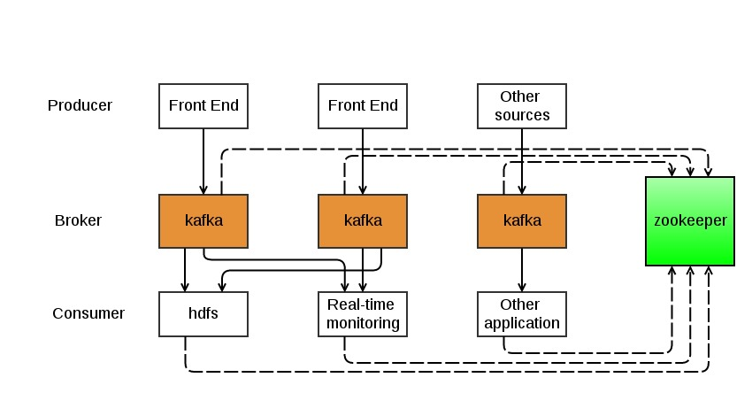
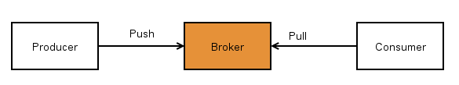
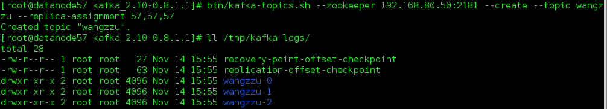
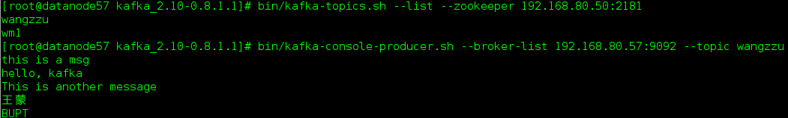
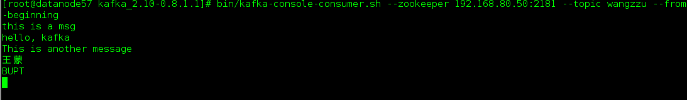

这篇文章主要是简单地把Kafka的背景，基础知识和应用场景介绍一下，算是一篇入门的文章。   
 ## 1.kafka介绍 
 关于kafka入门的文章最好的就莫过于kafka的[官方文档](http://kafka.apache.org/documentation.html)了，这上面对kafka的定义是：   
<blockquote> Kafka is a distributed, partitioned, replicated commit log service. It provides the functionality of a messaging system, but with a unique design.   
</blockquote> kafka是一个分布式的，可分区的，可备份的日志提交服务，它使用独特的设计实现了一个消息系统的功能。   到底kafka使用什么独特的设计可以让它在消息处理领域独占鳌头呢？这就涉及到kafka的内部机制，这些我会在后续的文章中向大家慢慢介绍，这里先介绍一下kafka集群的基本结构和kafka的一些专业术语。   
 ### 1.1.kafka集群的基本架构 
 一个典型的kafka集群架构如下图所示：   

   kafka集群常用的场景就是，producer把日志信息推送（push）到broker节点上，然后consumer（可以是写入到hdfs或者其他的一些应用）再从broker拉取（pull）信息。kafka的push&amp;pull机制如下图所示，具体的这样设计的原因我会在后续的文章中进行介绍。   

   作为一个message system，kafka遵循了传统的方式，选择由kafka的producer向broker push信息，而consumer从broker pull信息。kafka的consumer之所以没有采用push模式，主要是因为push模式很难适应速率不同的consumer，因为消息发送速率是由broker决定的。push模式的目标就是尽可能以最快速度传递消息，但是这样很容易造成consumer来不及处理消息，典型的表现就是拒绝服务以及网络拥塞，而pull模式则可以根据consumer的消费能力以适当的速率消费message。   
 ### 1.2.专业术语 
 kafka使用的一些主要的专业术语：    
 - <strong>Topic</strong>：特指Kafka处理的消息源的不同分类，其实也可以理解为对不同消息源的区分的一个标识； 
 - <strong>Partition</strong>：Topic物理上的分组，一个topic可以设置为多个partition，每个partition都是一个有序的队列，partition中的每条消息都会被分配一个有序的id（offset）； 
 - <strong>Message</strong>：消息，是通信的基本单位，每个producer可以向一个topic（主题）发送一些消息； 
 - <strong>Producers</strong>：消息和数据生产者，向Kafka的一个topic发送消息的过程叫做producers（producer可以选择向topic哪一个partition发送数据）。 
 - <strong>Consumers</strong>：消息和数据消费者，接收topics并处理其发布的消息的过程叫做consumer，同一个topic的数据可以被多个consumer接收； 
 - <strong>Broker</strong>：缓存代理，Kafka集群中的一台或多台服务器统称为broker。  理解了上述概念之后，再来看kafka就容易了。   
 ### 1.3.kafka的应用场景 
 Kafka主要用于处理流式数据。流式数据在web网站应用中非常常见，这些数据包括网站的pv、用户访问了什么内容，搜索了什么内容等。这些数据通常以日志的形式记录下来，然后每隔一段时间进行一次统计处理。Kafka的作用类似于缓存，能够很好地处理实时和离线应用。   
 ## 2.概念详解 
 
 ### 2.1.topic 
 正如前面介绍的，topic是kafka发送消息的一个标识，一般以目录的形式存在，对于一个有三个partition的topic而言，它日志信息结构大概如下图所示：   

   每一个partition实际上都是一个有序的，不可变的消息序列，producer发送到broker的消息会写入到相应的partition目录下，每个partition都会有一个有序的id（offset），这个offset确定这个消息在partition中的具体位置。   举一个例子，我们在一个kafka集群中建立的名为wangzzu，partition数为3的topic，kafka就会在broker的/tmp/kafka-logs（目录可以修改，可参考我[kafka集群安装与配置](http://matt33.com/2015/11/13/kafka-install/)）新建三个目录，这里我们直接指定将三个partition建立在同一个broker上，如下图所示：   

   当启动producer程序时，就会向kafka集群发送信息，而kafka就会把中间信息存储在这三个目录下，具体的发送方式和消息存储结构会在以后的文章中介绍。   
 ### 2.2.producer 
 producer这部分相比较而言，是比较简单的，就是把消息发送给它所选择的topic，也可以具体指定发给这个topic的哪个一个partition，否则producer就会使用hashing-based partitioner来决定发送到哪个partition，这个问题还是需要多说一些，之前我在测试kafka速度的时候就遇到了这个问题，当我们增加broker的数量时，kafka的发送速度并没有线性增加，最后发现就是因为这个原因，没有指明发送数据到哪个partition，具体的解释我就引用官网[WIKI](https://cwiki.apache.org/confluence/display/KAFKA/FAQ)中给出回答：   
<blockquote> In Kafka producer, a partition key can be specified to indicate the destination partition of the message. By default, a hashing-based partitioner is used to determine the partition id given the key, and people can use customized partitioners also. To reduce # of open sockets, in 0.8.0([High number of open file handles in 0.8 producer](https://issues.apache.org/jira/browse/KAFKA-1017)), when the partitioning key is not specified or null, a producer will pick a random partition and stick to it for some time (default is 10 mins) before switching to another one. So, if there are fewer producers than partitions, at a given point of time, some partitions may not receive any data. To alleviate this problem, one can either reduce the metadata refresh interval or specify a message key and a customized random partitioner. For more detail see [this thread](http://mail-archives.apache.org/mod_mbox/kafka-dev/201310.mbox/%3CCAFbh0Q0aVh%2Bvqxfy7H-%2BMnRFBt6BnyoZk1LWBoMspwSmTqUKMg%40mail.gmail.com%3E)   
</blockquote> 
 ### 2.3.consumer 
 这里的consumer部分，主要是以High Level Consumer API为例。   consumer是一个抽象的概念，调用Consumer API的程序都可以称作为一个consumer，它从broker端订阅某个topic的消息。如果只有一个consumer的话，该topic（可能含有多个partition）下所有消息都会被这个consumer接收。但是在分布式的环境中，我们可能会遇到这样一种情景，对于一个有多个partition的topic，我们希望启动多个consumer去消费这些partition（如果发送速度较快，一个consumer是无法消费完的），并且要求topic的一条消息只能发给其中一个consumer，不希望这些conusmer出现重复接收一条消息的情况。对于这种情况，我们应该怎么办呢？kafka给我们提供了一种机制，可以很好来适应这种情况，那就是
<strong>consumer group</strong>（当然也可以应用在第一种情况，实际上，如果只有一个consumer时，是不需要指定consumer group，这时kafka会自动给这个consumer生成一个group名）。   在调用conusmer API时，一般都会指定一个consumer group，该group订阅的topic的每一条消息都发送到这个group的某一台机器上。借用官网一张图来详细介绍一下这种情况，假如kafka集群有两台broker，集群上有一个topic，它有4个partition，partition 0和1在broker1上，partition 2和3在broker2上，这时有两个consumer group同时订阅这个topic，其中一个group有2个consumer，另一个consumer有4个consumer，则它们的订阅消息情况如下图所示：   

   因为group A只有两个consumer，所以一个consumer会消费两个partition；而group B有4个consumer，一个consumer会去消费一个partition。这里要注意的是，kafka可以保证一个
<strong>partition内的数据是有序的</strong>，所以group B中的consumer收到的数据是可以保证有序的，但是Group A中的consumer就无法保证了。   group读取topic，
<strong>partition分配</strong>机制是：    
 - 如果group中的consumer数小于topic中的partition数，那么group中的consumer就会消费多个partition； 
 - 如果group中的consumer数等于topic中的partition数，那么group中的一个consumer就会消费topic中的一个partition； 
 - 如果group中的consumer数大于topic中的partition数，那么group中就会有一部分的consumer处于空闲状态。  
 ## 3.kafka的简单使用 
 这部分是利用kafka自带的kafka-console-producer.sh和kafka-console-consumer.sh来发送和接收消息，而具体如何调用 kafka API使用kafka会在后续的文章中介绍。   首先要启动kafka和建立topic，可参考[Kafka常用的一些命令](http://matt33.com/2015/05/20/KafkaOrder/)   
``` scala
nohup bin/kafka-server-start.sh config/server.properties & #启动kafka，并且使用nohup将日志输出到当前目录的nohup.out中，使用&后台运行
```
 topic还接着使用wangzzu（建立topic命令参考2.1中的图片），下面开启kafka-console-producer.sh并发送几条消息   

   然后，启动kafka-console-consumer.sh就可以收到我们发送的这几条消息   

   这个就是kafka的最简单的使用情况了。   希望这篇文章对初学者能有所帮助（转载请注明出处）。   
<hr> 
 #### 参考 
  
 - [Kafka官方文档](http://kafka.apache.org/documentation.html)