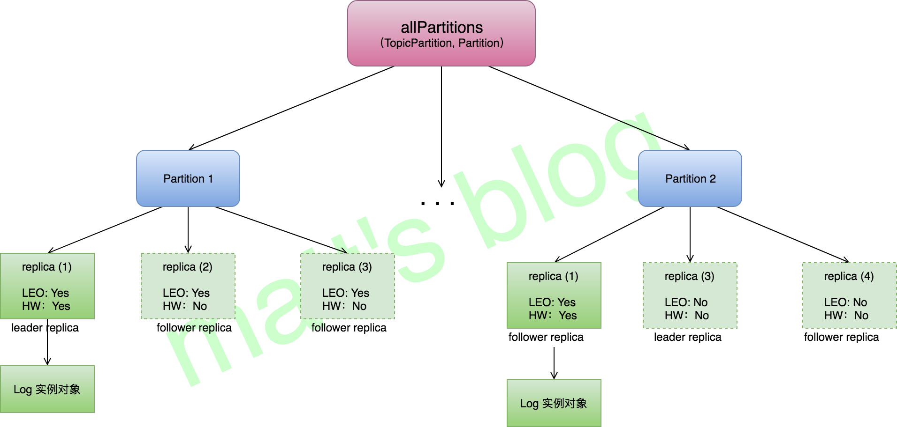
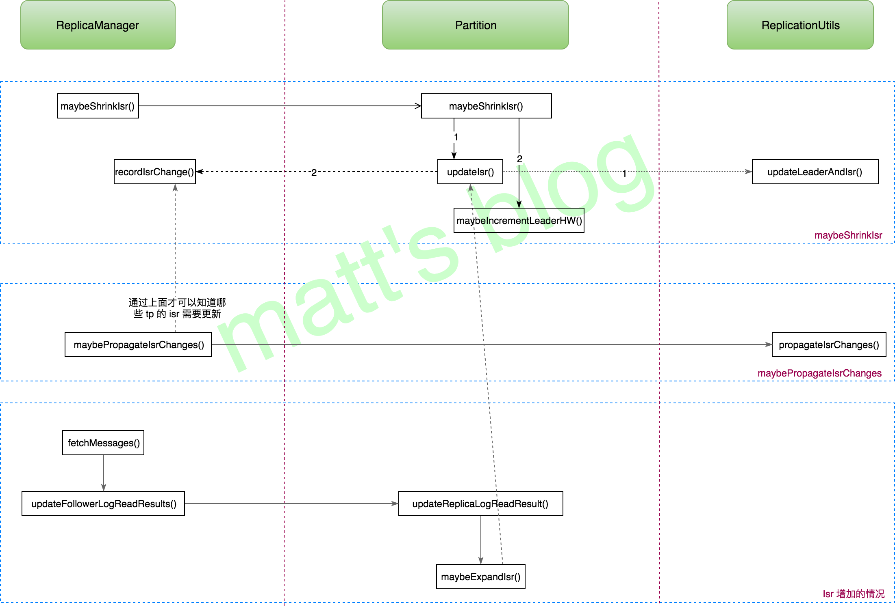

前面几篇文章讲述了 LogManager 的实现、Produce 请求、Fetch 请求的处理以及副本同步机制的实现，Kafka 存储层的主要内容基本上算是讲完了（还有几个小块的内容后面会结合 Controller 再详细介绍）。本篇文章以 ReplicaManager 类为入口，通过对 ReplicaManager 的详解，顺便再把 Kafka 存储层的内容做一个简单的总结。   
 ## ReplicaManager 简介 
 前面三篇文章，关于 Produce 请求、Fetch 请求以及副本同步流程的启动都是由 ReplicaManager 来控制的，ReplicaManager 可以说是 Server 端重要的组成部分，回头再仔细看下 KafkaApi 这个类，就会发现 Server 端要处理的多种类型的请求都是 ReplicaManager 来处理的，ReplicaManager 需要处理的请求的有以下六种：    
 - LeaderAndIsr 请求； 
 - StopReplica 请求； 
 - UpdateMetadata 请求； 
 - Produce 请求； 
 - Fetch 请求； 
 - ListOffset 请求；  其中后面三个已经在前面的文章中介绍过，前面三个都是 Controller 发送的请求，虽然是由 ReplicaManager 中处理的，也会在 Controller 部分展开详细的介绍。   这里先看下面这张图，这张图把 ReplicaManager、Partition、Replica、LogManager、Log、logSegment 这几个抽象的类之间的调用关系简单地串了起来，也算是对存储层这几个重要的部分简单总结了一下：   

   对着上面的图，简单总结一下：    
 - ReplicaManager 是最外层暴露的一个实例，前面说的那几种类型的请求都是由这个实例来处理的； 
 - LogManager 负责管理本节点上所有的日志（Log）实例，它作为 ReplicaManager 的变量传入到了 ReplicaManager 中，ReplicaManager 通过 LogManager 可以对相应的日志实例进行操作； 
 - 在 ReplicaManager 中有一个变量：allPartitions，它负责管理本节点所有的 Partition 实例（只要本节点有这个 partition 的日志实例，就会有一个对应的 Partition 对对象实例）； 
 - 在创建 Partition 实例时，ReplicaManager 也会作为成员变量传入到 Partition 实例中，Partition 通过 ReplicaManager 可以获得 LogManager 实例、brokerId 等； 
 - Partition 会为它的每一个副本创建一个 Replica 对象实例，但只会为那个在本地副本创建 Log 对象实例（LogManager 不存在这个 Log 对象的情况下，有的话直接引用），这样的话，本地的 Replica 也就与 Log 实例建立了一个联系。  关于 ReplicaManager 的 allPartitions 变量可以看下面这张图（假设 Partition 设置的是3副本）：   

   allPartitions 管理的 Partition 实例，因为是 3 副本，所以每个 Partition 实例又会管理着三个 Replica，其中只有本地副本（对于上图，就是值 replica.id = 1 的副本）才有对应的 Log 实例对象（HW 和 LEO 的介绍参考 [Offset 那些事](http://matt33.com/2017/01/16/kafka-group/#offset-%E9%82%A3%E4%BA%9B%E4%BA%8B)）。   
 ## ReplicaManager 启动 
 KafkaServer 在启动时，就初始化了 ReplicaManager 实例，如下所示，KafkaServer 在初始化 logManager 后，将 logManager 作为参数传递给了 ReplicaManager。   
``` scala
def startup() {
  try {
    info("starting")

    if(isShuttingDown.get)
      throw new IllegalStateException("Kafka server is still shutting down, cannot re-start!")

    if(startupComplete.get)
      return

    val canStartup = isStartingUp.compareAndSet(false, true)
    if (canStartup) {
      brokerState.newState(Starting)

      /* start scheduler */
      kafkaScheduler.startup()

      /* setup zookeeper */
      zkUtils = initZk()

      /* Get or create cluster_id */
      _clusterId = getOrGenerateClusterId(zkUtils)
      info(s"Cluster ID = $clusterId")

      /* generate brokerId */
      config.brokerId =  getBrokerId
      this.logIdent = "[Kafka Server " + config.brokerId + "], "

      /* start log manager */
      //note: 启动日志管理线程
      logManager = createLogManager(zkUtils.zkClient, brokerState)
      logManager.startup()

      /* start replica manager */
      //note: 启动 replica manager
      replicaManager = new ReplicaManager(config, metrics, time, zkUtils, kafkaScheduler, logManager,
        isShuttingDown, quotaManagers.follower)
      replicaManager.startup()
  } catch {
    case e: Throwable =>
      fatal("Fatal error during KafkaServer startup. Prepare to shutdown", e)
      isStartingUp.set(false)
      shutdown()
      throw e
    }
 }
```
 
 ### startup 
 ReplicaManager startup() 方法的实现如下：   
``` scala
def startup() {
  // start ISR expiration thread
  // A follower can lag behind leader for up to config.replicaLagTimeMaxMs x 1.5 before it is removed from ISR
  //note: 周期性检查 isr 是否有 replica 过期需要从 isr 中移除
  scheduler.schedule("isr-expiration", maybeShrinkIsr, period = config.replicaLagTimeMaxMs / 2, unit = TimeUnit.MILLISECONDS)
  //note: 周期性检查是不是有 topic-partition 的 isr 需要变动,如果需要,就更新到 zk 上,来触发 controller
  scheduler.schedule("isr-change-propagation", maybePropagateIsrChanges, period = 2500L, unit = TimeUnit.MILLISECONDS)
}
```
 这个方法与 LogManager 的 startup() 方法类似，也是启动了相应的定时任务，这里，ReplicaManger 启动了两个周期性的任务：    
 - maybeShrinkIsr: 判断 topic-partition 的 isr 是否有 replica 因为延迟或 hang 住需要从 isr 中移除； 
 - maybePropagateIsrChanges：判断是不是需要对 isr 进行更新，如果有 topic-partition 的 isr 发生了变动需要进行更新，那么这个方法就会被调用，它会触发 zk 的相应节点，进而触发 controller 进行相应的操作。  关于 ReplicaManager 这两个方法的处理过程及 topic-partition isr 变动情况的触发，下面这张流程图做了简单的说明，如下所示：   

   
 ### maybeShrinkIsr 
 如前面流程图所示， ReplicaManager 的 maybeShrinkIsr() 实现如下：   
``` scala
//note: 遍历所有的 partition 对象,检查其 isr 是否需要抖动
private def maybeShrinkIsr(): Unit = {
  trace("Evaluating ISR list of partitions to see which replicas can be removed from the ISR")
  allPartitions.values.foreach(partition => partition.maybeShrinkIsr(config.replicaLagTimeMaxMs))
}
```
 maybeShrinkIsr() 会遍历本节点所有的 Partition 实例，来检查它们 isr 中的 replica 是否需要从 isr 中移除，Partition 中这个方法的实现如下：   
``` scala
//note: 检查这个 isr 中的每个 replcia
def maybeShrinkIsr(replicaMaxLagTimeMs: Long) {
  val leaderHWIncremented = inWriteLock(leaderIsrUpdateLock) {
    leaderReplicaIfLocal match { //note: 只有本地副本是 leader, 才会做这个操作
      case Some(leaderReplica) =>
        //note: 检查当前 isr 的副本是否需要从 isr 中移除
        val outOfSyncReplicas = getOutOfSyncReplicas(leaderReplica, replicaMaxLagTimeMs)
        if(outOfSyncReplicas.nonEmpty) {
          val newInSyncReplicas = inSyncReplicas -- outOfSyncReplicas //note: new isr
          assert(newInSyncReplicas.nonEmpty)
          info("Shrinking ISR for partition [%s,%d] from %s to %s".format(topic, partitionId,
            inSyncReplicas.map(_.brokerId).mkString(","), newInSyncReplicas.map(_.brokerId).mkString(",")))
          // update ISR in zk and in cache
          updateIsr(newInSyncReplicas) //note: 更新 isr 到 zk
          // we may need to increment high watermark since ISR could be down to 1

          replicaManager.isrShrinkRate.mark() //note: 更新 metrics
          maybeIncrementLeaderHW(leaderReplica) //note: isr 变动了,判断是否需要更新 partition 的 hw
        } else {
          false
        }

      case None => false // do nothing if no longer leader
    }
  }

  // some delayed operations may be unblocked after HW changed
  if (leaderHWIncremented)
    tryCompleteDelayedRequests()
}

//note: 检查 isr 中的副本是否需要从 isr 中移除
def getOutOfSyncReplicas(leaderReplica: Replica, maxLagMs: Long): Set[Replica] = {
  //note: 获取那些不应该咋 isr 中副本的列表
  //note: 1. hang 住的 replica: replica 的 LEO 超过 maxLagMs 没有更新, 那么这个 replica 将会被从 isr 中移除;
  //note: 2. 数据同步慢的 replica: 副本在 maxLagMs 内没有追上 leader 当前的 LEO, 那么这个 replica 讲会从 ist 中移除;
  //note: 都是通过 lastCaughtUpTimeMs 来判断的
  val candidateReplicas = inSyncReplicas - leaderReplica

  val laggingReplicas = candidateReplicas.filter(r => (time.milliseconds - r.lastCaughtUpTimeMs) > maxLagMs)
  if (laggingReplicas.nonEmpty)
    debug("Lagging replicas for partition %s are %s".format(topicPartition, laggingReplicas.map(_.brokerId).mkString(",")))

  laggingReplicas
}
```
 maybeShrinkIsr() 这个方法的实现可以简单总结为以下几步：    
 - 先判断本地副本是不是这个 partition 的 leader，<strong>这个操作只会在 leader 上进行</strong>，如果不是 leader 直接跳过； 
 - 通过 <code>getOutOfSyncReplicas()</code> 方法遍历除 leader 外 isr 的所有 replica，找到那些满足条件（<strong>落后超过 maxLagMs 时间的副本</strong>）需要从 isr 中移除的 replica； 
 - 得到了新的 isr 列表，调用 <code>updateIsr()</code> 将新的 isr 更新到 zk 上，并且这个方法内部又调用了 ReplicaManager 的 <code>recordIsrChange()</code> 方法来告诉 ReplicaManager 当前这个 topic-partition 的 isr 发生了变化（<strong>可以看出，zk 上这个 topic-partition 的 isr 信息虽然变化了，但是实际上 controller 还是无法感知的</strong>）； 
 - 因为 isr 发生了变动，所以这里会通过 <code>maybeIncrementLeaderHW()</code> 方法来检查一下这个 partition 的 HW 是否需要更新。  updateIsr() 和 maybeIncrementLeaderHW() 的实现如下：   
``` scala
//note: 检查是否需要更新 partition 的 HW,这个方法将在两种情况下触发:
//note: 1.Partition ISR 变动; 2. 任何副本的 LEO 改变;
//note: 在获取 HW 时,是从 isr 和认为能追得上的副本中选择最小的 LEO,之所以也要从能追得上的副本中选择,是为了等待 follower 追上 HW,否则可能没机会追上了
private def maybeIncrementLeaderHW(leaderReplica: Replica, curTime: Long = time.milliseconds): Boolean = {
  //note: 获取 isr 以及能够追上 isr （认为最近一次 fetch 的时间在 replica.lag.time.max.time 之内） 副本的 LEO 信息。
  val allLogEndOffsets = assignedReplicas.filter { replica =>
    curTime - replica.lastCaughtUpTimeMs <= replicaManager.config.replicaLagTimeMaxMs || inSyncReplicas.contains(replica)
  }.map(_.logEndOffset)
  val newHighWatermark = allLogEndOffsets.min(new LogOffsetMetadata.OffsetOrdering) //note: 新的 HW
  val oldHighWatermark = leaderReplica.highWatermark
  if (oldHighWatermark.messageOffset < newHighWatermark.messageOffset || oldHighWatermark.onOlderSegment(newHighWatermark)) {
    leaderReplica.highWatermark = newHighWatermark
    debug("High watermark for partition [%s,%d] updated to %s".format(topic, partitionId, newHighWatermark))
    true
  } else {
    debug("Skipping update high watermark since Old hw %s is larger than new hw %s for partition [%s,%d]. All leo's are %s"
      .format(oldHighWatermark, newHighWatermark, topic, partitionId, allLogEndOffsets.mkString(",")))
    false
  }
}

private def updateIsr(newIsr: Set[Replica]) {
  val newLeaderAndIsr = new LeaderAndIsr(localBrokerId, leaderEpoch, newIsr.map(r => r.brokerId).toList, zkVersion)
  val (updateSucceeded,newVersion) = ReplicationUtils.updateLeaderAndIsr(zkUtils, topic, partitionId,
    newLeaderAndIsr, controllerEpoch, zkVersion) //note: 执行更新操作

  if(updateSucceeded) { //note: 成功更新到 zk 上
    replicaManager.recordIsrChange(topicPartition) //note: 告诉 replicaManager 这个 partition 的 isr 需要更新
    inSyncReplicas = newIsr
    zkVersion = newVersion
    trace("ISR updated to [%s] and zkVersion updated to [%d]".format(newIsr.mkString(","), zkVersion))
  } else {
    info("Cached zkVersion [%d] not equal to that in zookeeper, skip updating ISR".format(zkVersion))
  }
}
```
 
 ### maybePropagateIsrChanges 
 ReplicaManager maybePropagateIsrChanges() 方法的作用是将那些 isr 变动的 topic-partition 列表（isrChangeSet）通过 ReplicationUtils 的 propagateIsrChanges() 方法更新 zk 上，这时候 Controller 才能知道哪些 topic-partition 的 isr 发生了变动。   
``` scala
//note: 这个方法是周期性的运行,来判断 partition 的 isr 是否需要更新,
def maybePropagateIsrChanges() {
  val now = System.currentTimeMillis()
  isrChangeSet synchronized {
    if (isrChangeSet.nonEmpty && //note:  有 topic-partition 的 isr 需要更新
      (lastIsrChangeMs.get() + ReplicaManager.IsrChangePropagationBlackOut < now || //note: 5s 内没有触发过
        lastIsrPropagationMs.get() + ReplicaManager.IsrChangePropagationInterval < now)) { //note: 距离上次触发有60s
      ReplicationUtils.propagateIsrChanges(zkUtils, isrChangeSet) //note: 在 zk 创建 isr 变动的提醒
      isrChangeSet.clear() //note: 清空 isrChangeSet,它记录着 isr 变动的 topic-partition 信息
      lastIsrPropagationMs.set(now) //note: 最近一次触发这个方法的时间
    }
  }
}
```
 
 ## Partition ISR 变化 
 前面讲述了 ReplicaManager 周期性调度的两个方法：maybeShrinkIsr() 和 maybePropagateIsrChanges() ，其中 maybeShrinkIsr() 是来检查 isr 中是否有 replica 需要从 isr 中移除，也就是说这个方法只会减少 isr 中的副本数，那么 isr 中副本数的增加是在哪里触发的呢？   观察上面流程图的第三部分，ReplicaManager 在处理来自 replica 的 Fetch 请求时，会将 Fetch 的相关信息到更新 Partition 中，Partition 调用 maybeExpandIsr() 方法来判断 isr 是否需要更新。   举一个例子，一个 topic 的 partition 1有三个副本，其中 replica 1 为 leader replica，那么这个副本之间关系图如下所示：   

   简单分析一下上面的图：    
 - 对于 replica 1 而言，它是 leader，首先 replica 1 有对应的 Log 实例对象，而且它会记录其他远程副本的 LEO，以便更新这个 Partition 的 HW； 
 - 对于 replica 2 而言，它是 follower，replica 2 有对应的 Log 实例对象，它只会有本地的 LEO 和 HW 记录，没有其他副本的 LEO 记录。 
 - replica 2 和 replica 3 从 replica 1 上拉取数据，进行数据同步。  再来看前面的流程图，ReplicaManager 在 FetchMessages() 方法对来自副本的 Fetch 请求进行处理的，实际上是会更新相应 replica 的 LEO 信息的，这时候 leader 可以根据副本 LEO 信息的变动来判断 这个副本是否满足加入 isr 的条件，下面详细来看下这个过程。   
 ### updateFollowerLogReadResults 
 在 ReplicaManager 的 FetchMessages() 方法中，如果 Fetch 请求是来自副本，那么会调用 updateFollowerLogReadResults() 更新远程副本的信息，其实现如下：   
``` scala
private def updateFollowerLogReadResults(replicaId: Int, readResults: Seq[(TopicPartition, LogReadResult)]) {
  debug("Recording follower broker %d log read results: %s ".format(replicaId, readResults))
  readResults.foreach { case (topicPartition, readResult) =>
    getPartition(topicPartition) match {
      case Some(partition) =>
        //note: 更新副本的相关信息
        partition.updateReplicaLogReadResult(replicaId, readResult)

        // for producer requests with ack > 1, we need to check
        // if they can be unblocked after some follower's log end offsets have moved
        tryCompleteDelayedProduce(new TopicPartitionOperationKey(topicPartition))
      case None =>
        warn("While recording the replica LEO, the partition %s hasn't been created.".format(topicPartition))
    }
  }
}
```
 这个方法的作用就是找到本节点这个 Partition 对象，然后调用其 updateReplicaLogReadResult() 方法更新副本的 LEO 信息和拉取时间信息。   
 ### updateReplicaLogReadResult 
 这个方法的实现如下：   
``` scala
//note: 更新这个 partition replica 的 the end offset
def updateReplicaLogReadResult(replicaId: Int, logReadResult: LogReadResult) {
  getReplica(replicaId) match {
    case Some(replica) =>
      //note: 更新副本的信息
      replica.updateLogReadResult(logReadResult)
      // check if we need to expand ISR to include this replica
      // if it is not in the ISR yet
      //note: 如果该副本不在 isr 中,检查是否需要进行更新
      maybeExpandIsr(replicaId, logReadResult)

      debug("Recorded replica %d log end offset (LEO) position %d for partition %s."
        .format(replicaId, logReadResult.info.fetchOffsetMetadata.messageOffset, topicPartition))
    case None =>
      throw new NotAssignedReplicaException(("Leader %d failed to record follower %d's position %d since the replica" +
        " is not recognized to be one of the assigned replicas %s for partition %s.")
        .format(localBrokerId,
                replicaId,
                logReadResult.info.fetchOffsetMetadata.messageOffset,
                assignedReplicas.map(_.brokerId).mkString(","),
                topicPartition))
  }
}
```
 这个方法分为以下两步：    
 - <code>updateLogReadResult()</code>：更新副本的相关信息，这里是更新该副本的 LEO、lastFetchLeaderLogEndOffset 和 lastFetchTimeMs； 
 - <code>maybeExpandIsr()</code>：判断 isr 是否需要扩充，即是否有不在 isr 内的副本满足进入 isr 的条件。  
 ### maybeExpandIsr 
 maybeExpandIsr() 的实现如下：   
``` scala
//note: 检查当前 Partition 是否需要扩充 ISR, 副本的 LEO 大于等于 hw 的副本将会被添加到 isr 中
def maybeExpandIsr(replicaId: Int, logReadResult: LogReadResult) {
  val leaderHWIncremented = inWriteLock(leaderIsrUpdateLock) {
    // check if this replica needs to be added to the ISR
    leaderReplicaIfLocal match {
      case Some(leaderReplica) =>
        val replica = getReplica(replicaId).get
        val leaderHW = leaderReplica.highWatermark
        if(!inSyncReplicas.contains(replica) &&
           assignedReplicas.map(_.brokerId).contains(replicaId) &&
           replica.logEndOffset.offsetDiff(leaderHW) >= 0) { //note: replica LEO 大于 HW 的情况下,加入 isr 列表
          val newInSyncReplicas = inSyncReplicas + replica
          info(s"Expanding ISR for partition $topicPartition from ${inSyncReplicas.map(_.brokerId).mkString(",")} " +
            s"to ${newInSyncReplicas.map(_.brokerId).mkString(",")}")
          // update ISR in ZK and cache
          updateIsr(newInSyncReplicas) //note: 更新到 zk
          replicaManager.isrExpandRate.mark()
        }

        // check if the HW of the partition can now be incremented
        // since the replica may already be in the ISR and its LEO has just incremented
        //note: 检查 HW 是否需要更新
        maybeIncrementLeaderHW(leaderReplica, logReadResult.fetchTimeMs)

      case None => false // nothing to do if no longer leader
    }
  }

  // some delayed operations may be unblocked after HW changed
  if (leaderHWIncremented)
    tryCompleteDelayedRequests()
}
```
 这个方法会根据这个 replica 的 LEO 来判断它是否满足进入 ISR 的条件，如果满足的话，就添加到 ISR 中（前提是这个 replica 在 AR：assign replica 中，并且不在 ISR 中），之后再调用 updateIsr() 更新这个 topic-partition 的 isr 信息和更新 HW 信息。   
 ## Updata-Metadata 请求的处理 
 这里顺便讲述一下 Update-Metadata 请求的处理流程，先看下在 KafkaApis 中对 Update-Metadata 请求的处理流程：   
``` scala
//note: 处理 update-metadata 请求
def handleUpdateMetadataRequest(request: RequestChannel.Request) {
  val correlationId = request.header.correlationId
  val updateMetadataRequest = request.body.asInstanceOf[UpdateMetadataRequest]

  val updateMetadataResponse =
    if (authorize(request.session, ClusterAction, Resource.ClusterResource)) {
      //note: 更新 metadata, 并返回需要删除的 Partition
      val deletedPartitions = replicaManager.maybeUpdateMetadataCache(correlationId, updateMetadataRequest, metadataCache)
      if (deletedPartitions.nonEmpty)
        coordinator.handleDeletedPartitions(deletedPartitions) //note: GroupCoordinator 会清除相关 partition 的信息

      if (adminManager.hasDelayedTopicOperations) {
        updateMetadataRequest.partitionStates.keySet.asScala.map(_.topic).foreach { topic =>
          adminManager.tryCompleteDelayedTopicOperations(topic)
        }
      }
      new UpdateMetadataResponse(Errors.NONE.code)
    } else {
      new UpdateMetadataResponse(Errors.CLUSTER_AUTHORIZATION_FAILED.code)
    }

  requestChannel.sendResponse(new Response(request, updateMetadataResponse))
}
```
 这个请求的处理还是调用 ReplicaManager 的 maybeUpdateMetadataCache() 方法进行处理的，这个方法会先更新相关的 meta 信息，然后返回需要删除的 topic-partition 信息，GroupCoordinator 再从它的 meta 删除这个 topic-partition 的相关信息。   
 ### maybeUpdateMetadataCache 
 先看下 ReplicaManager 的 maybeUpdateMetadataCache() 方法实现：   
``` scala
//note: Controller 向所有的 Broker 发送请求,让它们去更新各自的 meta 信息
def maybeUpdateMetadataCache(correlationId: Int, updateMetadataRequest: UpdateMetadataRequest, metadataCache: MetadataCache) : Seq[TopicPartition] =  {
  replicaStateChangeLock synchronized {
    if(updateMetadataRequest.controllerEpoch < controllerEpoch) { //note: 来自过期的 controller
      val stateControllerEpochErrorMessage = ("Broker %d received update metadata request with correlation id %d from an " +
        "old controller %d with epoch %d. Latest known controller epoch is %d").format(localBrokerId,
        correlationId, updateMetadataRequest.controllerId, updateMetadataRequest.controllerEpoch,
        controllerEpoch)
      stateChangeLogger.warn(stateControllerEpochErrorMessage)
      throw new ControllerMovedException(stateControllerEpochErrorMessage)
    } else {
      //note: 更新 metadata 信息,并返回需要删除的 Partition 信息
      val deletedPartitions = metadataCache.updateCache(correlationId, updateMetadataRequest)
      controllerEpoch = updateMetadataRequest.controllerEpoch
      deletedPartitions
    }
  }
}
```
 这个方法就是：调用 metadataCache.updateCache() 方法更新 meta 缓存，然后返回需要删除的 topic-partition 列表。   
 ### updateCache 
 MetadataCache 的 updateCache() 的实现如下：   
``` scala
//note: 更新本地的 meta,并返回要删除的 topic-partition
def updateCache(correlationId: Int, updateMetadataRequest: UpdateMetadataRequest): Seq[TopicPartition] = {
  inWriteLock(partitionMetadataLock) {
    controllerId = updateMetadataRequest.controllerId match {
        case id if id < 0 => None
        case id => Some(id)
      }
    //note: 清空 aliveNodes 和 aliveBrokers 记录,并更新成最新的记录
    aliveNodes.clear()
    aliveBrokers.clear()
    updateMetadataRequest.liveBrokers.asScala.foreach { broker =>
      // `aliveNodes` is a hot path for metadata requests for large clusters, so we use java.util.HashMap which
      // is a bit faster than scala.collection.mutable.HashMap. When we drop support for Scala 2.10, we could
      // move to `AnyRefMap`, which has comparable performance.
      val nodes = new java.util.HashMap[ListenerName, Node]
      val endPoints = new mutable.ArrayBuffer[EndPoint]
      broker.endPoints.asScala.foreach { ep =>
        endPoints += EndPoint(ep.host, ep.port, ep.listenerName, ep.securityProtocol)
        nodes.put(ep.listenerName, new Node(broker.id, ep.host, ep.port))
      }
      aliveBrokers(broker.id) = Broker(broker.id, endPoints, Option(broker.rack))
      aliveNodes(broker.id) = nodes.asScala
    }

    val deletedPartitions = new mutable.ArrayBuffer[TopicPartition] //note:
    updateMetadataRequest.partitionStates.asScala.foreach { case (tp, info) =>
      val controllerId = updateMetadataRequest.controllerId
      val controllerEpoch = updateMetadataRequest.controllerEpoch
      if (info.leader == LeaderAndIsr.LeaderDuringDelete) { //note: partition 被标记为了删除
        removePartitionInfo(tp.topic, tp.partition) //note: 从 cache 中删除
        stateChangeLogger.trace(s"Broker $brokerId deleted partition $tp from metadata cache in response to UpdateMetadata " +
          s"request sent by controller $controllerId epoch $controllerEpoch with correlation id $correlationId")
        deletedPartitions += tp
      } else {//note: 更新
        val partitionInfo = partitionStateToPartitionStateInfo(info)
        addOrUpdatePartitionInfo(tp.topic, tp.partition, partitionInfo) //note: 更新 topic-partition meta
        stateChangeLogger.trace(s"Broker $brokerId cached leader info $partitionInfo for partition $tp in response to " +
          s"UpdateMetadata request sent by controller $controllerId epoch $controllerEpoch with correlation id $correlationId")
      }
    }
    deletedPartitions
  }
}
```
 它的处理流程如下：    
 - 清空本节点的 aliveNodes 和 aliveBrokers 记录，并更新为最新的记录； 
 - 对于要删除的 topic-partition，从缓存中删除，并记录下来作为这个方法的返回； 
 - 对于其他的 topic-partition，执行 updateOrCreate 操作。  到这里 ReplicaManager 算是讲述完了，Kafka 存储层的内容基本也介绍完了，后面会开始讲述 Kafka Controller 部分的内容，争取这部分能够在一个半月内总结完。