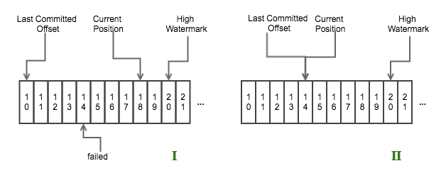

由于 0.10.x 版 Kafka 与 0.8.x 版有很大的变化，这种变化对下游 Storm 有非常大的影响，0.10.x 版的 Kafka 不但增加了权限管理的功能，而且还将 simple 和 high consumer 的 offsets 进行统一管理，也就意味着在 0.8.x 中 Storm 需要去负责管理 offsets，而在 0.10.x 中，Storm 不需要关心 consumer 的 offsets 的问题，这对 KafkaSpout 的设计有很大的影响，本文就是对 Storm 对 0.10.x 版 Kafka 支持的实现部分的解析。   
 # 0.10.x 版 KafkaSpout 的实现 
 社区对新版 Kafka 的支持，总体分为两种情况：    
 - 一种是选择自动 commit 机制； 
 - 另一种是非自动 commit，就是将 commit 的权利交与 Storm 来控制。  下面分别对这两种情况进行分析。   Kafka Consumer 的一些配置会对 Storm 的性能很大影响，下面的三个参数的设置对其性能的影响最大（默认值是根据[MICROBENCHMARKING APACHE STORM 1.0 PERFORMANCE](https://hortonworks.com/blog/microbenchmarking-storm-1-0-performance/)测试得到）：    
 - <code>fetch.min.bytes</code>：默认值 200； 
 - <code>fetch.max.wait.ms</code>：默认值 30000（30s）； 
 - <code>Kafka Consumer instance poll timeout</code>, 它可以在通过 [KafkaSpoutConfig](https://github.com/apache/storm/blob/1.0.x-branch/external/storm-kafka-client/src/main/java/org/apache/storm/kafka/spout/KafkaSpoutConfig.java) 的方法 [setPollTimeoutMs](https://github.com/apache/storm/blob/1.0.x-branch/external/storm-kafka-client/src/main/java/org/apache/storm/kafka/spout/KafkaSpoutConfig.java#L180-L184) 来配置，默认值是 10000000；  
 ## 自动 commit 模式 
 自动 commit 模式就是 commit 的时机由 Consumer 来控制，本质上是异步 commit，当定时达到时，就进行 commit。而 Storm 端并没有进行任何记录，也就是这部分的容错完全由 Consumer 端来控制，而 Consumer 并不会关心数据的处理成功与否，只关心数据是否 commit，如果未 commit，就会重新发送数据，那么就有可能导致下面这个后果：   
 ### 造成那些已经 commit、但 Storm 端处理失败的数据丢失 
 
<strong>丢失的原因</strong>   一些数据发送到 Spout 之后，恰好 commit 的定时到达，进行了 commit，但是这中间有某条或者几条数据处理失败，这就是说，这几条处理失败的数据已经进行 commit 了，Kafka 端也就不会重新进行发送。   可能出现的这种后果也确定了自动 commit 模式不能满足我们的需求，为了保证数据不丢，需要数据在 Storm 中 ack 之后才能被 commit，因此，commit 还是应该由 Storm 端来进行控制，才能保证数据被正确处理。   
 ## 非自动 commit 模式 
 当选用非自动的 commit 机制（实际上就是使用 Consumer 的同步 commit 机制）时，需要手动去设置 commit 的参数，有以下两项需要设置：    
 - <code>offset.commit.period.ms</code>：设置 spout 多久向 Kafka commit一次，在 KafkaSpoutConfig 的 [setOffsetCommitPeriodMs](https://github.com/apache/storm/blob/1.0.x-branch/external/storm-kafka-client/src/main/java/org/apache/storm/kafka/spout/KafkaSpoutConfig.java#L189-L193) 中配置； 
 - <code>max.uncommitted.offsets</code>：控制在下一次拉取数据之前最多可以有多少数据在等待 commit，在 KafkaSpoutConfig 的 [setMaxUncommittedOffsets](https://github.com/apache/storm/blob/1.0.x-branch/external/storm-kafka-client/src/main/java/org/apache/storm/kafka/spout/KafkaSpoutConfig.java#L211-L217) 中配置；  
 ### spout 的处理过程 
 关于 Kafka 的几个 offset 的概念，可以参考[offset的一些相关概念](http://matt33.com/2017/01/16/kafka-group/#offset-那些事)   KafkaSpout 的处理过程主要是在 nextTuple() 方法，其处理过程如下：   
``` scala
public void nextTuple() {
    if (initialized) {
        if (commit()) {// Step1 非自动 commit,并且定时达到
            commitOffsetsForAckedTuples();// 对所有已经 ack 的 msgs 进行 commit
        }

        if (poll()) {//Step2 拉取的数据都已经发送,并且未 commit 的消息数小于设置的最大 uncommit 数
            setWaitingToEmit(pollKafkaBroker());
            //将拉取的所有 record 都放到 waitingToEmit 集合中,可能会重复拉取数据（由于一些 msg 需要重试，通过修改 Last Committed Offset 的值来实现的）
        }

        if (waitingToEmit()) {//Step3 waitingToEmit 中还有数据
            emit();//发送数据,但会跳过已经 ack 或者已经发送的消息
        }
    } else {
        LOG.debug("Spout not initialized. Not sending tuples until initialization completes");
    }
}
```
 上面主要分为三步：    
 - 如果是非自动 commit，并且 commit 定时达到，那么就将所有已经 ack 的数据（<strong>这些数据的 offset 必须是连续的</strong>，不连续的数据不会进行 commit）进行 commit； 
 - 如果拉取的数据都已经发送，并且未 commit 的消息数（记录在 <code>numUncommittedOffsets</code> 中）小于设置的最大 uncommit 数，那么就根据更新后的 offset （将 offset 重置到需要重试的 msg 的最小 offset，这样该 offset 后面的 msg 还是会被重新拉取）拉取数据，并将拉取到的数据存储到 <code>waitingToEmit</code> 集合中； 
 - 如果 <code>waitingToEmit</code> 集合中还有数据，就发送数据，但在发送数据的过程中，会进行判断，只发送没有 ack 的数据。  
 ### KafkaSpout 如何进行容错 
 举个示例，如下图所示   

    
 - 图1表示一个 <code>nextTuple()</code> 循环结束之后，offset 为14那条数据处理失败，而offset 为15-18的数据处理成功； 
 - 图2表示在下次循环 Step 1 结束之后、Step 2 开始之前，Consumer 会将 the last committed offset 重置到 offset 为14的位置。  也就是说从 offset 为14开始，后面的数据会重新发送。   
<strong>有人可能会问，那样的话会不会造成数据重复发送？</strong>   Storm 是如何解决这个问题的呢？答案就是 Storm 会用一个 map 记录已经 ack 的数据（acked），Storm 在进行 commit 的时候也是根据这个 map 的数据进行 commit 的，不过 commit 数据的 offset 必须是连续的，如上图所示，只能将 offset 为11-13的数据 commit，而15-18的数据由于 offset 为14的数据未处理成功而不能 commit。offset 为11-13的数据在 commit 成功后会从 map 中移除，而 offset 为15-18的数据依然在 map 中，Storm 在将从 Kafka 拉取的数据加入到 waitingToEmit 集合时后，进行 emit 数据时，会先检测该数据是否存在 acked 中，如果存在的话，就证明该条数据已经处理过了，不会在进行发送。   这里有几点需要注意的：    
 - 对已经 ack 的 msg 进行 commit 时，所 commit 的 msg 的 offset 必须是<strong>连续</strong>的（该 msg 存储在一个 TreeMap 中，按 offset 排序），断续的数据会暂时接着保存在集合中，不会进行 commit，如果出现断续，那就证明中间有数据处理失败，需要重新处理； 
 - storm 处理 failed 的 msg，会保存到一个专门的集合中，在每次拉取数据时（是拉取数据，不是发送数据，发送数据时会检测该数据是否已经成功处理），会遍历该集合中包含的所有 TopicPartiion，获取该 partition 的 Last Committed Offset；  这样设计有一个副作用就是：如果有一个 msg 一直不成功，就会导致 KafkaSpout 因为这一条数据的影响而不断地重复拉取这批数据，造成整个拓扑卡在这里。   
 ### Kafka Rebalance 的影响 
 Kafka Rebalance 可以参考[Consumer Rebalance](http://matt33.com/2017/01/16/kafka-group/#Consumer-Rebalance).   KafkaSpout 实现了一个内部类用来监控 Group Rebalance 的情况，实现了两个回调函数，一旦发现 group 的状态变为 preparingRabalance 之后    
 - <code>onPartitionsRevoked</code> 这个方法会在 Consumer 停止拉取数据之后、group 进行 rebalance 操作之前调用，作用是对已经 ack 的 msg 进行 commit； 
 - <code>onPartitionsAssigned</code> 这个方法 group 已经进行 reassignment 之后，开始拉取数据之前调用，作用是清理内存中不属于这个线程的 msg、获取 partition 的 last committed offset。  
 ### 潜在的风险点 
 这部分还是有可能导致数据重复发送的，设想下面一种情况：   如果之前由于一个条消息处理失败（Partition 1），造成部分数据没有 commit 成功，在进行 rebalance 后，恰好 Partition 1 被分配到其他 spout 线程时，那么当前的 spout 就会关于 Partition 1 的相关数据删除掉，导致部分已经 commit 成功的数据（记录在 acked 中）被删除，而另外的 spout 就会重新拉取这部分数据进行处理，那么就会导致这部分已经成功处理的数据
<strong>重复处理</strong>。